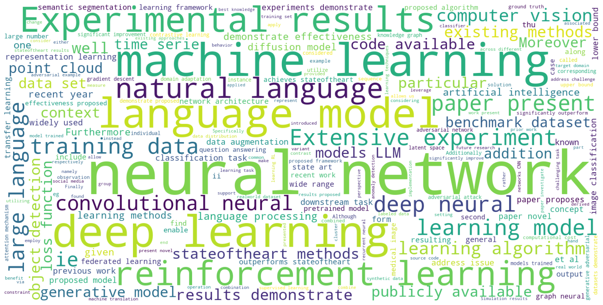

# Arxiv Data Exploration


```python
import requests
import pandas as pd
import plotly.express as px
import plotly.graph_objects as go
import matplotlib.pyplot as plt
from upsetplot import UpSet, from_contents, from_memberships
from upsetplot import plot as ups_plot
import json
from IPython.display import display
from wordcloud import WordCloud
import nltk
from nltk.corpus import stopwords
import string

from bs4 import BeautifulSoup

# Download stopwords if not already downloaded
nltk.download('stopwords')
```

    [nltk_data] Downloading package stopwords to
    [nltk_data]     C:\Users\chira\AppData\Roaming\nltk_data...
    [nltk_data]   Package stopwords is already up-to-date!
    


    True


## Load Data


```python
arxiv_metadata = pd.read_json('./arxiv-metadata-oai-snapshot.json', lines=True)
```


```python
print(f"Number of rows: {len(arxiv_metadata)}")
arxiv_metadata.head()
```

    Number of rows: 2511805
    


<div>
<style scoped>
    .dataframe tbody tr th:only-of-type {
        vertical-align: middle;
    }

    .dataframe tbody tr th {
        vertical-align: top;
    }

    .dataframe thead th {
        text-align: right;
    }
</style>
<table border="1" class="dataframe">
  <thead>
    <tr style="text-align: right;">
      <th></th>
      <th>id</th>
      <th>submitter</th>
      <th>authors</th>
      <th>title</th>
      <th>comments</th>
      <th>journal-ref</th>
      <th>doi</th>
      <th>report-no</th>
      <th>categories</th>
      <th>license</th>
      <th>abstract</th>
      <th>versions</th>
      <th>update_date</th>
      <th>authors_parsed</th>
    </tr>
  </thead>
  <tbody>
    <tr>
      <th>0</th>
      <td>0704.0001</td>
      <td>Pavel Nadolsky</td>
      <td>C. Bal\'azs, E. L. Berger, P. M. Nadolsky, C.-...</td>
      <td>Calculation of prompt diphoton production cros...</td>
      <td>37 pages, 15 figures; published version</td>
      <td>Phys.Rev.D76:013009,2007</td>
      <td>10.1103/PhysRevD.76.013009</td>
      <td>ANL-HEP-PR-07-12</td>
      <td>hep-ph</td>
      <td>None</td>
      <td>A fully differential calculation in perturba...</td>
      <td>[{'version': 'v1', 'created': 'Mon, 2 Apr 2007...</td>
      <td>2008-11-26</td>
      <td>[[Balázs, C., ], [Berger, E. L., ], [Nadolsky,...</td>
    </tr>
    <tr>
      <th>1</th>
      <td>0704.0002</td>
      <td>Louis Theran</td>
      <td>Ileana Streinu and Louis Theran</td>
      <td>Sparsity-certifying Graph Decompositions</td>
      <td>To appear in Graphs and Combinatorics</td>
      <td>None</td>
      <td>None</td>
      <td>None</td>
      <td>math.CO cs.CG</td>
      <td>http://arxiv.org/licenses/nonexclusive-distrib...</td>
      <td>We describe a new algorithm, the $(k,\ell)$-...</td>
      <td>[{'version': 'v1', 'created': 'Sat, 31 Mar 200...</td>
      <td>2008-12-13</td>
      <td>[[Streinu, Ileana, ], [Theran, Louis, ]]</td>
    </tr>
    <tr>
      <th>2</th>
      <td>0704.0003</td>
      <td>Hongjun Pan</td>
      <td>Hongjun Pan</td>
      <td>The evolution of the Earth-Moon system based o...</td>
      <td>23 pages, 3 figures</td>
      <td>None</td>
      <td>None</td>
      <td>None</td>
      <td>physics.gen-ph</td>
      <td>None</td>
      <td>The evolution of Earth-Moon system is descri...</td>
      <td>[{'version': 'v1', 'created': 'Sun, 1 Apr 2007...</td>
      <td>2008-01-13</td>
      <td>[[Pan, Hongjun, ]]</td>
    </tr>
    <tr>
      <th>3</th>
      <td>0704.0004</td>
      <td>David Callan</td>
      <td>David Callan</td>
      <td>A determinant of Stirling cycle numbers counts...</td>
      <td>11 pages</td>
      <td>None</td>
      <td>None</td>
      <td>None</td>
      <td>math.CO</td>
      <td>None</td>
      <td>We show that a determinant of Stirling cycle...</td>
      <td>[{'version': 'v1', 'created': 'Sat, 31 Mar 200...</td>
      <td>2007-05-23</td>
      <td>[[Callan, David, ]]</td>
    </tr>
    <tr>
      <th>4</th>
      <td>0704.0005</td>
      <td>Alberto Torchinsky</td>
      <td>Wael Abu-Shammala and Alberto Torchinsky</td>
      <td>From dyadic $\Lambda_{\alpha}$ to $\Lambda_{\a...</td>
      <td>None</td>
      <td>Illinois J. Math. 52 (2008) no.2, 681-689</td>
      <td>None</td>
      <td>None</td>
      <td>math.CA math.FA</td>
      <td>None</td>
      <td>In this paper we show how to compute the $\L...</td>
      <td>[{'version': 'v1', 'created': 'Mon, 2 Apr 2007...</td>
      <td>2013-10-15</td>
      <td>[[Abu-Shammala, Wael, ], [Torchinsky, Alberto, ]]</td>
    </tr>
  </tbody>
</table>
</div>


```python
# Show number of papers by year, let's use `update_date` for the year info
arxiv_metadata['update_date'] = pd.to_datetime(arxiv_metadata['update_date'])
arxiv_metadata['year'] = arxiv_metadata['update_date'].dt.year

year_counts = arxiv_metadata['year'].value_counts().reset_index()
year_counts.columns = ['year', 'count']

fig = px.bar(year_counts, x='year', y='count', title='Number of research papers per year')
fig.show()
```


<div>                            <div id="7263de42-f7f1-4732-aea8-5aed248c7e54" class="plotly-graph-div" style="height:525px; width:100%;"></div>            <script type="text/javascript">                require(["plotly"], function(Plotly) {                    window.PLOTLYENV=window.PLOTLYENV || {};                                    if (document.getElementById("7263de42-f7f1-4732-aea8-5aed248c7e54")) {                    Plotly.newPlot(                        "7263de42-f7f1-4732-aea8-5aed248c7e54",                        [{"alignmentgroup":"True","hovertemplate":"year=%{x}\u003cbr\u003ecount=%{y}\u003cextra\u003e\u003c\u002fextra\u003e","legendgroup":"","marker":{"color":"#636efa","pattern":{"shape":""}},"name":"","offsetgroup":"","orientation":"v","showlegend":false,"textposition":"auto","x":[2023,2009,2015,2022,2021,2020,2024,2019,2007,2018,2016,2017,2014,2013,2008,2011,2012,2010],"xaxis":"x","y":[241399,229007,214603,194900,187853,174921,173682,154500,145829,135574,133257,122141,87816,71825,69325,61788,57214,56171],"yaxis":"y","type":"bar"}],                        {"template":{"data":{"histogram2dcontour":[{"type":"histogram2dcontour","colorbar":{"outlinewidth":0,"ticks":""},"colorscale":[[0.0,"#0d0887"],[0.1111111111111111,"#46039f"],[0.2222222222222222,"#7201a8"],[0.3333333333333333,"#9c179e"],[0.4444444444444444,"#bd3786"],[0.5555555555555556,"#d8576b"],[0.6666666666666666,"#ed7953"],[0.7777777777777778,"#fb9f3a"],[0.8888888888888888,"#fdca26"],[1.0,"#f0f921"]]}],"choropleth":[{"type":"choropleth","colorbar":{"outlinewidth":0,"ticks":""}}],"histogram2d":[{"type":"histogram2d","colorbar":{"outlinewidth":0,"ticks":""},"colorscale":[[0.0,"#0d0887"],[0.1111111111111111,"#46039f"],[0.2222222222222222,"#7201a8"],[0.3333333333333333,"#9c179e"],[0.4444444444444444,"#bd3786"],[0.5555555555555556,"#d8576b"],[0.6666666666666666,"#ed7953"],[0.7777777777777778,"#fb9f3a"],[0.8888888888888888,"#fdca26"],[1.0,"#f0f921"]]}],"heatmap":[{"type":"heatmap","colorbar":{"outlinewidth":0,"ticks":""},"colorscale":[[0.0,"#0d0887"],[0.1111111111111111,"#46039f"],[0.2222222222222222,"#7201a8"],[0.3333333333333333,"#9c179e"],[0.4444444444444444,"#bd3786"],[0.5555555555555556,"#d8576b"],[0.6666666666666666,"#ed7953"],[0.7777777777777778,"#fb9f3a"],[0.8888888888888888,"#fdca26"],[1.0,"#f0f921"]]}],"heatmapgl":[{"type":"heatmapgl","colorbar":{"outlinewidth":0,"ticks":""},"colorscale":[[0.0,"#0d0887"],[0.1111111111111111,"#46039f"],[0.2222222222222222,"#7201a8"],[0.3333333333333333,"#9c179e"],[0.4444444444444444,"#bd3786"],[0.5555555555555556,"#d8576b"],[0.6666666666666666,"#ed7953"],[0.7777777777777778,"#fb9f3a"],[0.8888888888888888,"#fdca26"],[1.0,"#f0f921"]]}],"contourcarpet":[{"type":"contourcarpet","colorbar":{"outlinewidth":0,"ticks":""}}],"contour":[{"type":"contour","colorbar":{"outlinewidth":0,"ticks":""},"colorscale":[[0.0,"#0d0887"],[0.1111111111111111,"#46039f"],[0.2222222222222222,"#7201a8"],[0.3333333333333333,"#9c179e"],[0.4444444444444444,"#bd3786"],[0.5555555555555556,"#d8576b"],[0.6666666666666666,"#ed7953"],[0.7777777777777778,"#fb9f3a"],[0.8888888888888888,"#fdca26"],[1.0,"#f0f921"]]}],"surface":[{"type":"surface","colorbar":{"outlinewidth":0,"ticks":""},"colorscale":[[0.0,"#0d0887"],[0.1111111111111111,"#46039f"],[0.2222222222222222,"#7201a8"],[0.3333333333333333,"#9c179e"],[0.4444444444444444,"#bd3786"],[0.5555555555555556,"#d8576b"],[0.6666666666666666,"#ed7953"],[0.7777777777777778,"#fb9f3a"],[0.8888888888888888,"#fdca26"],[1.0,"#f0f921"]]}],"mesh3d":[{"type":"mesh3d","colorbar":{"outlinewidth":0,"ticks":""}}],"scatter":[{"fillpattern":{"fillmode":"overlay","size":10,"solidity":0.2},"type":"scatter"}],"parcoords":[{"type":"parcoords","line":{"colorbar":{"outlinewidth":0,"ticks":""}}}],"scatterpolargl":[{"type":"scatterpolargl","marker":{"colorbar":{"outlinewidth":0,"ticks":""}}}],"bar":[{"error_x":{"color":"#2a3f5f"},"error_y":{"color":"#2a3f5f"},"marker":{"line":{"color":"#E5ECF6","width":0.5},"pattern":{"fillmode":"overlay","size":10,"solidity":0.2}},"type":"bar"}],"scattergeo":[{"type":"scattergeo","marker":{"colorbar":{"outlinewidth":0,"ticks":""}}}],"scatterpolar":[{"type":"scatterpolar","marker":{"colorbar":{"outlinewidth":0,"ticks":""}}}],"histogram":[{"marker":{"pattern":{"fillmode":"overlay","size":10,"solidity":0.2}},"type":"histogram"}],"scattergl":[{"type":"scattergl","marker":{"colorbar":{"outlinewidth":0,"ticks":""}}}],"scatter3d":[{"type":"scatter3d","line":{"colorbar":{"outlinewidth":0,"ticks":""}},"marker":{"colorbar":{"outlinewidth":0,"ticks":""}}}],"scattermapbox":[{"type":"scattermapbox","marker":{"colorbar":{"outlinewidth":0,"ticks":""}}}],"scatterternary":[{"type":"scatterternary","marker":{"colorbar":{"outlinewidth":0,"ticks":""}}}],"scattercarpet":[{"type":"scattercarpet","marker":{"colorbar":{"outlinewidth":0,"ticks":""}}}],"carpet":[{"aaxis":{"endlinecolor":"#2a3f5f","gridcolor":"white","linecolor":"white","minorgridcolor":"white","startlinecolor":"#2a3f5f"},"baxis":{"endlinecolor":"#2a3f5f","gridcolor":"white","linecolor":"white","minorgridcolor":"white","startlinecolor":"#2a3f5f"},"type":"carpet"}],"table":[{"cells":{"fill":{"color":"#EBF0F8"},"line":{"color":"white"}},"header":{"fill":{"color":"#C8D4E3"},"line":{"color":"white"}},"type":"table"}],"barpolar":[{"marker":{"line":{"color":"#E5ECF6","width":0.5},"pattern":{"fillmode":"overlay","size":10,"solidity":0.2}},"type":"barpolar"}],"pie":[{"automargin":true,"type":"pie"}]},"layout":{"autotypenumbers":"strict","colorway":["#636efa","#EF553B","#00cc96","#ab63fa","#FFA15A","#19d3f3","#FF6692","#B6E880","#FF97FF","#FECB52"],"font":{"color":"#2a3f5f"},"hovermode":"closest","hoverlabel":{"align":"left"},"paper_bgcolor":"white","plot_bgcolor":"#E5ECF6","polar":{"bgcolor":"#E5ECF6","angularaxis":{"gridcolor":"white","linecolor":"white","ticks":""},"radialaxis":{"gridcolor":"white","linecolor":"white","ticks":""}},"ternary":{"bgcolor":"#E5ECF6","aaxis":{"gridcolor":"white","linecolor":"white","ticks":""},"baxis":{"gridcolor":"white","linecolor":"white","ticks":""},"caxis":{"gridcolor":"white","linecolor":"white","ticks":""}},"coloraxis":{"colorbar":{"outlinewidth":0,"ticks":""}},"colorscale":{"sequential":[[0.0,"#0d0887"],[0.1111111111111111,"#46039f"],[0.2222222222222222,"#7201a8"],[0.3333333333333333,"#9c179e"],[0.4444444444444444,"#bd3786"],[0.5555555555555556,"#d8576b"],[0.6666666666666666,"#ed7953"],[0.7777777777777778,"#fb9f3a"],[0.8888888888888888,"#fdca26"],[1.0,"#f0f921"]],"sequentialminus":[[0.0,"#0d0887"],[0.1111111111111111,"#46039f"],[0.2222222222222222,"#7201a8"],[0.3333333333333333,"#9c179e"],[0.4444444444444444,"#bd3786"],[0.5555555555555556,"#d8576b"],[0.6666666666666666,"#ed7953"],[0.7777777777777778,"#fb9f3a"],[0.8888888888888888,"#fdca26"],[1.0,"#f0f921"]],"diverging":[[0,"#8e0152"],[0.1,"#c51b7d"],[0.2,"#de77ae"],[0.3,"#f1b6da"],[0.4,"#fde0ef"],[0.5,"#f7f7f7"],[0.6,"#e6f5d0"],[0.7,"#b8e186"],[0.8,"#7fbc41"],[0.9,"#4d9221"],[1,"#276419"]]},"xaxis":{"gridcolor":"white","linecolor":"white","ticks":"","title":{"standoff":15},"zerolinecolor":"white","automargin":true,"zerolinewidth":2},"yaxis":{"gridcolor":"white","linecolor":"white","ticks":"","title":{"standoff":15},"zerolinecolor":"white","automargin":true,"zerolinewidth":2},"scene":{"xaxis":{"backgroundcolor":"#E5ECF6","gridcolor":"white","linecolor":"white","showbackground":true,"ticks":"","zerolinecolor":"white","gridwidth":2},"yaxis":{"backgroundcolor":"#E5ECF6","gridcolor":"white","linecolor":"white","showbackground":true,"ticks":"","zerolinecolor":"white","gridwidth":2},"zaxis":{"backgroundcolor":"#E5ECF6","gridcolor":"white","linecolor":"white","showbackground":true,"ticks":"","zerolinecolor":"white","gridwidth":2}},"shapedefaults":{"line":{"color":"#2a3f5f"}},"annotationdefaults":{"arrowcolor":"#2a3f5f","arrowhead":0,"arrowwidth":1},"geo":{"bgcolor":"white","landcolor":"#E5ECF6","subunitcolor":"white","showland":true,"showlakes":true,"lakecolor":"white"},"title":{"x":0.05},"mapbox":{"style":"light"}}},"xaxis":{"anchor":"y","domain":[0.0,1.0],"title":{"text":"year"}},"yaxis":{"anchor":"x","domain":[0.0,1.0],"title":{"text":"count"}},"legend":{"tracegroupgap":0},"title":{"text":"Number of research papers per year"},"barmode":"relative"},                        {"responsive": true}                    ).then(function(){

var gd = document.getElementById('7263de42-f7f1-4732-aea8-5aed248c7e54');
var x = new MutationObserver(function (mutations, observer) {{
        var display = window.getComputedStyle(gd).display;
        if (!display || display === 'none') {{
            console.log([gd, 'removed!']);
            Plotly.purge(gd);
            observer.disconnect();
        }}
}});

// Listen for the removal of the full notebook cells
var notebookContainer = gd.closest('#notebook-container');
if (notebookContainer) {{
    x.observe(notebookContainer, {childList: true});
}}

// Listen for the clearing of the current output cell
var outputEl = gd.closest('.output');
if (outputEl) {{
    x.observe(outputEl, {childList: true});
}}

                        })                };                });            </script>        </div>


## Categories

Categories in the data is actually in abreviations defined on: [ArXiv Category Taxonomy](https://arxiv.org/category_taxonomy). We'll extract those and create a expanded categories for each catgory abbreviation given. In general, a category is defined as: `<Main Category>.<Sub-Category>`.


```python
# Categories are defined on this page by Arxiv: https://arxiv.org/category_taxonomy
url = "https://arxiv.org/category_taxonomy"

# Send a GET request to the URL
response = requests.get(url)

# Get the page source from the response content
page_source = response.text

# Parse the page source
soup = BeautifulSoup(page_source, 'html.parser')

# Find the category list element
category_list = soup.find(id='category_taxonomy_list')

# Extract the category information
categories = {}
main_category = None
for category in category_list.find_all('h4'):
    if category.find_previous('h2'):
        main_category = category.find_previous('h2').text
    category_id = category.text.split(' (')[0]  # Switched with 'category_name'
    category_name = category.text.split('(')[1].split(')')[0]  # Switched with 'category_id'
    category_description = category.find_next('p').text
    categories[category_id] = {
        "ID": category_id,  # Switched with 'category_name'
        "Main Category": main_category,
        "Name": category_name,  # Switched with 'category_id'
        "Description": category_description
    }

# Create a dataframe from the categories list
categories_df = pd.DataFrame(categories.values())

# Capture all the top main categories
all_main_categories = sorted(categories_df['Main Category'].unique())
categories_df.head()
```


<div>
<style scoped>
    .dataframe tbody tr th:only-of-type {
        vertical-align: middle;
    }

    .dataframe tbody tr th {
        vertical-align: top;
    }

    .dataframe thead th {
        text-align: right;
    }
</style>
<table border="1" class="dataframe">
  <thead>
    <tr style="text-align: right;">
      <th></th>
      <th>ID</th>
      <th>Main Category</th>
      <th>Name</th>
      <th>Description</th>
    </tr>
  </thead>
  <tbody>
    <tr>
      <th>0</th>
      <td>cs.AI</td>
      <td>Computer Science</td>
      <td>Artificial Intelligence</td>
      <td>Covers all areas of AI except Vision, Robotics...</td>
    </tr>
    <tr>
      <th>1</th>
      <td>cs.AR</td>
      <td>Computer Science</td>
      <td>Hardware Architecture</td>
      <td>Covers systems organization and hardware archi...</td>
    </tr>
    <tr>
      <th>2</th>
      <td>cs.CC</td>
      <td>Computer Science</td>
      <td>Computational Complexity</td>
      <td>Covers models of computation, complexity class...</td>
    </tr>
    <tr>
      <th>3</th>
      <td>cs.CE</td>
      <td>Computer Science</td>
      <td>Computational Engineering, Finance, and Science</td>
      <td>Covers applications of computer science to the...</td>
    </tr>
    <tr>
      <th>4</th>
      <td>cs.CG</td>
      <td>Computer Science</td>
      <td>Computational Geometry</td>
      <td>Roughly includes material in ACM Subject Class...</td>
    </tr>
  </tbody>
</table>
</div>


```python
## Does a paper belong to two main categories?
multiple_main_category = any(arxiv_metadata['categories'].apply(lambda x: len(set([a.split('.')[0] for a in x.split(' ')])) > 1))
print(f"Does a paper belong to many main-categories? {multiple_main_category}")
```

    Does a paper belong to many main-categories? True
    


```python
# Let's visualize how many paper in each "main-category" have been published
# We'll remember the caveat that, there might be dual counting because a paper can belong to multiple categories
def get_category(category_id):
    global categories
    try:
        return categories[category_id]['Main Category']
    except KeyError as e:
        for cid, cinfo in categories.items():
            if cid.startswith(category_id):
                return cinfo['Main Category']
        return None


def get_categories(category_ids):
    return list(set([str(get_category(cid)) for cid in category_ids]))
```


```python
arxiv_metadata_plot = arxiv_metadata[['id', 'categories', 'year']]
arxiv_metadata_plot = arxiv_metadata_plot.assign(category=arxiv_metadata_plot['categories'].str.split(' ')).explode('category')
arxiv_metadata_plot['category'] = arxiv_metadata_plot['category'].apply(lambda x: get_category(x))

# Group by year and category, then count papers
arxiv_metadata_plot = arxiv_metadata_plot.groupby(['year', 'category']).size().reset_index(name='count')

# Plot stacked histogram using Plotly
fig = px.bar(arxiv_metadata_plot, x='year', y='count', color='category',
             title='Stacked Histogram of Papers by Year and Category',
             labels={'year': 'Year', 'count': 'Number of Papers'},
             barmode='stack')

fig.show()
```


<div>                            <div id="88d979de-105f-4797-8ec2-a9863d65cd87" class="plotly-graph-div" style="height:525px; width:100%;"></div>            <script type="text/javascript">                require(["plotly"], function(Plotly) {                    window.PLOTLYENV=window.PLOTLYENV || {};                                    if (document.getElementById("88d979de-105f-4797-8ec2-a9863d65cd87")) {                    Plotly.newPlot(                        "88d979de-105f-4797-8ec2-a9863d65cd87",                        [{"alignmentgroup":"True","hovertemplate":"category=Computer Science\u003cbr\u003eYear=%{x}\u003cbr\u003eNumber of Names=%{y}\u003cextra\u003e\u003c\u002fextra\u003e","legendgroup":"Computer Science","marker":{"color":"#636efa","pattern":{"shape":""}},"name":"Computer Science","offsetgroup":"Computer Science","orientation":"v","showlegend":true,"textposition":"auto","x":[2007,2008,2009,2010,2011,2012,2013,2014,2015,2016,2017,2018,2019,2020,2021,2022,2023,2024],"xaxis":"x","y":[10586,4585,6255,7728,9300,13418,16962,19082,26586,34456,38008,52279,72264,99025,117075,128314,168096,133597],"yaxis":"y","type":"bar"},{"alignmentgroup":"True","hovertemplate":"category=Mathematics\u003cbr\u003eYear=%{x}\u003cbr\u003eNumber of Names=%{y}\u003cextra\u003e\u003c\u002fextra\u003e","legendgroup":"Mathematics","marker":{"color":"#EF553B","pattern":{"shape":""}},"name":"Mathematics","offsetgroup":"Mathematics","orientation":"v","showlegend":true,"textposition":"auto","x":[2007,2008,2009,2010,2011,2012,2013,2014,2015,2016,2017,2018,2019,2020,2021,2022,2023,2024],"xaxis":"x","y":[66818,21554,29244,22472,26528,29169,33140,39888,56535,53632,48164,51757,57604,63165,66782,69141,87194,60299],"yaxis":"y","type":"bar"},{"alignmentgroup":"True","hovertemplate":"category=Physics\u003cbr\u003eYear=%{x}\u003cbr\u003eNumber of Names=%{y}\u003cextra\u003e\u003c\u002fextra\u003e","legendgroup":"Physics","marker":{"color":"#00cc96","pattern":{"shape":""}},"name":"Physics","offsetgroup":"Physics","orientation":"v","showlegend":true,"textposition":"auto","x":[2007,2008,2009,2010,2011,2012,2013,2014,2015,2016,2017,2018,2019,2020,2021,2022,2023,2024],"xaxis":"x","y":[130979,76302,280911,56240,62885,49732,64748,78718,248411,117987,100106,101154,110825,122449,124706,127101,151244,101998],"yaxis":"y","type":"bar"},{"alignmentgroup":"True","hovertemplate":"category=Quantitative Biology\u003cbr\u003eYear=%{x}\u003cbr\u003eNumber of Names=%{y}\u003cextra\u003e\u003c\u002fextra\u003e","legendgroup":"Quantitative Biology","marker":{"color":"#ab63fa","pattern":{"shape":""}},"name":"Quantitative Biology","offsetgroup":"Quantitative Biology","orientation":"v","showlegend":true,"textposition":"auto","x":[2007,2008,2009,2010,2011,2012,2013,2014,2015,2016,2017,2018,2019,2020,2021,2022,2023,2024],"xaxis":"x","y":[3399,993,3043,1099,1236,1590,2317,2244,4114,3114,2824,2916,3274,4504,4066,3833,4727,3235],"yaxis":"y","type":"bar"},{"alignmentgroup":"True","hovertemplate":"category=Statistics\u003cbr\u003eYear=%{x}\u003cbr\u003eNumber of Names=%{y}\u003cextra\u003e\u003c\u002fextra\u003e","legendgroup":"Statistics","marker":{"color":"#FFA15A","pattern":{"shape":""}},"name":"Statistics","offsetgroup":"Statistics","orientation":"v","showlegend":true,"textposition":"auto","x":[2007,2008,2009,2010,2011,2012,2013,2014,2015,2016,2017,2018,2019,2020,2021,2022,2023,2024],"xaxis":"x","y":[1208,1104,1339,1338,1817,3018,3418,3853,5577,6258,7523,11408,16634,19482,15526,14515,17102,12686],"yaxis":"y","type":"bar"},{"alignmentgroup":"True","hovertemplate":"category=Quantitative Finance\u003cbr\u003eYear=%{x}\u003cbr\u003eNumber of Names=%{y}\u003cextra\u003e\u003c\u002fextra\u003e","legendgroup":"Quantitative Finance","marker":{"color":"#19d3f3","pattern":{"shape":""}},"name":"Quantitative Finance","offsetgroup":"Quantitative Finance","orientation":"v","showlegend":true,"textposition":"auto","x":[2008,2009,2010,2011,2012,2013,2014,2015,2016,2017,2018,2019,2020,2021,2022,2023,2024],"xaxis":"x","y":[1002,916,559,566,624,776,914,1327,1187,1042,1271,1527,2124,2532,2361,2925,2106],"yaxis":"y","type":"bar"},{"alignmentgroup":"True","hovertemplate":"category=Economics\u003cbr\u003eYear=%{x}\u003cbr\u003eNumber of Names=%{y}\u003cextra\u003e\u003c\u002fextra\u003e","legendgroup":"Economics","marker":{"color":"#FF6692","pattern":{"shape":""}},"name":"Economics","offsetgroup":"Economics","orientation":"v","showlegend":true,"textposition":"auto","x":[2017,2018,2019,2020,2021,2022,2023,2024],"xaxis":"x","y":[75,400,662,1236,1753,1806,2429,1930],"yaxis":"y","type":"bar"},{"alignmentgroup":"True","hovertemplate":"category=Electrical Engineering and Systems Science\u003cbr\u003eYear=%{x}\u003cbr\u003eNumber of Names=%{y}\u003cextra\u003e\u003c\u002fextra\u003e","legendgroup":"Electrical Engineering and Systems Science","marker":{"color":"#B6E880","pattern":{"shape":""}},"name":"Electrical Engineering and Systems Science","offsetgroup":"Electrical Engineering and Systems Science","orientation":"v","showlegend":true,"textposition":"auto","x":[2017,2018,2019,2020,2021,2022,2023,2024],"xaxis":"x","y":[398,2953,7815,14705,15079,16677,19241,13240],"yaxis":"y","type":"bar"}],                        {"template":{"data":{"histogram2dcontour":[{"type":"histogram2dcontour","colorbar":{"outlinewidth":0,"ticks":""},"colorscale":[[0.0,"#0d0887"],[0.1111111111111111,"#46039f"],[0.2222222222222222,"#7201a8"],[0.3333333333333333,"#9c179e"],[0.4444444444444444,"#bd3786"],[0.5555555555555556,"#d8576b"],[0.6666666666666666,"#ed7953"],[0.7777777777777778,"#fb9f3a"],[0.8888888888888888,"#fdca26"],[1.0,"#f0f921"]]}],"choropleth":[{"type":"choropleth","colorbar":{"outlinewidth":0,"ticks":""}}],"histogram2d":[{"type":"histogram2d","colorbar":{"outlinewidth":0,"ticks":""},"colorscale":[[0.0,"#0d0887"],[0.1111111111111111,"#46039f"],[0.2222222222222222,"#7201a8"],[0.3333333333333333,"#9c179e"],[0.4444444444444444,"#bd3786"],[0.5555555555555556,"#d8576b"],[0.6666666666666666,"#ed7953"],[0.7777777777777778,"#fb9f3a"],[0.8888888888888888,"#fdca26"],[1.0,"#f0f921"]]}],"heatmap":[{"type":"heatmap","colorbar":{"outlinewidth":0,"ticks":""},"colorscale":[[0.0,"#0d0887"],[0.1111111111111111,"#46039f"],[0.2222222222222222,"#7201a8"],[0.3333333333333333,"#9c179e"],[0.4444444444444444,"#bd3786"],[0.5555555555555556,"#d8576b"],[0.6666666666666666,"#ed7953"],[0.7777777777777778,"#fb9f3a"],[0.8888888888888888,"#fdca26"],[1.0,"#f0f921"]]}],"heatmapgl":[{"type":"heatmapgl","colorbar":{"outlinewidth":0,"ticks":""},"colorscale":[[0.0,"#0d0887"],[0.1111111111111111,"#46039f"],[0.2222222222222222,"#7201a8"],[0.3333333333333333,"#9c179e"],[0.4444444444444444,"#bd3786"],[0.5555555555555556,"#d8576b"],[0.6666666666666666,"#ed7953"],[0.7777777777777778,"#fb9f3a"],[0.8888888888888888,"#fdca26"],[1.0,"#f0f921"]]}],"contourcarpet":[{"type":"contourcarpet","colorbar":{"outlinewidth":0,"ticks":""}}],"contour":[{"type":"contour","colorbar":{"outlinewidth":0,"ticks":""},"colorscale":[[0.0,"#0d0887"],[0.1111111111111111,"#46039f"],[0.2222222222222222,"#7201a8"],[0.3333333333333333,"#9c179e"],[0.4444444444444444,"#bd3786"],[0.5555555555555556,"#d8576b"],[0.6666666666666666,"#ed7953"],[0.7777777777777778,"#fb9f3a"],[0.8888888888888888,"#fdca26"],[1.0,"#f0f921"]]}],"surface":[{"type":"surface","colorbar":{"outlinewidth":0,"ticks":""},"colorscale":[[0.0,"#0d0887"],[0.1111111111111111,"#46039f"],[0.2222222222222222,"#7201a8"],[0.3333333333333333,"#9c179e"],[0.4444444444444444,"#bd3786"],[0.5555555555555556,"#d8576b"],[0.6666666666666666,"#ed7953"],[0.7777777777777778,"#fb9f3a"],[0.8888888888888888,"#fdca26"],[1.0,"#f0f921"]]}],"mesh3d":[{"type":"mesh3d","colorbar":{"outlinewidth":0,"ticks":""}}],"scatter":[{"fillpattern":{"fillmode":"overlay","size":10,"solidity":0.2},"type":"scatter"}],"parcoords":[{"type":"parcoords","line":{"colorbar":{"outlinewidth":0,"ticks":""}}}],"scatterpolargl":[{"type":"scatterpolargl","marker":{"colorbar":{"outlinewidth":0,"ticks":""}}}],"bar":[{"error_x":{"color":"#2a3f5f"},"error_y":{"color":"#2a3f5f"},"marker":{"line":{"color":"#E5ECF6","width":0.5},"pattern":{"fillmode":"overlay","size":10,"solidity":0.2}},"type":"bar"}],"scattergeo":[{"type":"scattergeo","marker":{"colorbar":{"outlinewidth":0,"ticks":""}}}],"scatterpolar":[{"type":"scatterpolar","marker":{"colorbar":{"outlinewidth":0,"ticks":""}}}],"histogram":[{"marker":{"pattern":{"fillmode":"overlay","size":10,"solidity":0.2}},"type":"histogram"}],"scattergl":[{"type":"scattergl","marker":{"colorbar":{"outlinewidth":0,"ticks":""}}}],"scatter3d":[{"type":"scatter3d","line":{"colorbar":{"outlinewidth":0,"ticks":""}},"marker":{"colorbar":{"outlinewidth":0,"ticks":""}}}],"scattermapbox":[{"type":"scattermapbox","marker":{"colorbar":{"outlinewidth":0,"ticks":""}}}],"scatterternary":[{"type":"scatterternary","marker":{"colorbar":{"outlinewidth":0,"ticks":""}}}],"scattercarpet":[{"type":"scattercarpet","marker":{"colorbar":{"outlinewidth":0,"ticks":""}}}],"carpet":[{"aaxis":{"endlinecolor":"#2a3f5f","gridcolor":"white","linecolor":"white","minorgridcolor":"white","startlinecolor":"#2a3f5f"},"baxis":{"endlinecolor":"#2a3f5f","gridcolor":"white","linecolor":"white","minorgridcolor":"white","startlinecolor":"#2a3f5f"},"type":"carpet"}],"table":[{"cells":{"fill":{"color":"#EBF0F8"},"line":{"color":"white"}},"header":{"fill":{"color":"#C8D4E3"},"line":{"color":"white"}},"type":"table"}],"barpolar":[{"marker":{"line":{"color":"#E5ECF6","width":0.5},"pattern":{"fillmode":"overlay","size":10,"solidity":0.2}},"type":"barpolar"}],"pie":[{"automargin":true,"type":"pie"}]},"layout":{"autotypenumbers":"strict","colorway":["#636efa","#EF553B","#00cc96","#ab63fa","#FFA15A","#19d3f3","#FF6692","#B6E880","#FF97FF","#FECB52"],"font":{"color":"#2a3f5f"},"hovermode":"closest","hoverlabel":{"align":"left"},"paper_bgcolor":"white","plot_bgcolor":"#E5ECF6","polar":{"bgcolor":"#E5ECF6","angularaxis":{"gridcolor":"white","linecolor":"white","ticks":""},"radialaxis":{"gridcolor":"white","linecolor":"white","ticks":""}},"ternary":{"bgcolor":"#E5ECF6","aaxis":{"gridcolor":"white","linecolor":"white","ticks":""},"baxis":{"gridcolor":"white","linecolor":"white","ticks":""},"caxis":{"gridcolor":"white","linecolor":"white","ticks":""}},"coloraxis":{"colorbar":{"outlinewidth":0,"ticks":""}},"colorscale":{"sequential":[[0.0,"#0d0887"],[0.1111111111111111,"#46039f"],[0.2222222222222222,"#7201a8"],[0.3333333333333333,"#9c179e"],[0.4444444444444444,"#bd3786"],[0.5555555555555556,"#d8576b"],[0.6666666666666666,"#ed7953"],[0.7777777777777778,"#fb9f3a"],[0.8888888888888888,"#fdca26"],[1.0,"#f0f921"]],"sequentialminus":[[0.0,"#0d0887"],[0.1111111111111111,"#46039f"],[0.2222222222222222,"#7201a8"],[0.3333333333333333,"#9c179e"],[0.4444444444444444,"#bd3786"],[0.5555555555555556,"#d8576b"],[0.6666666666666666,"#ed7953"],[0.7777777777777778,"#fb9f3a"],[0.8888888888888888,"#fdca26"],[1.0,"#f0f921"]],"diverging":[[0,"#8e0152"],[0.1,"#c51b7d"],[0.2,"#de77ae"],[0.3,"#f1b6da"],[0.4,"#fde0ef"],[0.5,"#f7f7f7"],[0.6,"#e6f5d0"],[0.7,"#b8e186"],[0.8,"#7fbc41"],[0.9,"#4d9221"],[1,"#276419"]]},"xaxis":{"gridcolor":"white","linecolor":"white","ticks":"","title":{"standoff":15},"zerolinecolor":"white","automargin":true,"zerolinewidth":2},"yaxis":{"gridcolor":"white","linecolor":"white","ticks":"","title":{"standoff":15},"zerolinecolor":"white","automargin":true,"zerolinewidth":2},"scene":{"xaxis":{"backgroundcolor":"#E5ECF6","gridcolor":"white","linecolor":"white","showbackground":true,"ticks":"","zerolinecolor":"white","gridwidth":2},"yaxis":{"backgroundcolor":"#E5ECF6","gridcolor":"white","linecolor":"white","showbackground":true,"ticks":"","zerolinecolor":"white","gridwidth":2},"zaxis":{"backgroundcolor":"#E5ECF6","gridcolor":"white","linecolor":"white","showbackground":true,"ticks":"","zerolinecolor":"white","gridwidth":2}},"shapedefaults":{"line":{"color":"#2a3f5f"}},"annotationdefaults":{"arrowcolor":"#2a3f5f","arrowhead":0,"arrowwidth":1},"geo":{"bgcolor":"white","landcolor":"#E5ECF6","subunitcolor":"white","showland":true,"showlakes":true,"lakecolor":"white"},"title":{"x":0.05},"mapbox":{"style":"light"}}},"xaxis":{"anchor":"y","domain":[0.0,1.0],"title":{"text":"Year"}},"yaxis":{"anchor":"x","domain":[0.0,1.0],"title":{"text":"Number of Names"}},"legend":{"title":{"text":"category"},"tracegroupgap":0},"title":{"text":"Stacked Histogram of Names by Year and Category"},"barmode":"stack"},                        {"responsive": true}                    ).then(function(){

var gd = document.getElementById('88d979de-105f-4797-8ec2-a9863d65cd87');
var x = new MutationObserver(function (mutations, observer) {{
        var display = window.getComputedStyle(gd).display;
        if (!display || display === 'none') {{
            console.log([gd, 'removed!']);
            Plotly.purge(gd);
            observer.disconnect();
        }}
}});

// Listen for the removal of the full notebook cells
var notebookContainer = gd.closest('#notebook-container');
if (notebookContainer) {{
    x.observe(notebookContainer, {childList: true});
}}

// Listen for the clearing of the current output cell
var outputEl = gd.closest('.output');
if (outputEl) {{
    x.observe(outputEl, {childList: true});
}}

                        })                };                });            </script>        </div>


```python
arxiv_metadata_plot = arxiv_metadata[['id', 'categories', 'year']]
arxiv_metadata_plot = arxiv_metadata_plot.assign(category=arxiv_metadata_plot['categories'].str.split(' ')).explode('category')
arxiv_metadata_plot['category'] = arxiv_metadata_plot['category'].apply(lambda x: get_category(x))

# Group by year and category, then count papers
arxiv_metadata_plot = arxiv_metadata_plot.groupby(['year', 'category']).size().reset_index(name='count')

# Plot stacked histogram using Plotly
# Calculate the total count per year for percentage calculation
total_per_year = arxiv_metadata_plot.groupby('year')['count'].sum().reset_index()
total_per_year.columns = ['year', 'total_count']

# Merge the total counts with the grouped data
arxiv_metadata_plot = pd.merge(arxiv_metadata_plot, total_per_year, on='year')

# Calculate the percentage
arxiv_metadata_plot['percentage'] = arxiv_metadata_plot['count'] / arxiv_metadata_plot['total_count'] * 100

# Plot stacked percentage plot using Plotly
fig = px.bar(arxiv_metadata_plot, x='year', y='percentage', color='category',
             title='Stacked Percentage of Research Papers by Year and Category',
             labels={'year': 'Year', 'percentage': 'Participation Percentage'},
             barmode='stack')

fig.show()
```


<div>                            <div id="a0c61c6c-0302-4ff4-99c9-e71062b9f70d" class="plotly-graph-div" style="height:525px; width:100%;"></div>            <script type="text/javascript">                require(["plotly"], function(Plotly) {                    window.PLOTLYENV=window.PLOTLYENV || {};                                    if (document.getElementById("a0c61c6c-0302-4ff4-99c9-e71062b9f70d")) {                    Plotly.newPlot(                        "a0c61c6c-0302-4ff4-99c9-e71062b9f70d",                        [{"alignmentgroup":"True","hovertemplate":"category=Computer Science\u003cbr\u003eYear=%{x}\u003cbr\u003eParticipation Percentage=%{y}\u003cextra\u003e\u003c\u002fextra\u003e","legendgroup":"Computer Science","marker":{"color":"#636efa","pattern":{"shape":""}},"name":"Computer Science","offsetgroup":"Computer Science","orientation":"v","showlegend":true,"textposition":"auto","x":[2007,2008,2009,2010,2011,2012,2013,2014,2015,2016,2017,2018,2019,2020,2021,2022,2023,2024],"xaxis":"x","y":[4.9701863937274045,4.344324426757627,1.9443097467268455,8.640815778880988,9.088066294023376,13.754856434070383,13.976483384283252,13.187375171908583,7.761202744124946,15.905167240599352,19.18239628545473,23.324469746317,26.704606345041665,30.311610395175855,33.68880550415948,35.27552041523253,37.11072549772826,40.59576226636402],"yaxis":"y","type":"bar"},{"alignmentgroup":"True","hovertemplate":"category=Mathematics\u003cbr\u003eYear=%{x}\u003cbr\u003eParticipation Percentage=%{y}\u003cextra\u003e\u003c\u002fextra\u003e","legendgroup":"Mathematics","marker":{"color":"#EF553B","pattern":{"shape":""}},"name":"Mathematics","offsetgroup":"Mathematics","orientation":"v","showlegend":true,"textposition":"auto","x":[2007,2008,2009,2010,2011,2012,2013,2014,2015,2016,2017,2018,2019,2020,2021,2022,2023,2024],"xaxis":"x","y":[31.371425888539367,20.42258859200303,9.09023089261069,25.12634733217049,25.923464800844307,29.90128240612603,27.30696022610229,27.566189123629048,16.504159976645745,24.75696335755237,24.308065004542243,23.09157751028384,21.287115906949243,19.33484342955095,19.216791024375645,19.007939562554295,19.249908380026405,18.322895490912845],"yaxis":"y","type":"bar"},{"alignmentgroup":"True","hovertemplate":"category=Physics\u003cbr\u003eYear=%{x}\u003cbr\u003eParticipation Percentage=%{y}\u003cextra\u003e\u003c\u002fextra\u003e","legendgroup":"Physics","marker":{"color":"#00cc96","pattern":{"shape":""}},"name":"Physics","offsetgroup":"Physics","orientation":"v","showlegend":true,"textposition":"auto","x":[2007,2008,2009,2010,2011,2012,2013,2014,2015,2016,2017,2018,2019,2020,2021,2022,2023,2024],"xaxis":"x","y":[61.49537536973567,72.29675952245594,87.31862434257152,62.88295540945481,61.451940741898916,50.98051275742945,53.35157093300155,54.4012052605754,72.51817252955773,54.463749919218586,50.52286262238821,45.13023226762084,40.95452781729828,37.48171049006704,35.884656666254216,34.942047791328065,33.39029225667722,30.993858841475458],"yaxis":"y","type":"bar"},{"alignmentgroup":"True","hovertemplate":"category=Quantitative Biology\u003cbr\u003eYear=%{x}\u003cbr\u003eParticipation Percentage=%{y}\u003cextra\u003e\u003c\u002fextra\u003e","legendgroup":"Quantitative Biology","marker":{"color":"#ab63fa","pattern":{"shape":""}},"name":"Quantitative Biology","offsetgroup":"Quantitative Biology","orientation":"v","showlegend":true,"textposition":"auto","x":[2007,2008,2009,2010,2011,2012,2013,2014,2015,2016,2017,2018,2019,2020,2021,2022,2023,2024],"xaxis":"x","y":[1.595849570402366,0.9408754974417283,0.9458888184316212,1.228811664206807,1.2078333268185903,1.6299166589783805,1.9091800496040738,1.5508054651379761,1.2009925558312655,1.4374474920834217,1.4252548702937315,1.30098421508178,1.2098815616858523,1.3786770332731335,1.1700079707872089,1.0537514982900251,1.0435846149091086,0.9830107781738182],"yaxis":"y","type":"bar"},{"alignmentgroup":"True","hovertemplate":"category=Statistics\u003cbr\u003eYear=%{x}\u003cbr\u003eParticipation Percentage=%{y}\u003cextra\u003e\u003c\u002fextra\u003e","legendgroup":"Statistics","marker":{"color":"#FFA15A","pattern":{"shape":""}},"name":"Statistics","offsetgroup":"Statistics","orientation":"v","showlegend":true,"textposition":"auto","x":[2007,2008,2009,2010,2011,2012,2013,2014,2015,2016,2017,2018,2019,2020,2021,2022,2023,2024],"xaxis":"x","y":[0.5671627775951923,1.046048891415577,0.41621594738085466,1.496041862337314,1.7755931673376852,3.0937663376080207,2.8163907680391556,2.6627689203104374,1.6280834914611007,2.8887432259017514,3.7968103361259713,5.08972151085492,6.146966981393544,5.963451590192538,4.467669393615888,3.9903999472162046,3.775625996229231,3.8548608135743607],"yaxis":"y","type":"bar"},{"alignmentgroup":"True","hovertemplate":"category=Quantitative Finance\u003cbr\u003eYear=%{x}\u003cbr\u003eParticipation Percentage=%{y}\u003cextra\u003e\u003c\u002fextra\u003e","legendgroup":"Quantitative Finance","marker":{"color":"#19d3f3","pattern":{"shape":""}},"name":"Quantitative Finance","offsetgroup":"Quantitative Finance","orientation":"v","showlegend":true,"textposition":"auto","x":[2008,2009,2010,2011,2012,2013,2014,2015,2016,2017,2018,2019,2020,2021,2022,2023,2024],"xaxis":"x","y":[0.9494030699260944,0.2847302522784637,0.6250279529495952,0.5531016690771215,0.6396654057877418,0.6394146389696854,0.6316560584385517,0.3873887023792147,0.5479287646445157,0.5258907842939335,0.5670613639811188,0.5642911254411411,0.6501576418010958,0.7285932567715722,0.6490757337497388,0.6457552355847562,0.6399445746009462],"yaxis":"y","type":"bar"},{"alignmentgroup":"True","hovertemplate":"category=Economics\u003cbr\u003eYear=%{x}\u003cbr\u003eParticipation Percentage=%{y}\u003cextra\u003e\u003c\u002fextra\u003e","legendgroup":"Economics","marker":{"color":"#FF6692","pattern":{"shape":""}},"name":"Economics","offsetgroup":"Economics","orientation":"v","showlegend":true,"textposition":"auto","x":[2017,2018,2019,2020,2021,2022,2023,2024],"xaxis":"x","y":[0.03785202382154033,0.17846148355031274,0.24463701705437815,0.3783403226300162,0.5044328511534621,0.49649757524439997,0.5362528093112386,0.5864639263911805],"yaxis":"y","type":"bar"},{"alignmentgroup":"True","hovertemplate":"category=Electrical Engineering and Systems Science\u003cbr\u003eYear=%{x}\u003cbr\u003eParticipation Percentage=%{y}\u003cextra\u003e\u003c\u002fextra\u003e","legendgroup":"Electrical Engineering and Systems Science","marker":{"color":"#B6E880","pattern":{"shape":""}},"name":"Electrical Engineering and Systems Science","offsetgroup":"Electrical Engineering and Systems Science","orientation":"v","showlegend":true,"textposition":"auto","x":[2017,2018,2019,2020,2021,2022,2023,2024],"xaxis":"x","y":[0.20086807307964066,1.3174919023101839,2.8879732451358993,4.501209097309376,4.339043332882519,4.58476747638475,4.247855209533776,4.023203308507373],"yaxis":"y","type":"bar"}],                        {"template":{"data":{"histogram2dcontour":[{"type":"histogram2dcontour","colorbar":{"outlinewidth":0,"ticks":""},"colorscale":[[0.0,"#0d0887"],[0.1111111111111111,"#46039f"],[0.2222222222222222,"#7201a8"],[0.3333333333333333,"#9c179e"],[0.4444444444444444,"#bd3786"],[0.5555555555555556,"#d8576b"],[0.6666666666666666,"#ed7953"],[0.7777777777777778,"#fb9f3a"],[0.8888888888888888,"#fdca26"],[1.0,"#f0f921"]]}],"choropleth":[{"type":"choropleth","colorbar":{"outlinewidth":0,"ticks":""}}],"histogram2d":[{"type":"histogram2d","colorbar":{"outlinewidth":0,"ticks":""},"colorscale":[[0.0,"#0d0887"],[0.1111111111111111,"#46039f"],[0.2222222222222222,"#7201a8"],[0.3333333333333333,"#9c179e"],[0.4444444444444444,"#bd3786"],[0.5555555555555556,"#d8576b"],[0.6666666666666666,"#ed7953"],[0.7777777777777778,"#fb9f3a"],[0.8888888888888888,"#fdca26"],[1.0,"#f0f921"]]}],"heatmap":[{"type":"heatmap","colorbar":{"outlinewidth":0,"ticks":""},"colorscale":[[0.0,"#0d0887"],[0.1111111111111111,"#46039f"],[0.2222222222222222,"#7201a8"],[0.3333333333333333,"#9c179e"],[0.4444444444444444,"#bd3786"],[0.5555555555555556,"#d8576b"],[0.6666666666666666,"#ed7953"],[0.7777777777777778,"#fb9f3a"],[0.8888888888888888,"#fdca26"],[1.0,"#f0f921"]]}],"heatmapgl":[{"type":"heatmapgl","colorbar":{"outlinewidth":0,"ticks":""},"colorscale":[[0.0,"#0d0887"],[0.1111111111111111,"#46039f"],[0.2222222222222222,"#7201a8"],[0.3333333333333333,"#9c179e"],[0.4444444444444444,"#bd3786"],[0.5555555555555556,"#d8576b"],[0.6666666666666666,"#ed7953"],[0.7777777777777778,"#fb9f3a"],[0.8888888888888888,"#fdca26"],[1.0,"#f0f921"]]}],"contourcarpet":[{"type":"contourcarpet","colorbar":{"outlinewidth":0,"ticks":""}}],"contour":[{"type":"contour","colorbar":{"outlinewidth":0,"ticks":""},"colorscale":[[0.0,"#0d0887"],[0.1111111111111111,"#46039f"],[0.2222222222222222,"#7201a8"],[0.3333333333333333,"#9c179e"],[0.4444444444444444,"#bd3786"],[0.5555555555555556,"#d8576b"],[0.6666666666666666,"#ed7953"],[0.7777777777777778,"#fb9f3a"],[0.8888888888888888,"#fdca26"],[1.0,"#f0f921"]]}],"surface":[{"type":"surface","colorbar":{"outlinewidth":0,"ticks":""},"colorscale":[[0.0,"#0d0887"],[0.1111111111111111,"#46039f"],[0.2222222222222222,"#7201a8"],[0.3333333333333333,"#9c179e"],[0.4444444444444444,"#bd3786"],[0.5555555555555556,"#d8576b"],[0.6666666666666666,"#ed7953"],[0.7777777777777778,"#fb9f3a"],[0.8888888888888888,"#fdca26"],[1.0,"#f0f921"]]}],"mesh3d":[{"type":"mesh3d","colorbar":{"outlinewidth":0,"ticks":""}}],"scatter":[{"fillpattern":{"fillmode":"overlay","size":10,"solidity":0.2},"type":"scatter"}],"parcoords":[{"type":"parcoords","line":{"colorbar":{"outlinewidth":0,"ticks":""}}}],"scatterpolargl":[{"type":"scatterpolargl","marker":{"colorbar":{"outlinewidth":0,"ticks":""}}}],"bar":[{"error_x":{"color":"#2a3f5f"},"error_y":{"color":"#2a3f5f"},"marker":{"line":{"color":"#E5ECF6","width":0.5},"pattern":{"fillmode":"overlay","size":10,"solidity":0.2}},"type":"bar"}],"scattergeo":[{"type":"scattergeo","marker":{"colorbar":{"outlinewidth":0,"ticks":""}}}],"scatterpolar":[{"type":"scatterpolar","marker":{"colorbar":{"outlinewidth":0,"ticks":""}}}],"histogram":[{"marker":{"pattern":{"fillmode":"overlay","size":10,"solidity":0.2}},"type":"histogram"}],"scattergl":[{"type":"scattergl","marker":{"colorbar":{"outlinewidth":0,"ticks":""}}}],"scatter3d":[{"type":"scatter3d","line":{"colorbar":{"outlinewidth":0,"ticks":""}},"marker":{"colorbar":{"outlinewidth":0,"ticks":""}}}],"scattermapbox":[{"type":"scattermapbox","marker":{"colorbar":{"outlinewidth":0,"ticks":""}}}],"scatterternary":[{"type":"scatterternary","marker":{"colorbar":{"outlinewidth":0,"ticks":""}}}],"scattercarpet":[{"type":"scattercarpet","marker":{"colorbar":{"outlinewidth":0,"ticks":""}}}],"carpet":[{"aaxis":{"endlinecolor":"#2a3f5f","gridcolor":"white","linecolor":"white","minorgridcolor":"white","startlinecolor":"#2a3f5f"},"baxis":{"endlinecolor":"#2a3f5f","gridcolor":"white","linecolor":"white","minorgridcolor":"white","startlinecolor":"#2a3f5f"},"type":"carpet"}],"table":[{"cells":{"fill":{"color":"#EBF0F8"},"line":{"color":"white"}},"header":{"fill":{"color":"#C8D4E3"},"line":{"color":"white"}},"type":"table"}],"barpolar":[{"marker":{"line":{"color":"#E5ECF6","width":0.5},"pattern":{"fillmode":"overlay","size":10,"solidity":0.2}},"type":"barpolar"}],"pie":[{"automargin":true,"type":"pie"}]},"layout":{"autotypenumbers":"strict","colorway":["#636efa","#EF553B","#00cc96","#ab63fa","#FFA15A","#19d3f3","#FF6692","#B6E880","#FF97FF","#FECB52"],"font":{"color":"#2a3f5f"},"hovermode":"closest","hoverlabel":{"align":"left"},"paper_bgcolor":"white","plot_bgcolor":"#E5ECF6","polar":{"bgcolor":"#E5ECF6","angularaxis":{"gridcolor":"white","linecolor":"white","ticks":""},"radialaxis":{"gridcolor":"white","linecolor":"white","ticks":""}},"ternary":{"bgcolor":"#E5ECF6","aaxis":{"gridcolor":"white","linecolor":"white","ticks":""},"baxis":{"gridcolor":"white","linecolor":"white","ticks":""},"caxis":{"gridcolor":"white","linecolor":"white","ticks":""}},"coloraxis":{"colorbar":{"outlinewidth":0,"ticks":""}},"colorscale":{"sequential":[[0.0,"#0d0887"],[0.1111111111111111,"#46039f"],[0.2222222222222222,"#7201a8"],[0.3333333333333333,"#9c179e"],[0.4444444444444444,"#bd3786"],[0.5555555555555556,"#d8576b"],[0.6666666666666666,"#ed7953"],[0.7777777777777778,"#fb9f3a"],[0.8888888888888888,"#fdca26"],[1.0,"#f0f921"]],"sequentialminus":[[0.0,"#0d0887"],[0.1111111111111111,"#46039f"],[0.2222222222222222,"#7201a8"],[0.3333333333333333,"#9c179e"],[0.4444444444444444,"#bd3786"],[0.5555555555555556,"#d8576b"],[0.6666666666666666,"#ed7953"],[0.7777777777777778,"#fb9f3a"],[0.8888888888888888,"#fdca26"],[1.0,"#f0f921"]],"diverging":[[0,"#8e0152"],[0.1,"#c51b7d"],[0.2,"#de77ae"],[0.3,"#f1b6da"],[0.4,"#fde0ef"],[0.5,"#f7f7f7"],[0.6,"#e6f5d0"],[0.7,"#b8e186"],[0.8,"#7fbc41"],[0.9,"#4d9221"],[1,"#276419"]]},"xaxis":{"gridcolor":"white","linecolor":"white","ticks":"","title":{"standoff":15},"zerolinecolor":"white","automargin":true,"zerolinewidth":2},"yaxis":{"gridcolor":"white","linecolor":"white","ticks":"","title":{"standoff":15},"zerolinecolor":"white","automargin":true,"zerolinewidth":2},"scene":{"xaxis":{"backgroundcolor":"#E5ECF6","gridcolor":"white","linecolor":"white","showbackground":true,"ticks":"","zerolinecolor":"white","gridwidth":2},"yaxis":{"backgroundcolor":"#E5ECF6","gridcolor":"white","linecolor":"white","showbackground":true,"ticks":"","zerolinecolor":"white","gridwidth":2},"zaxis":{"backgroundcolor":"#E5ECF6","gridcolor":"white","linecolor":"white","showbackground":true,"ticks":"","zerolinecolor":"white","gridwidth":2}},"shapedefaults":{"line":{"color":"#2a3f5f"}},"annotationdefaults":{"arrowcolor":"#2a3f5f","arrowhead":0,"arrowwidth":1},"geo":{"bgcolor":"white","landcolor":"#E5ECF6","subunitcolor":"white","showland":true,"showlakes":true,"lakecolor":"white"},"title":{"x":0.05},"mapbox":{"style":"light"}}},"xaxis":{"anchor":"y","domain":[0.0,1.0],"title":{"text":"Year"}},"yaxis":{"anchor":"x","domain":[0.0,1.0],"title":{"text":"Participation Percentage"}},"legend":{"title":{"text":"category"},"tracegroupgap":0},"title":{"text":"Stacked Percentage of Research Papers by Year and Category"},"barmode":"stack"},                        {"responsive": true}                    ).then(function(){

var gd = document.getElementById('a0c61c6c-0302-4ff4-99c9-e71062b9f70d');
var x = new MutationObserver(function (mutations, observer) {{
        var display = window.getComputedStyle(gd).display;
        if (!display || display === 'none') {{
            console.log([gd, 'removed!']);
            Plotly.purge(gd);
            observer.disconnect();
        }}
}});

// Listen for the removal of the full notebook cells
var notebookContainer = gd.closest('#notebook-container');
if (notebookContainer) {{
    x.observe(notebookContainer, {childList: true});
}}

// Listen for the clearing of the current output cell
var outputEl = gd.closest('.output');
if (outputEl) {{
    x.observe(outputEl, {childList: true});
}}

                        })                };                });            </script>        </div>


```python
arxiv_metadata_plot = arxiv_metadata[['id', 'categories', 'year']]
arxiv_metadata_plot = arxiv_metadata_plot.assign(category=arxiv_metadata_plot['categories'].str.split(' '))
arxiv_metadata_plot['category'] = arxiv_metadata_plot['category'].apply(lambda x: get_categories(x))

arxiv_metadata_plot.head()

# Create a DataFrame for the intersection
intersection_data = []
for i, cat1 in enumerate(all_main_categories):
    row = []
    for j, cat2 in enumerate(all_main_categories):
        if j >= i:
            count = 0
        else:
            count = sum(1 for cats in arxiv_metadata_plot['category'] if cat1 in cats and cat2 in cats)
        row.append(count)
    intersection_data.append(row)

arxiv_metadata_plot = pd.DataFrame(intersection_data, index=all_main_categories, columns=all_main_categories)

fig = go.Figure(data=go.Heatmap(
                    z=arxiv_metadata_plot.values,
                    x=arxiv_metadata_plot.columns,
                    y=arxiv_metadata_plot.index,
                    hoverongaps = False,
                    colorscale='Viridis'))

# Update layout
fig.update_layout(
    title='Main Category Co-occurrence Heatmap',
    xaxis_title='Categories',
    yaxis_title='Categories',
    width=800,
    height=800
)

# Add text annotations
annotations = []
for i, row in enumerate(arxiv_metadata_plot.values):
    for j, value in enumerate(row):
        annotations.append(
            dict(
                x=arxiv_metadata_plot.columns[j],
                y=arxiv_metadata_plot.index[i],
                text=str(value),
                showarrow=False,
                font=dict(color='white' if value > arxiv_metadata_plot.values.max() / 2 else 'black')
            )
        )
fig.update_layout(annotations=annotations)

# Show the plot
fig.show()
```


<div>                            <div id="23c72176-26e2-4aa1-b919-a99dcc8da722" class="plotly-graph-div" style="height:800px; width:800px;"></div>            <script type="text/javascript">                require(["plotly"], function(Plotly) {                    window.PLOTLYENV=window.PLOTLYENV || {};                                    if (document.getElementById("23c72176-26e2-4aa1-b919-a99dcc8da722")) {                    Plotly.newPlot(                        "23c72176-26e2-4aa1-b919-a99dcc8da722",                        [{"colorscale":[[0.0,"#440154"],[0.1111111111111111,"#482878"],[0.2222222222222222,"#3e4989"],[0.3333333333333333,"#31688e"],[0.4444444444444444,"#26828e"],[0.5555555555555556,"#1f9e89"],[0.6666666666666666,"#35b779"],[0.7777777777777778,"#6ece58"],[0.8888888888888888,"#b5de2b"],[1.0,"#fde725"]],"hoverongaps":false,"x":["Computer Science","Economics","Electrical Engineering and Systems Science","Mathematics","Physics","Quantitative Biology","Quantitative Finance","Statistics"],"y":["Computer Science","Economics","Electrical Engineering and Systems Science","Mathematics","Physics","Quantitative Biology","Quantitative Finance","Statistics"],"z":[[0,0,0,0,0,0,0,0],[2302,0,0,0,0,0,0,0],[71452,149,0,0,0,0,0,0],[110616,1077,13060,0,0,0,0,0],[38749,559,5027,106060,0,0,0,0],[10742,98,1837,4854,16461,0,0,0],[3093,4476,148,3770,3219,99,0,0],[67016,2237,4831,33327,6611,3852,1864,0]],"type":"heatmap"}],                        {"template":{"data":{"histogram2dcontour":[{"type":"histogram2dcontour","colorbar":{"outlinewidth":0,"ticks":""},"colorscale":[[0.0,"#0d0887"],[0.1111111111111111,"#46039f"],[0.2222222222222222,"#7201a8"],[0.3333333333333333,"#9c179e"],[0.4444444444444444,"#bd3786"],[0.5555555555555556,"#d8576b"],[0.6666666666666666,"#ed7953"],[0.7777777777777778,"#fb9f3a"],[0.8888888888888888,"#fdca26"],[1.0,"#f0f921"]]}],"choropleth":[{"type":"choropleth","colorbar":{"outlinewidth":0,"ticks":""}}],"histogram2d":[{"type":"histogram2d","colorbar":{"outlinewidth":0,"ticks":""},"colorscale":[[0.0,"#0d0887"],[0.1111111111111111,"#46039f"],[0.2222222222222222,"#7201a8"],[0.3333333333333333,"#9c179e"],[0.4444444444444444,"#bd3786"],[0.5555555555555556,"#d8576b"],[0.6666666666666666,"#ed7953"],[0.7777777777777778,"#fb9f3a"],[0.8888888888888888,"#fdca26"],[1.0,"#f0f921"]]}],"heatmap":[{"type":"heatmap","colorbar":{"outlinewidth":0,"ticks":""},"colorscale":[[0.0,"#0d0887"],[0.1111111111111111,"#46039f"],[0.2222222222222222,"#7201a8"],[0.3333333333333333,"#9c179e"],[0.4444444444444444,"#bd3786"],[0.5555555555555556,"#d8576b"],[0.6666666666666666,"#ed7953"],[0.7777777777777778,"#fb9f3a"],[0.8888888888888888,"#fdca26"],[1.0,"#f0f921"]]}],"heatmapgl":[{"type":"heatmapgl","colorbar":{"outlinewidth":0,"ticks":""},"colorscale":[[0.0,"#0d0887"],[0.1111111111111111,"#46039f"],[0.2222222222222222,"#7201a8"],[0.3333333333333333,"#9c179e"],[0.4444444444444444,"#bd3786"],[0.5555555555555556,"#d8576b"],[0.6666666666666666,"#ed7953"],[0.7777777777777778,"#fb9f3a"],[0.8888888888888888,"#fdca26"],[1.0,"#f0f921"]]}],"contourcarpet":[{"type":"contourcarpet","colorbar":{"outlinewidth":0,"ticks":""}}],"contour":[{"type":"contour","colorbar":{"outlinewidth":0,"ticks":""},"colorscale":[[0.0,"#0d0887"],[0.1111111111111111,"#46039f"],[0.2222222222222222,"#7201a8"],[0.3333333333333333,"#9c179e"],[0.4444444444444444,"#bd3786"],[0.5555555555555556,"#d8576b"],[0.6666666666666666,"#ed7953"],[0.7777777777777778,"#fb9f3a"],[0.8888888888888888,"#fdca26"],[1.0,"#f0f921"]]}],"surface":[{"type":"surface","colorbar":{"outlinewidth":0,"ticks":""},"colorscale":[[0.0,"#0d0887"],[0.1111111111111111,"#46039f"],[0.2222222222222222,"#7201a8"],[0.3333333333333333,"#9c179e"],[0.4444444444444444,"#bd3786"],[0.5555555555555556,"#d8576b"],[0.6666666666666666,"#ed7953"],[0.7777777777777778,"#fb9f3a"],[0.8888888888888888,"#fdca26"],[1.0,"#f0f921"]]}],"mesh3d":[{"type":"mesh3d","colorbar":{"outlinewidth":0,"ticks":""}}],"scatter":[{"fillpattern":{"fillmode":"overlay","size":10,"solidity":0.2},"type":"scatter"}],"parcoords":[{"type":"parcoords","line":{"colorbar":{"outlinewidth":0,"ticks":""}}}],"scatterpolargl":[{"type":"scatterpolargl","marker":{"colorbar":{"outlinewidth":0,"ticks":""}}}],"bar":[{"error_x":{"color":"#2a3f5f"},"error_y":{"color":"#2a3f5f"},"marker":{"line":{"color":"#E5ECF6","width":0.5},"pattern":{"fillmode":"overlay","size":10,"solidity":0.2}},"type":"bar"}],"scattergeo":[{"type":"scattergeo","marker":{"colorbar":{"outlinewidth":0,"ticks":""}}}],"scatterpolar":[{"type":"scatterpolar","marker":{"colorbar":{"outlinewidth":0,"ticks":""}}}],"histogram":[{"marker":{"pattern":{"fillmode":"overlay","size":10,"solidity":0.2}},"type":"histogram"}],"scattergl":[{"type":"scattergl","marker":{"colorbar":{"outlinewidth":0,"ticks":""}}}],"scatter3d":[{"type":"scatter3d","line":{"colorbar":{"outlinewidth":0,"ticks":""}},"marker":{"colorbar":{"outlinewidth":0,"ticks":""}}}],"scattermapbox":[{"type":"scattermapbox","marker":{"colorbar":{"outlinewidth":0,"ticks":""}}}],"scatterternary":[{"type":"scatterternary","marker":{"colorbar":{"outlinewidth":0,"ticks":""}}}],"scattercarpet":[{"type":"scattercarpet","marker":{"colorbar":{"outlinewidth":0,"ticks":""}}}],"carpet":[{"aaxis":{"endlinecolor":"#2a3f5f","gridcolor":"white","linecolor":"white","minorgridcolor":"white","startlinecolor":"#2a3f5f"},"baxis":{"endlinecolor":"#2a3f5f","gridcolor":"white","linecolor":"white","minorgridcolor":"white","startlinecolor":"#2a3f5f"},"type":"carpet"}],"table":[{"cells":{"fill":{"color":"#EBF0F8"},"line":{"color":"white"}},"header":{"fill":{"color":"#C8D4E3"},"line":{"color":"white"}},"type":"table"}],"barpolar":[{"marker":{"line":{"color":"#E5ECF6","width":0.5},"pattern":{"fillmode":"overlay","size":10,"solidity":0.2}},"type":"barpolar"}],"pie":[{"automargin":true,"type":"pie"}]},"layout":{"autotypenumbers":"strict","colorway":["#636efa","#EF553B","#00cc96","#ab63fa","#FFA15A","#19d3f3","#FF6692","#B6E880","#FF97FF","#FECB52"],"font":{"color":"#2a3f5f"},"hovermode":"closest","hoverlabel":{"align":"left"},"paper_bgcolor":"white","plot_bgcolor":"#E5ECF6","polar":{"bgcolor":"#E5ECF6","angularaxis":{"gridcolor":"white","linecolor":"white","ticks":""},"radialaxis":{"gridcolor":"white","linecolor":"white","ticks":""}},"ternary":{"bgcolor":"#E5ECF6","aaxis":{"gridcolor":"white","linecolor":"white","ticks":""},"baxis":{"gridcolor":"white","linecolor":"white","ticks":""},"caxis":{"gridcolor":"white","linecolor":"white","ticks":""}},"coloraxis":{"colorbar":{"outlinewidth":0,"ticks":""}},"colorscale":{"sequential":[[0.0,"#0d0887"],[0.1111111111111111,"#46039f"],[0.2222222222222222,"#7201a8"],[0.3333333333333333,"#9c179e"],[0.4444444444444444,"#bd3786"],[0.5555555555555556,"#d8576b"],[0.6666666666666666,"#ed7953"],[0.7777777777777778,"#fb9f3a"],[0.8888888888888888,"#fdca26"],[1.0,"#f0f921"]],"sequentialminus":[[0.0,"#0d0887"],[0.1111111111111111,"#46039f"],[0.2222222222222222,"#7201a8"],[0.3333333333333333,"#9c179e"],[0.4444444444444444,"#bd3786"],[0.5555555555555556,"#d8576b"],[0.6666666666666666,"#ed7953"],[0.7777777777777778,"#fb9f3a"],[0.8888888888888888,"#fdca26"],[1.0,"#f0f921"]],"diverging":[[0,"#8e0152"],[0.1,"#c51b7d"],[0.2,"#de77ae"],[0.3,"#f1b6da"],[0.4,"#fde0ef"],[0.5,"#f7f7f7"],[0.6,"#e6f5d0"],[0.7,"#b8e186"],[0.8,"#7fbc41"],[0.9,"#4d9221"],[1,"#276419"]]},"xaxis":{"gridcolor":"white","linecolor":"white","ticks":"","title":{"standoff":15},"zerolinecolor":"white","automargin":true,"zerolinewidth":2},"yaxis":{"gridcolor":"white","linecolor":"white","ticks":"","title":{"standoff":15},"zerolinecolor":"white","automargin":true,"zerolinewidth":2},"scene":{"xaxis":{"backgroundcolor":"#E5ECF6","gridcolor":"white","linecolor":"white","showbackground":true,"ticks":"","zerolinecolor":"white","gridwidth":2},"yaxis":{"backgroundcolor":"#E5ECF6","gridcolor":"white","linecolor":"white","showbackground":true,"ticks":"","zerolinecolor":"white","gridwidth":2},"zaxis":{"backgroundcolor":"#E5ECF6","gridcolor":"white","linecolor":"white","showbackground":true,"ticks":"","zerolinecolor":"white","gridwidth":2}},"shapedefaults":{"line":{"color":"#2a3f5f"}},"annotationdefaults":{"arrowcolor":"#2a3f5f","arrowhead":0,"arrowwidth":1},"geo":{"bgcolor":"white","landcolor":"#E5ECF6","subunitcolor":"white","showland":true,"showlakes":true,"lakecolor":"white"},"title":{"x":0.05},"mapbox":{"style":"light"}}},"title":{"text":"Main Category Co-occurrence Heatmap"},"xaxis":{"title":{"text":"Categories"}},"yaxis":{"title":{"text":"Categories"}},"width":800,"height":800,"annotations":[{"font":{"color":"black"},"showarrow":false,"text":"0","x":"Computer Science","y":"Computer Science"},{"font":{"color":"black"},"showarrow":false,"text":"0","x":"Economics","y":"Computer Science"},{"font":{"color":"black"},"showarrow":false,"text":"0","x":"Electrical Engineering and Systems Science","y":"Computer Science"},{"font":{"color":"black"},"showarrow":false,"text":"0","x":"Mathematics","y":"Computer Science"},{"font":{"color":"black"},"showarrow":false,"text":"0","x":"Physics","y":"Computer Science"},{"font":{"color":"black"},"showarrow":false,"text":"0","x":"Quantitative Biology","y":"Computer Science"},{"font":{"color":"black"},"showarrow":false,"text":"0","x":"Quantitative Finance","y":"Computer Science"},{"font":{"color":"black"},"showarrow":false,"text":"0","x":"Statistics","y":"Computer Science"},{"font":{"color":"black"},"showarrow":false,"text":"2302","x":"Computer Science","y":"Economics"},{"font":{"color":"black"},"showarrow":false,"text":"0","x":"Economics","y":"Economics"},{"font":{"color":"black"},"showarrow":false,"text":"0","x":"Electrical Engineering and Systems Science","y":"Economics"},{"font":{"color":"black"},"showarrow":false,"text":"0","x":"Mathematics","y":"Economics"},{"font":{"color":"black"},"showarrow":false,"text":"0","x":"Physics","y":"Economics"},{"font":{"color":"black"},"showarrow":false,"text":"0","x":"Quantitative Biology","y":"Economics"},{"font":{"color":"black"},"showarrow":false,"text":"0","x":"Quantitative Finance","y":"Economics"},{"font":{"color":"black"},"showarrow":false,"text":"0","x":"Statistics","y":"Economics"},{"font":{"color":"white"},"showarrow":false,"text":"71452","x":"Computer Science","y":"Electrical Engineering and Systems Science"},{"font":{"color":"black"},"showarrow":false,"text":"149","x":"Economics","y":"Electrical Engineering and Systems Science"},{"font":{"color":"black"},"showarrow":false,"text":"0","x":"Electrical Engineering and Systems Science","y":"Electrical Engineering and Systems Science"},{"font":{"color":"black"},"showarrow":false,"text":"0","x":"Mathematics","y":"Electrical Engineering and Systems Science"},{"font":{"color":"black"},"showarrow":false,"text":"0","x":"Physics","y":"Electrical Engineering and Systems Science"},{"font":{"color":"black"},"showarrow":false,"text":"0","x":"Quantitative Biology","y":"Electrical Engineering and Systems Science"},{"font":{"color":"black"},"showarrow":false,"text":"0","x":"Quantitative Finance","y":"Electrical Engineering and Systems Science"},{"font":{"color":"black"},"showarrow":false,"text":"0","x":"Statistics","y":"Electrical Engineering and Systems Science"},{"font":{"color":"white"},"showarrow":false,"text":"110616","x":"Computer Science","y":"Mathematics"},{"font":{"color":"black"},"showarrow":false,"text":"1077","x":"Economics","y":"Mathematics"},{"font":{"color":"black"},"showarrow":false,"text":"13060","x":"Electrical Engineering and Systems Science","y":"Mathematics"},{"font":{"color":"black"},"showarrow":false,"text":"0","x":"Mathematics","y":"Mathematics"},{"font":{"color":"black"},"showarrow":false,"text":"0","x":"Physics","y":"Mathematics"},{"font":{"color":"black"},"showarrow":false,"text":"0","x":"Quantitative Biology","y":"Mathematics"},{"font":{"color":"black"},"showarrow":false,"text":"0","x":"Quantitative Finance","y":"Mathematics"},{"font":{"color":"black"},"showarrow":false,"text":"0","x":"Statistics","y":"Mathematics"},{"font":{"color":"black"},"showarrow":false,"text":"38749","x":"Computer Science","y":"Physics"},{"font":{"color":"black"},"showarrow":false,"text":"559","x":"Economics","y":"Physics"},{"font":{"color":"black"},"showarrow":false,"text":"5027","x":"Electrical Engineering and Systems Science","y":"Physics"},{"font":{"color":"white"},"showarrow":false,"text":"106060","x":"Mathematics","y":"Physics"},{"font":{"color":"black"},"showarrow":false,"text":"0","x":"Physics","y":"Physics"},{"font":{"color":"black"},"showarrow":false,"text":"0","x":"Quantitative Biology","y":"Physics"},{"font":{"color":"black"},"showarrow":false,"text":"0","x":"Quantitative Finance","y":"Physics"},{"font":{"color":"black"},"showarrow":false,"text":"0","x":"Statistics","y":"Physics"},{"font":{"color":"black"},"showarrow":false,"text":"10742","x":"Computer Science","y":"Quantitative Biology"},{"font":{"color":"black"},"showarrow":false,"text":"98","x":"Economics","y":"Quantitative Biology"},{"font":{"color":"black"},"showarrow":false,"text":"1837","x":"Electrical Engineering and Systems Science","y":"Quantitative Biology"},{"font":{"color":"black"},"showarrow":false,"text":"4854","x":"Mathematics","y":"Quantitative Biology"},{"font":{"color":"black"},"showarrow":false,"text":"16461","x":"Physics","y":"Quantitative Biology"},{"font":{"color":"black"},"showarrow":false,"text":"0","x":"Quantitative Biology","y":"Quantitative Biology"},{"font":{"color":"black"},"showarrow":false,"text":"0","x":"Quantitative Finance","y":"Quantitative Biology"},{"font":{"color":"black"},"showarrow":false,"text":"0","x":"Statistics","y":"Quantitative Biology"},{"font":{"color":"black"},"showarrow":false,"text":"3093","x":"Computer Science","y":"Quantitative Finance"},{"font":{"color":"black"},"showarrow":false,"text":"4476","x":"Economics","y":"Quantitative Finance"},{"font":{"color":"black"},"showarrow":false,"text":"148","x":"Electrical Engineering and Systems Science","y":"Quantitative Finance"},{"font":{"color":"black"},"showarrow":false,"text":"3770","x":"Mathematics","y":"Quantitative Finance"},{"font":{"color":"black"},"showarrow":false,"text":"3219","x":"Physics","y":"Quantitative Finance"},{"font":{"color":"black"},"showarrow":false,"text":"99","x":"Quantitative Biology","y":"Quantitative Finance"},{"font":{"color":"black"},"showarrow":false,"text":"0","x":"Quantitative Finance","y":"Quantitative Finance"},{"font":{"color":"black"},"showarrow":false,"text":"0","x":"Statistics","y":"Quantitative Finance"},{"font":{"color":"white"},"showarrow":false,"text":"67016","x":"Computer Science","y":"Statistics"},{"font":{"color":"black"},"showarrow":false,"text":"2237","x":"Economics","y":"Statistics"},{"font":{"color":"black"},"showarrow":false,"text":"4831","x":"Electrical Engineering and Systems Science","y":"Statistics"},{"font":{"color":"black"},"showarrow":false,"text":"33327","x":"Mathematics","y":"Statistics"},{"font":{"color":"black"},"showarrow":false,"text":"6611","x":"Physics","y":"Statistics"},{"font":{"color":"black"},"showarrow":false,"text":"3852","x":"Quantitative Biology","y":"Statistics"},{"font":{"color":"black"},"showarrow":false,"text":"1864","x":"Quantitative Finance","y":"Statistics"},{"font":{"color":"black"},"showarrow":false,"text":"0","x":"Statistics","y":"Statistics"}]},                        {"responsive": true}                    ).then(function(){

var gd = document.getElementById('23c72176-26e2-4aa1-b919-a99dcc8da722');
var x = new MutationObserver(function (mutations, observer) {{
        var display = window.getComputedStyle(gd).display;
        if (!display || display === 'none') {{
            console.log([gd, 'removed!']);
            Plotly.purge(gd);
            observer.disconnect();
        }}
}});

// Listen for the removal of the full notebook cells
var notebookContainer = gd.closest('#notebook-container');
if (notebookContainer) {{
    x.observe(notebookContainer, {childList: true});
}}

// Listen for the clearing of the current output cell
var outputEl = gd.closest('.output');
if (outputEl) {{
    x.observe(outputEl, {childList: true});
}}

                        })                };                });            </script>        </div>


#### Conclusions

1. The number of research papers generated has been growing, especially in the category of `Computer Science`. Other than that, `Physics` seem to be the most active area of research. Since 2022, papers in Computer Science has surpassed `Physics` in generating published research.
2. Computer Science and Mathematics have the most common papers, Physics and Mathematics being the second one.

## Computer Science

As we're specifically interested in Computer Science, we'll filter out papers and only look at papers in Computer Science and do a similar kind of analysis involving the sub-categories of computer science.

### Sub-fields of Computer Science


```python
def get_cs_sub_category(category_id):
    global categories
    if not category_id.startswith('cs.'):
        return ""
    try:
        return categories[category_id]['Name']
    except KeyError as e:
        return ""


def get_cs_sub_categories(category_ids):
    category_ids = category_ids.split(' ')
    
    to_return = set([str(get_cs_sub_category(cid)) for cid in category_ids])
    return [a for a in to_return if len(a) > 0]
```


```python
arxiv_metadata = arxiv_metadata.assign(main_categories=arxiv_metadata['categories'].str.split(' '))
arxiv_metadata['main_categories'] = arxiv_metadata['main_categories'].apply(lambda x: get_categories(x))
```


```python
arxiv_metadata['is_cs'] = arxiv_metadata['main_categories'].apply(lambda x: 'Computer Science' in x)
cs_arxiv_metadata = arxiv_metadata[arxiv_metadata['is_cs']]
cs_arxiv_metadata['cs_categories'] = cs_arxiv_metadata['categories'].apply(lambda x: get_cs_sub_categories(x))
```

    C:\Users\chira\AppData\Local\Temp\ipykernel_27980\429207710.py:3: SettingWithCopyWarning:
    
    
    A value is trying to be set on a copy of a slice from a DataFrame.
    Try using .loc[row_indexer,col_indexer] = value instead
    
    See the caveats in the documentation: https://pandas.pydata.org/pandas-docs/stable/user_guide/indexing.html#returning-a-view-versus-a-copy
    
    


```python
cs_arxiv_metadata_plot = cs_arxiv_metadata[['id', 'cs_categories', 'year']]
cs_arxiv_metadata_plot = cs_arxiv_metadata_plot.explode('cs_categories')

# Group by year and category, then count papers
cs_arxiv_metadata_plot = cs_arxiv_metadata_plot.groupby(['year', 'cs_categories']).size().reset_index(name='count')

# Plot stacked histogram using Plotly
fig = px.bar(cs_arxiv_metadata_plot, x='year', y='count', color='cs_categories',
             title='Stacked Histogram of computer Science Papers by Year and Category',
             labels={'year': 'Year', 'count': 'Number of Papers'},
             barmode='stack')

fig.show()
```


<div>                            <div id="05f05d1c-88ed-4223-8964-988a52193d41" class="plotly-graph-div" style="height:525px; width:100%;"></div>            <script type="text/javascript">                require(["plotly"], function(Plotly) {                    window.PLOTLYENV=window.PLOTLYENV || {};                                    if (document.getElementById("05f05d1c-88ed-4223-8964-988a52193d41")) {                    Plotly.newPlot(                        "05f05d1c-88ed-4223-8964-988a52193d41",                        [{"alignmentgroup":"True","hovertemplate":"cs_categories=Artificial Intelligence\u003cbr\u003eYear=%{x}\u003cbr\u003eNumber of Papers=%{y}\u003cextra\u003e\u003c\u002fextra\u003e","legendgroup":"Artificial Intelligence","marker":{"color":"#636efa","pattern":{"shape":""}},"name":"Artificial Intelligence","offsetgroup":"Artificial Intelligence","orientation":"v","showlegend":true,"textposition":"auto","x":[2007,2008,2009,2010,2011,2012,2013,2014,2015,2016,2017,2018,2019,2020,2021,2022,2023,2024],"xaxis":"x","y":[965,228,377,436,704,983,1671,1009,1123,1772,2458,3830,4411,6487,11340,14250,21673,20039],"yaxis":"y","type":"bar"},{"alignmentgroup":"True","hovertemplate":"cs_categories=Computation and Language\u003cbr\u003eYear=%{x}\u003cbr\u003eNumber of Papers=%{y}\u003cextra\u003e\u003c\u002fextra\u003e","legendgroup":"Computation and Language","marker":{"color":"#EF553B","pattern":{"shape":""}},"name":"Computation and Language","offsetgroup":"Computation and Language","orientation":"v","showlegend":true,"textposition":"auto","x":[2007,2008,2009,2010,2011,2012,2013,2014,2015,2016,2017,2018,2019,2020,2021,2022,2023,2024],"xaxis":"x","y":[637,724,132,77,103,199,292,491,725,1629,2200,3436,4879,6603,7891,8804,13141,13253],"yaxis":"y","type":"bar"},{"alignmentgroup":"True","hovertemplate":"cs_categories=Computational Complexity\u003cbr\u003eYear=%{x}\u003cbr\u003eNumber of Papers=%{y}\u003cextra\u003e\u003c\u002fextra\u003e","legendgroup":"Computational Complexity","marker":{"color":"#00cc96","pattern":{"shape":""}},"name":"Computational Complexity","offsetgroup":"Computational Complexity","orientation":"v","showlegend":true,"textposition":"auto","x":[2007,2008,2009,2010,2011,2012,2013,2014,2015,2016,2017,2018,2019,2020,2021,2022,2023,2024],"xaxis":"x","y":[643,224,329,322,332,389,436,498,735,608,634,626,673,763,822,858,1121,770],"yaxis":"y","type":"bar"},{"alignmentgroup":"True","hovertemplate":"cs_categories=Computational Engineering, Finance, and Science\u003cbr\u003eYear=%{x}\u003cbr\u003eNumber of Papers=%{y}\u003cextra\u003e\u003c\u002fextra\u003e","legendgroup":"Computational Engineering, Finance, and Science","marker":{"color":"#ab63fa","pattern":{"shape":""}},"name":"Computational Engineering, Finance, and Science","offsetgroup":"Computational Engineering, Finance, and Science","orientation":"v","showlegend":true,"textposition":"auto","x":[2007,2008,2009,2010,2011,2012,2013,2014,2015,2016,2017,2018,2019,2020,2021,2022,2023,2024],"xaxis":"x","y":[240,34,87,137,115,193,293,310,327,271,284,379,412,613,715,758,1104,880],"yaxis":"y","type":"bar"},{"alignmentgroup":"True","hovertemplate":"cs_categories=Computational Geometry\u003cbr\u003eYear=%{x}\u003cbr\u003eNumber of Papers=%{y}\u003cextra\u003e\u003c\u002fextra\u003e","legendgroup":"Computational Geometry","marker":{"color":"#FFA15A","pattern":{"shape":""}},"name":"Computational Geometry","offsetgroup":"Computational Geometry","orientation":"v","showlegend":true,"textposition":"auto","x":[2007,2008,2009,2010,2011,2012,2013,2014,2015,2016,2017,2018,2019,2020,2021,2022,2023,2024],"xaxis":"x","y":[244,82,133,156,168,219,292,290,407,409,411,468,508,633,647,614,684,482],"yaxis":"y","type":"bar"},{"alignmentgroup":"True","hovertemplate":"cs_categories=Computer Science and Game Theory\u003cbr\u003eYear=%{x}\u003cbr\u003eNumber of Papers=%{y}\u003cextra\u003e\u003c\u002fextra\u003e","legendgroup":"Computer Science and Game Theory","marker":{"color":"#19d3f3","pattern":{"shape":""}},"name":"Computer Science and Game Theory","offsetgroup":"Computer Science and Game Theory","orientation":"v","showlegend":true,"textposition":"auto","x":[2007,2008,2009,2010,2011,2012,2013,2014,2015,2016,2017,2018,2019,2020,2021,2022,2023,2024],"xaxis":"x","y":[151,102,153,179,237,377,390,485,630,685,623,653,772,943,1099,1197,1629,1239],"yaxis":"y","type":"bar"},{"alignmentgroup":"True","hovertemplate":"cs_categories=Computer Vision and Pattern Recognition\u003cbr\u003eYear=%{x}\u003cbr\u003eNumber of Papers=%{y}\u003cextra\u003e\u003c\u002fextra\u003e","legendgroup":"Computer Vision and Pattern Recognition","marker":{"color":"#FF6692","pattern":{"shape":""}},"name":"Computer Vision and Pattern Recognition","offsetgroup":"Computer Vision and Pattern Recognition","orientation":"v","showlegend":true,"textposition":"auto","x":[2007,2008,2009,2010,2011,2012,2013,2014,2015,2016,2017,2018,2019,2020,2021,2022,2023,2024],"xaxis":"x","y":[184,63,127,250,286,462,707,1071,1984,3311,4960,7708,10502,14356,16857,19542,25216,18969],"yaxis":"y","type":"bar"},{"alignmentgroup":"True","hovertemplate":"cs_categories=Computers and Society\u003cbr\u003eYear=%{x}\u003cbr\u003eNumber of Papers=%{y}\u003cextra\u003e\u003c\u002fextra\u003e","legendgroup":"Computers and Society","marker":{"color":"#B6E880","pattern":{"shape":""}},"name":"Computers and Society","offsetgroup":"Computers and Society","orientation":"v","showlegend":true,"textposition":"auto","x":[2007,2008,2009,2010,2011,2012,2013,2014,2015,2016,2017,2018,2019,2020,2021,2022,2023,2024],"xaxis":"x","y":[211,74,100,100,98,177,408,493,663,815,852,1240,1343,2185,2304,2195,3197,2473],"yaxis":"y","type":"bar"},{"alignmentgroup":"True","hovertemplate":"cs_categories=Cryptography and Security\u003cbr\u003eYear=%{x}\u003cbr\u003eNumber of Papers=%{y}\u003cextra\u003e\u003c\u002fextra\u003e","legendgroup":"Cryptography and Security","marker":{"color":"#FF97FF","pattern":{"shape":""}},"name":"Cryptography and Security","offsetgroup":"Cryptography and Security","orientation":"v","showlegend":true,"textposition":"auto","x":[2007,2008,2009,2010,2011,2012,2013,2014,2015,2016,2017,2018,2019,2020,2021,2022,2023,2024],"xaxis":"x","y":[411,163,315,423,389,553,612,711,893,1165,1323,2011,2718,3433,4012,4465,5525,4340],"yaxis":"y","type":"bar"},{"alignmentgroup":"True","hovertemplate":"cs_categories=Data Structures and Algorithms\u003cbr\u003eYear=%{x}\u003cbr\u003eNumber of Papers=%{y}\u003cextra\u003e\u003c\u002fextra\u003e","legendgroup":"Data Structures and Algorithms","marker":{"color":"#FECB52","pattern":{"shape":""}},"name":"Data Structures and Algorithms","offsetgroup":"Data Structures and Algorithms","orientation":"v","showlegend":true,"textposition":"auto","x":[2007,2008,2009,2010,2011,2012,2013,2014,2015,2016,2017,2018,2019,2020,2021,2022,2023,2024],"xaxis":"x","y":[550,275,434,464,607,764,964,1060,1525,1446,1481,1707,1873,2183,2172,2121,2693,1794],"yaxis":"y","type":"bar"},{"alignmentgroup":"True","hovertemplate":"cs_categories=Databases\u003cbr\u003eYear=%{x}\u003cbr\u003eNumber of Papers=%{y}\u003cextra\u003e\u003c\u002fextra\u003e","legendgroup":"Databases","marker":{"color":"#636efa","pattern":{"shape":""}},"name":"Databases","offsetgroup":"Databases","orientation":"v","showlegend":true,"textposition":"auto","x":[2007,2008,2009,2010,2011,2012,2013,2014,2015,2016,2017,2018,2019,2020,2021,2022,2023,2024],"xaxis":"x","y":[328,85,158,182,200,373,302,302,393,442,488,529,668,825,858,871,1056,733],"yaxis":"y","type":"bar"},{"alignmentgroup":"True","hovertemplate":"cs_categories=Digital Libraries\u003cbr\u003eYear=%{x}\u003cbr\u003eNumber of Papers=%{y}\u003cextra\u003e\u003c\u002fextra\u003e","legendgroup":"Digital Libraries","marker":{"color":"#EF553B","pattern":{"shape":""}},"name":"Digital Libraries","offsetgroup":"Digital Libraries","orientation":"v","showlegend":true,"textposition":"auto","x":[2007,2008,2009,2010,2011,2012,2013,2014,2015,2016,2017,2018,2019,2020,2021,2022,2023,2024],"xaxis":"x","y":[181,33,117,102,126,174,282,223,286,274,287,436,317,389,485,408,461,289],"yaxis":"y","type":"bar"},{"alignmentgroup":"True","hovertemplate":"cs_categories=Discrete Mathematics\u003cbr\u003eYear=%{x}\u003cbr\u003eNumber of Papers=%{y}\u003cextra\u003e\u003c\u002fextra\u003e","legendgroup":"Discrete Mathematics","marker":{"color":"#00cc96","pattern":{"shape":""}},"name":"Discrete Mathematics","offsetgroup":"Discrete Mathematics","orientation":"v","showlegend":true,"textposition":"auto","x":[2007,2008,2009,2010,2011,2012,2013,2014,2015,2016,2017,2018,2019,2020,2021,2022,2023,2024],"xaxis":"x","y":[436,262,326,371,471,600,561,610,823,786,785,850,924,967,1117,1059,1438,999],"yaxis":"y","type":"bar"},{"alignmentgroup":"True","hovertemplate":"cs_categories=Distributed, Parallel, and Cluster Computing\u003cbr\u003eYear=%{x}\u003cbr\u003eNumber of Papers=%{y}\u003cextra\u003e\u003c\u002fextra\u003e","legendgroup":"Distributed, Parallel, and Cluster Computing","marker":{"color":"#ab63fa","pattern":{"shape":""}},"name":"Distributed, Parallel, and Cluster Computing","offsetgroup":"Distributed, Parallel, and Cluster Computing","orientation":"v","showlegend":true,"textposition":"auto","x":[2007,2008,2009,2010,2011,2012,2013,2014,2015,2016,2017,2018,2019,2020,2021,2022,2023,2024],"xaxis":"x","y":[484,123,221,312,373,451,602,651,957,1108,1200,1484,1877,2303,2439,2304,2756,2040],"yaxis":"y","type":"bar"},{"alignmentgroup":"True","hovertemplate":"cs_categories=General Literature\u003cbr\u003eYear=%{x}\u003cbr\u003eNumber of Papers=%{y}\u003cextra\u003e\u003c\u002fextra\u003e","legendgroup":"General Literature","marker":{"color":"#FFA15A","pattern":{"shape":""}},"name":"General Literature","offsetgroup":"General Literature","orientation":"v","showlegend":true,"textposition":"auto","x":[2007,2008,2009,2010,2011,2012,2013,2014,2015,2016,2017,2018,2019,2020,2021,2022,2023,2024],"xaxis":"x","y":[30,11,13,3,5,11,11,3,5,6,9,8,13,14,19,32,15,6],"yaxis":"y","type":"bar"},{"alignmentgroup":"True","hovertemplate":"cs_categories=Graphics\u003cbr\u003eYear=%{x}\u003cbr\u003eNumber of Papers=%{y}\u003cextra\u003e\u003c\u002fextra\u003e","legendgroup":"Graphics","marker":{"color":"#19d3f3","pattern":{"shape":""}},"name":"Graphics","offsetgroup":"Graphics","orientation":"v","showlegend":true,"textposition":"auto","x":[2007,2008,2009,2010,2011,2012,2013,2014,2015,2016,2017,2018,2019,2020,2021,2022,2023,2024],"xaxis":"x","y":[57,21,29,41,38,46,82,81,129,150,231,330,458,652,727,927,1252,929],"yaxis":"y","type":"bar"},{"alignmentgroup":"True","hovertemplate":"cs_categories=Hardware Architecture\u003cbr\u003eYear=%{x}\u003cbr\u003eNumber of Papers=%{y}\u003cextra\u003e\u003c\u002fextra\u003e","legendgroup":"Hardware Architecture","marker":{"color":"#FF6692","pattern":{"shape":""}},"name":"Hardware Architecture","offsetgroup":"Hardware Architecture","orientation":"v","showlegend":true,"textposition":"auto","x":[2007,2008,2009,2010,2011,2012,2013,2014,2015,2016,2017,2018,2019,2020,2021,2022,2023,2024],"xaxis":"x","y":[83,7,20,37,140,53,64,97,95,145,185,236,232,471,660,765,958,766],"yaxis":"y","type":"bar"},{"alignmentgroup":"True","hovertemplate":"cs_categories=Human-Computer Interaction\u003cbr\u003eYear=%{x}\u003cbr\u003eNumber of Papers=%{y}\u003cextra\u003e\u003c\u002fextra\u003e","legendgroup":"Human-Computer Interaction","marker":{"color":"#B6E880","pattern":{"shape":""}},"name":"Human-Computer Interaction","offsetgroup":"Human-Computer Interaction","orientation":"v","showlegend":true,"textposition":"auto","x":[2007,2008,2009,2010,2011,2012,2013,2014,2015,2016,2017,2018,2019,2020,2021,2022,2023,2024],"xaxis":"x","y":[175,102,93,94,72,140,196,247,277,520,591,831,1313,1804,2132,2461,3655,3188],"yaxis":"y","type":"bar"},{"alignmentgroup":"True","hovertemplate":"cs_categories=Information Retrieval\u003cbr\u003eYear=%{x}\u003cbr\u003eNumber of Papers=%{y}\u003cextra\u003e\u003c\u002fextra\u003e","legendgroup":"Information Retrieval","marker":{"color":"#FF97FF","pattern":{"shape":""}},"name":"Information Retrieval","offsetgroup":"Information Retrieval","orientation":"v","showlegend":true,"textposition":"auto","x":[2007,2008,2009,2010,2011,2012,2013,2014,2015,2016,2017,2018,2019,2020,2021,2022,2023,2024],"xaxis":"x","y":[274,71,160,152,160,350,365,395,511,587,748,1042,1513,1887,2068,2122,2688,2205],"yaxis":"y","type":"bar"},{"alignmentgroup":"True","hovertemplate":"cs_categories=Information Theory\u003cbr\u003eYear=%{x}\u003cbr\u003eNumber of Papers=%{y}\u003cextra\u003e\u003c\u002fextra\u003e","legendgroup":"Information Theory","marker":{"color":"#FECB52","pattern":{"shape":""}},"name":"Information Theory","offsetgroup":"Information Theory","orientation":"v","showlegend":true,"textposition":"auto","x":[2007,2008,2009,2010,2011,2012,2013,2014,2015,2016,2017,2018,2019,2020,2021,2022,2023,2024],"xaxis":"x","y":[1066,649,942,976,1085,1453,1952,2068,3331,4987,3383,3366,3254,3578,3843,3801,4195,3022],"yaxis":"y","type":"bar"},{"alignmentgroup":"True","hovertemplate":"cs_categories=Logic in Computer Science\u003cbr\u003eYear=%{x}\u003cbr\u003eNumber of Papers=%{y}\u003cextra\u003e\u003c\u002fextra\u003e","legendgroup":"Logic in Computer Science","marker":{"color":"#636efa","pattern":{"shape":""}},"name":"Logic in Computer Science","offsetgroup":"Logic in Computer Science","orientation":"v","showlegend":true,"textposition":"auto","x":[2007,2008,2009,2010,2011,2012,2013,2014,2015,2016,2017,2018,2019,2020,2021,2022,2023,2024],"xaxis":"x","y":[592,184,296,429,468,490,630,780,1235,867,967,953,1150,1159,1314,1202,2140,1315],"yaxis":"y","type":"bar"},{"alignmentgroup":"True","hovertemplate":"cs_categories=Machine Learning\u003cbr\u003eYear=%{x}\u003cbr\u003eNumber of Papers=%{y}\u003cextra\u003e\u003c\u002fextra\u003e","legendgroup":"Machine Learning","marker":{"color":"#EF553B","pattern":{"shape":""}},"name":"Machine Learning","offsetgroup":"Machine Learning","orientation":"v","showlegend":true,"textposition":"auto","x":[2007,2008,2009,2010,2011,2012,2013,2014,2015,2016,2017,2018,2019,2020,2021,2022,2023,2024],"xaxis":"x","y":[333,96,202,241,334,1113,1173,1473,2202,3295,4438,8351,15899,23016,26266,28925,35628,27785],"yaxis":"y","type":"bar"},{"alignmentgroup":"True","hovertemplate":"cs_categories=Mathematical Software\u003cbr\u003eYear=%{x}\u003cbr\u003eNumber of Papers=%{y}\u003cextra\u003e\u003c\u002fextra\u003e","legendgroup":"Mathematical Software","marker":{"color":"#00cc96","pattern":{"shape":""}},"name":"Mathematical Software","offsetgroup":"Mathematical Software","orientation":"v","showlegend":true,"textposition":"auto","x":[2007,2008,2009,2010,2011,2012,2013,2014,2015,2016,2017,2018,2019,2020,2021,2022,2023,2024],"xaxis":"x","y":[64,18,39,50,49,94,103,125,144,150,128,150,132,191,245,192,220,136],"yaxis":"y","type":"bar"},{"alignmentgroup":"True","hovertemplate":"cs_categories=Multiagent Systems\u003cbr\u003eYear=%{x}\u003cbr\u003eNumber of Papers=%{y}\u003cextra\u003e\u003c\u002fextra\u003e","legendgroup":"Multiagent Systems","marker":{"color":"#ab63fa","pattern":{"shape":""}},"name":"Multiagent Systems","offsetgroup":"Multiagent Systems","orientation":"v","showlegend":true,"textposition":"auto","x":[2007,2008,2009,2010,2011,2012,2013,2014,2015,2016,2017,2018,2019,2020,2021,2022,2023,2024],"xaxis":"x","y":[142,50,82,89,88,114,118,188,177,258,296,374,611,839,969,1023,1394,968],"yaxis":"y","type":"bar"},{"alignmentgroup":"True","hovertemplate":"cs_categories=Multimedia\u003cbr\u003eYear=%{x}\u003cbr\u003eNumber of Papers=%{y}\u003cextra\u003e\u003c\u002fextra\u003e","legendgroup":"Multimedia","marker":{"color":"#FFA15A","pattern":{"shape":""}},"name":"Multimedia","offsetgroup":"Multimedia","orientation":"v","showlegend":true,"textposition":"auto","x":[2007,2008,2009,2010,2011,2012,2013,2014,2015,2016,2017,2018,2019,2020,2021,2022,2023,2024],"xaxis":"x","y":[45,37,52,91,83,97,120,146,196,274,306,375,457,631,727,872,1218,814],"yaxis":"y","type":"bar"},{"alignmentgroup":"True","hovertemplate":"cs_categories=Networking and Internet Architecture\u003cbr\u003eYear=%{x}\u003cbr\u003eNumber of Papers=%{y}\u003cextra\u003e\u003c\u002fextra\u003e","legendgroup":"Networking and Internet Architecture","marker":{"color":"#19d3f3","pattern":{"shape":""}},"name":"Networking and Internet Architecture","offsetgroup":"Networking and Internet Architecture","orientation":"v","showlegend":true,"textposition":"auto","x":[2007,2008,2009,2010,2011,2012,2013,2014,2015,2016,2017,2018,2019,2020,2021,2022,2023,2024],"xaxis":"x","y":[487,205,402,622,529,818,878,986,1081,1824,1287,1537,1785,2011,2001,2054,2206,1534],"yaxis":"y","type":"bar"},{"alignmentgroup":"True","hovertemplate":"cs_categories=Neural and Evolutionary Computing\u003cbr\u003eYear=%{x}\u003cbr\u003eNumber of Papers=%{y}\u003cextra\u003e\u003c\u002fextra\u003e","legendgroup":"Neural and Evolutionary Computing","marker":{"color":"#FF6692","pattern":{"shape":""}},"name":"Neural and Evolutionary Computing","offsetgroup":"Neural and Evolutionary Computing","orientation":"v","showlegend":true,"textposition":"auto","x":[2007,2008,2009,2010,2011,2012,2013,2014,2015,2016,2017,2018,2019,2020,2021,2022,2023,2024],"xaxis":"x","y":[277,69,124,198,129,188,267,403,607,863,970,1131,1384,1662,1520,1578,1756,1319],"yaxis":"y","type":"bar"},{"alignmentgroup":"True","hovertemplate":"cs_categories=Numerical Analysis\u003cbr\u003eYear=%{x}\u003cbr\u003eNumber of Papers=%{y}\u003cextra\u003e\u003c\u002fextra\u003e","legendgroup":"Numerical Analysis","marker":{"color":"#B6E880","pattern":{"shape":""}},"name":"Numerical Analysis","offsetgroup":"Numerical Analysis","orientation":"v","showlegend":true,"textposition":"auto","x":[2007,2008,2009,2010,2011,2012,2013,2014,2015,2016,2017,2018,2019,2020,2021,2022,2023,2024],"xaxis":"x","y":[97,44,63,98,108,152,178,222,354,313,275,348,1525,3380,3938,4064,5268,3661],"yaxis":"y","type":"bar"},{"alignmentgroup":"True","hovertemplate":"cs_categories=Operating Systems\u003cbr\u003eYear=%{x}\u003cbr\u003eNumber of Papers=%{y}\u003cextra\u003e\u003c\u002fextra\u003e","legendgroup":"Operating Systems","marker":{"color":"#FF97FF","pattern":{"shape":""}},"name":"Operating Systems","offsetgroup":"Operating Systems","orientation":"v","showlegend":true,"textposition":"auto","x":[2007,2008,2009,2010,2011,2012,2013,2014,2015,2016,2017,2018,2019,2020,2021,2022,2023,2024],"xaxis":"x","y":[35,19,14,26,29,22,40,37,40,40,47,49,86,88,75,77,110,77],"yaxis":"y","type":"bar"},{"alignmentgroup":"True","hovertemplate":"cs_categories=Other Computer Science\u003cbr\u003eYear=%{x}\u003cbr\u003eNumber of Papers=%{y}\u003cextra\u003e\u003c\u002fextra\u003e","legendgroup":"Other Computer Science","marker":{"color":"#FECB52","pattern":{"shape":""}},"name":"Other Computer Science","offsetgroup":"Other Computer Science","orientation":"v","showlegend":true,"textposition":"auto","x":[2007,2008,2009,2010,2011,2012,2013,2014,2015,2016,2017,2018,2019,2020,2021,2022,2023,2024],"xaxis":"x","y":[138,192,94,170,113,186,150,157,137,151,105,119,121,110,88,73,68,35],"yaxis":"y","type":"bar"},{"alignmentgroup":"True","hovertemplate":"cs_categories=Performance\u003cbr\u003eYear=%{x}\u003cbr\u003eNumber of Papers=%{y}\u003cextra\u003e\u003c\u002fextra\u003e","legendgroup":"Performance","marker":{"color":"#636efa","pattern":{"shape":""}},"name":"Performance","offsetgroup":"Performance","orientation":"v","showlegend":true,"textposition":"auto","x":[2007,2008,2009,2010,2011,2012,2013,2014,2015,2016,2017,2018,2019,2020,2021,2022,2023,2024],"xaxis":"x","y":[106,39,90,69,82,102,112,126,169,223,207,244,365,447,422,389,452,308],"yaxis":"y","type":"bar"},{"alignmentgroup":"True","hovertemplate":"cs_categories=Programming Languages\u003cbr\u003eYear=%{x}\u003cbr\u003eNumber of Papers=%{y}\u003cextra\u003e\u003c\u002fextra\u003e","legendgroup":"Programming Languages","marker":{"color":"#EF553B","pattern":{"shape":""}},"name":"Programming Languages","offsetgroup":"Programming Languages","orientation":"v","showlegend":true,"textposition":"auto","x":[2007,2008,2009,2010,2011,2012,2013,2014,2015,2016,2017,2018,2019,2020,2021,2022,2023,2024],"xaxis":"x","y":[358,59,117,181,232,187,303,273,390,402,449,533,633,682,756,711,936,644],"yaxis":"y","type":"bar"},{"alignmentgroup":"True","hovertemplate":"cs_categories=Robotics\u003cbr\u003eYear=%{x}\u003cbr\u003eNumber of Papers=%{y}\u003cextra\u003e\u003c\u002fextra\u003e","legendgroup":"Robotics","marker":{"color":"#00cc96","pattern":{"shape":""}},"name":"Robotics","offsetgroup":"Robotics","orientation":"v","showlegend":true,"textposition":"auto","x":[2007,2008,2009,2010,2011,2012,2013,2014,2015,2016,2017,2018,2019,2020,2021,2022,2023,2024],"xaxis":"x","y":[167,57,62,68,91,135,168,233,341,687,1040,1625,2462,3553,4627,5103,7039,5353],"yaxis":"y","type":"bar"},{"alignmentgroup":"True","hovertemplate":"cs_categories=Software Engineering\u003cbr\u003eYear=%{x}\u003cbr\u003eNumber of Papers=%{y}\u003cextra\u003e\u003c\u002fextra\u003e","legendgroup":"Software Engineering","marker":{"color":"#ab63fa","pattern":{"shape":""}},"name":"Software Engineering","offsetgroup":"Software Engineering","orientation":"v","showlegend":true,"textposition":"auto","x":[2007,2008,2009,2010,2011,2012,2013,2014,2015,2016,2017,2018,2019,2020,2021,2022,2023,2024],"xaxis":"x","y":[264,111,157,214,239,353,428,660,538,548,707,952,1083,1396,2127,2039,2692,2336],"yaxis":"y","type":"bar"},{"alignmentgroup":"True","hovertemplate":"cs_categories=Sound\u003cbr\u003eYear=%{x}\u003cbr\u003eNumber of Papers=%{y}\u003cextra\u003e\u003c\u002fextra\u003e","legendgroup":"Sound","marker":{"color":"#FFA15A","pattern":{"shape":""}},"name":"Sound","offsetgroup":"Sound","orientation":"v","showlegend":true,"textposition":"auto","x":[2007,2008,2009,2010,2011,2012,2013,2014,2015,2016,2017,2018,2019,2020,2021,2022,2023,2024],"xaxis":"x","y":[19,5,15,25,25,27,48,63,122,264,363,739,1111,1778,2151,2631,2930,1857],"yaxis":"y","type":"bar"},{"alignmentgroup":"True","hovertemplate":"cs_categories=Symbolic Computation\u003cbr\u003eYear=%{x}\u003cbr\u003eNumber of Papers=%{y}\u003cextra\u003e\u003c\u002fextra\u003e","legendgroup":"Symbolic Computation","marker":{"color":"#19d3f3","pattern":{"shape":""}},"name":"Symbolic Computation","offsetgroup":"Symbolic Computation","orientation":"v","showlegend":true,"textposition":"auto","x":[2007,2008,2009,2010,2011,2012,2013,2014,2015,2016,2017,2018,2019,2020,2021,2022,2023,2024],"xaxis":"x","y":[112,67,72,92,85,76,118,135,115,140,141,155,175,197,196,229,252,220],"yaxis":"y","type":"bar"},{"alignmentgroup":"True","hovertemplate":"cs_categories=Formal Languages and Automata Theory\u003cbr\u003eYear=%{x}\u003cbr\u003eNumber of Papers=%{y}\u003cextra\u003e\u003c\u002fextra\u003e","legendgroup":"Formal Languages and Automata Theory","marker":{"color":"#FF6692","pattern":{"shape":""}},"name":"Formal Languages and Automata Theory","offsetgroup":"Formal Languages and Automata Theory","orientation":"v","showlegend":true,"textposition":"auto","x":[2009,2010,2011,2012,2013,2014,2015,2016,2017,2018,2019,2020,2021,2022,2023,2024],"xaxis":"x","y":[108,145,152,185,208,270,345,269,288,281,392,413,423,419,670,393],"yaxis":"y","type":"bar"},{"alignmentgroup":"True","hovertemplate":"cs_categories=Social and Information Networks\u003cbr\u003eYear=%{x}\u003cbr\u003eNumber of Papers=%{y}\u003cextra\u003e\u003c\u002fextra\u003e","legendgroup":"Social and Information Networks","marker":{"color":"#B6E880","pattern":{"shape":""}},"name":"Social and Information Networks","offsetgroup":"Social and Information Networks","orientation":"v","showlegend":true,"textposition":"auto","x":[2010,2011,2012,2013,2014,2015,2016,2017,2018,2019,2020,2021,2022,2023,2024],"xaxis":"x","y":[77,381,634,797,981,1501,1352,1334,1434,1649,2166,2004,1865,2177,1498],"yaxis":"y","type":"bar"},{"alignmentgroup":"True","hovertemplate":"cs_categories=Systems and Control\u003cbr\u003eYear=%{x}\u003cbr\u003eNumber of Papers=%{y}\u003cextra\u003e\u003c\u002fextra\u003e","legendgroup":"Systems and Control","marker":{"color":"#FF97FF","pattern":{"shape":""}},"name":"Systems and Control","offsetgroup":"Systems and Control","orientation":"v","showlegend":true,"textposition":"auto","x":[2010,2011,2012,2013,2014,2015,2016,2017,2018,2019,2020,2021,2022,2023,2024],"xaxis":"x","y":[29,327,412,529,615,903,1217,1305,1458,2213,3803,4558,4821,5784,4195],"yaxis":"y","type":"bar"},{"alignmentgroup":"True","hovertemplate":"cs_categories=Emerging Technologies\u003cbr\u003eYear=%{x}\u003cbr\u003eNumber of Papers=%{y}\u003cextra\u003e\u003c\u002fextra\u003e","legendgroup":"Emerging Technologies","marker":{"color":"#FECB52","pattern":{"shape":""}},"name":"Emerging Technologies","offsetgroup":"Emerging Technologies","orientation":"v","showlegend":true,"textposition":"auto","x":[2011,2012,2013,2014,2015,2016,2017,2018,2019,2020,2021,2022,2023,2024],"xaxis":"x","y":[47,66,112,114,170,203,222,301,371,414,461,493,699,733],"yaxis":"y","type":"bar"}],                        {"template":{"data":{"histogram2dcontour":[{"type":"histogram2dcontour","colorbar":{"outlinewidth":0,"ticks":""},"colorscale":[[0.0,"#0d0887"],[0.1111111111111111,"#46039f"],[0.2222222222222222,"#7201a8"],[0.3333333333333333,"#9c179e"],[0.4444444444444444,"#bd3786"],[0.5555555555555556,"#d8576b"],[0.6666666666666666,"#ed7953"],[0.7777777777777778,"#fb9f3a"],[0.8888888888888888,"#fdca26"],[1.0,"#f0f921"]]}],"choropleth":[{"type":"choropleth","colorbar":{"outlinewidth":0,"ticks":""}}],"histogram2d":[{"type":"histogram2d","colorbar":{"outlinewidth":0,"ticks":""},"colorscale":[[0.0,"#0d0887"],[0.1111111111111111,"#46039f"],[0.2222222222222222,"#7201a8"],[0.3333333333333333,"#9c179e"],[0.4444444444444444,"#bd3786"],[0.5555555555555556,"#d8576b"],[0.6666666666666666,"#ed7953"],[0.7777777777777778,"#fb9f3a"],[0.8888888888888888,"#fdca26"],[1.0,"#f0f921"]]}],"heatmap":[{"type":"heatmap","colorbar":{"outlinewidth":0,"ticks":""},"colorscale":[[0.0,"#0d0887"],[0.1111111111111111,"#46039f"],[0.2222222222222222,"#7201a8"],[0.3333333333333333,"#9c179e"],[0.4444444444444444,"#bd3786"],[0.5555555555555556,"#d8576b"],[0.6666666666666666,"#ed7953"],[0.7777777777777778,"#fb9f3a"],[0.8888888888888888,"#fdca26"],[1.0,"#f0f921"]]}],"heatmapgl":[{"type":"heatmapgl","colorbar":{"outlinewidth":0,"ticks":""},"colorscale":[[0.0,"#0d0887"],[0.1111111111111111,"#46039f"],[0.2222222222222222,"#7201a8"],[0.3333333333333333,"#9c179e"],[0.4444444444444444,"#bd3786"],[0.5555555555555556,"#d8576b"],[0.6666666666666666,"#ed7953"],[0.7777777777777778,"#fb9f3a"],[0.8888888888888888,"#fdca26"],[1.0,"#f0f921"]]}],"contourcarpet":[{"type":"contourcarpet","colorbar":{"outlinewidth":0,"ticks":""}}],"contour":[{"type":"contour","colorbar":{"outlinewidth":0,"ticks":""},"colorscale":[[0.0,"#0d0887"],[0.1111111111111111,"#46039f"],[0.2222222222222222,"#7201a8"],[0.3333333333333333,"#9c179e"],[0.4444444444444444,"#bd3786"],[0.5555555555555556,"#d8576b"],[0.6666666666666666,"#ed7953"],[0.7777777777777778,"#fb9f3a"],[0.8888888888888888,"#fdca26"],[1.0,"#f0f921"]]}],"surface":[{"type":"surface","colorbar":{"outlinewidth":0,"ticks":""},"colorscale":[[0.0,"#0d0887"],[0.1111111111111111,"#46039f"],[0.2222222222222222,"#7201a8"],[0.3333333333333333,"#9c179e"],[0.4444444444444444,"#bd3786"],[0.5555555555555556,"#d8576b"],[0.6666666666666666,"#ed7953"],[0.7777777777777778,"#fb9f3a"],[0.8888888888888888,"#fdca26"],[1.0,"#f0f921"]]}],"mesh3d":[{"type":"mesh3d","colorbar":{"outlinewidth":0,"ticks":""}}],"scatter":[{"fillpattern":{"fillmode":"overlay","size":10,"solidity":0.2},"type":"scatter"}],"parcoords":[{"type":"parcoords","line":{"colorbar":{"outlinewidth":0,"ticks":""}}}],"scatterpolargl":[{"type":"scatterpolargl","marker":{"colorbar":{"outlinewidth":0,"ticks":""}}}],"bar":[{"error_x":{"color":"#2a3f5f"},"error_y":{"color":"#2a3f5f"},"marker":{"line":{"color":"#E5ECF6","width":0.5},"pattern":{"fillmode":"overlay","size":10,"solidity":0.2}},"type":"bar"}],"scattergeo":[{"type":"scattergeo","marker":{"colorbar":{"outlinewidth":0,"ticks":""}}}],"scatterpolar":[{"type":"scatterpolar","marker":{"colorbar":{"outlinewidth":0,"ticks":""}}}],"histogram":[{"marker":{"pattern":{"fillmode":"overlay","size":10,"solidity":0.2}},"type":"histogram"}],"scattergl":[{"type":"scattergl","marker":{"colorbar":{"outlinewidth":0,"ticks":""}}}],"scatter3d":[{"type":"scatter3d","line":{"colorbar":{"outlinewidth":0,"ticks":""}},"marker":{"colorbar":{"outlinewidth":0,"ticks":""}}}],"scattermapbox":[{"type":"scattermapbox","marker":{"colorbar":{"outlinewidth":0,"ticks":""}}}],"scatterternary":[{"type":"scatterternary","marker":{"colorbar":{"outlinewidth":0,"ticks":""}}}],"scattercarpet":[{"type":"scattercarpet","marker":{"colorbar":{"outlinewidth":0,"ticks":""}}}],"carpet":[{"aaxis":{"endlinecolor":"#2a3f5f","gridcolor":"white","linecolor":"white","minorgridcolor":"white","startlinecolor":"#2a3f5f"},"baxis":{"endlinecolor":"#2a3f5f","gridcolor":"white","linecolor":"white","minorgridcolor":"white","startlinecolor":"#2a3f5f"},"type":"carpet"}],"table":[{"cells":{"fill":{"color":"#EBF0F8"},"line":{"color":"white"}},"header":{"fill":{"color":"#C8D4E3"},"line":{"color":"white"}},"type":"table"}],"barpolar":[{"marker":{"line":{"color":"#E5ECF6","width":0.5},"pattern":{"fillmode":"overlay","size":10,"solidity":0.2}},"type":"barpolar"}],"pie":[{"automargin":true,"type":"pie"}]},"layout":{"autotypenumbers":"strict","colorway":["#636efa","#EF553B","#00cc96","#ab63fa","#FFA15A","#19d3f3","#FF6692","#B6E880","#FF97FF","#FECB52"],"font":{"color":"#2a3f5f"},"hovermode":"closest","hoverlabel":{"align":"left"},"paper_bgcolor":"white","plot_bgcolor":"#E5ECF6","polar":{"bgcolor":"#E5ECF6","angularaxis":{"gridcolor":"white","linecolor":"white","ticks":""},"radialaxis":{"gridcolor":"white","linecolor":"white","ticks":""}},"ternary":{"bgcolor":"#E5ECF6","aaxis":{"gridcolor":"white","linecolor":"white","ticks":""},"baxis":{"gridcolor":"white","linecolor":"white","ticks":""},"caxis":{"gridcolor":"white","linecolor":"white","ticks":""}},"coloraxis":{"colorbar":{"outlinewidth":0,"ticks":""}},"colorscale":{"sequential":[[0.0,"#0d0887"],[0.1111111111111111,"#46039f"],[0.2222222222222222,"#7201a8"],[0.3333333333333333,"#9c179e"],[0.4444444444444444,"#bd3786"],[0.5555555555555556,"#d8576b"],[0.6666666666666666,"#ed7953"],[0.7777777777777778,"#fb9f3a"],[0.8888888888888888,"#fdca26"],[1.0,"#f0f921"]],"sequentialminus":[[0.0,"#0d0887"],[0.1111111111111111,"#46039f"],[0.2222222222222222,"#7201a8"],[0.3333333333333333,"#9c179e"],[0.4444444444444444,"#bd3786"],[0.5555555555555556,"#d8576b"],[0.6666666666666666,"#ed7953"],[0.7777777777777778,"#fb9f3a"],[0.8888888888888888,"#fdca26"],[1.0,"#f0f921"]],"diverging":[[0,"#8e0152"],[0.1,"#c51b7d"],[0.2,"#de77ae"],[0.3,"#f1b6da"],[0.4,"#fde0ef"],[0.5,"#f7f7f7"],[0.6,"#e6f5d0"],[0.7,"#b8e186"],[0.8,"#7fbc41"],[0.9,"#4d9221"],[1,"#276419"]]},"xaxis":{"gridcolor":"white","linecolor":"white","ticks":"","title":{"standoff":15},"zerolinecolor":"white","automargin":true,"zerolinewidth":2},"yaxis":{"gridcolor":"white","linecolor":"white","ticks":"","title":{"standoff":15},"zerolinecolor":"white","automargin":true,"zerolinewidth":2},"scene":{"xaxis":{"backgroundcolor":"#E5ECF6","gridcolor":"white","linecolor":"white","showbackground":true,"ticks":"","zerolinecolor":"white","gridwidth":2},"yaxis":{"backgroundcolor":"#E5ECF6","gridcolor":"white","linecolor":"white","showbackground":true,"ticks":"","zerolinecolor":"white","gridwidth":2},"zaxis":{"backgroundcolor":"#E5ECF6","gridcolor":"white","linecolor":"white","showbackground":true,"ticks":"","zerolinecolor":"white","gridwidth":2}},"shapedefaults":{"line":{"color":"#2a3f5f"}},"annotationdefaults":{"arrowcolor":"#2a3f5f","arrowhead":0,"arrowwidth":1},"geo":{"bgcolor":"white","landcolor":"#E5ECF6","subunitcolor":"white","showland":true,"showlakes":true,"lakecolor":"white"},"title":{"x":0.05},"mapbox":{"style":"light"}}},"xaxis":{"anchor":"y","domain":[0.0,1.0],"title":{"text":"Year"}},"yaxis":{"anchor":"x","domain":[0.0,1.0],"title":{"text":"Number of Papers"}},"legend":{"title":{"text":"cs_categories"},"tracegroupgap":0},"title":{"text":"Stacked Histogram of computer Science Papers by Year and Category"},"barmode":"stack"},                        {"responsive": true}                    ).then(function(){

var gd = document.getElementById('05f05d1c-88ed-4223-8964-988a52193d41');
var x = new MutationObserver(function (mutations, observer) {{
        var display = window.getComputedStyle(gd).display;
        if (!display || display === 'none') {{
            console.log([gd, 'removed!']);
            Plotly.purge(gd);
            observer.disconnect();
        }}
}});

// Listen for the removal of the full notebook cells
var notebookContainer = gd.closest('#notebook-container');
if (notebookContainer) {{
    x.observe(notebookContainer, {childList: true});
}}

// Listen for the clearing of the current output cell
var outputEl = gd.closest('.output');
if (outputEl) {{
    x.observe(outputEl, {childList: true});
}}

                        })                };                });            </script>        </div>


```python
cs_arxiv_metadata_plot = cs_arxiv_metadata[['id', 'cs_categories', 'year']]
cs_arxiv_metadata_plot = cs_arxiv_metadata_plot.explode('cs_categories')

# Group by year and category, then count papers
cs_arxiv_metadata_plot = cs_arxiv_metadata_plot.groupby(['year', 'cs_categories']).size().reset_index(name='count')

# Plot stacked histogram using Plotly
# Calculate the total count per year for percentage calculation
total_per_year = cs_arxiv_metadata_plot.groupby('year')['count'].sum().reset_index()
total_per_year.columns = ['year', 'total_count']

# Merge the total counts with the grouped data
cs_arxiv_metadata_plot = pd.merge(cs_arxiv_metadata_plot, total_per_year, on='year')

# Calculate the percentage
cs_arxiv_metadata_plot['percentage'] = cs_arxiv_metadata_plot['count'] / cs_arxiv_metadata_plot['total_count'] * 100

# Plot stacked percentage plot using Plotly
fig = px.bar(cs_arxiv_metadata_plot, x='year', y='percentage', color='cs_categories',
             title='Stacked Percentage of Computer Science Research Papers by Year and Category',
             labels={'year': 'Year', 'percentage': 'Participation Percentage'},
             barmode='stack')

fig.show()
```


<div>                            <div id="55df7220-a562-4f42-9e90-0f4215ec42ca" class="plotly-graph-div" style="height:525px; width:100%;"></div>            <script type="text/javascript">                require(["plotly"], function(Plotly) {                    window.PLOTLYENV=window.PLOTLYENV || {};                                    if (document.getElementById("55df7220-a562-4f42-9e90-0f4215ec42ca")) {                    Plotly.newPlot(                        "55df7220-a562-4f42-9e90-0f4215ec42ca",                        [{"alignmentgroup":"True","hovertemplate":"cs_categories=Artificial Intelligence\u003cbr\u003eYear=%{x}\u003cbr\u003eParticipation Percentage=%{y}\u003cextra\u003e\u003c\u002fextra\u003e","legendgroup":"Artificial Intelligence","marker":{"color":"#636efa","pattern":{"shape":""}},"name":"Artificial Intelligence","offsetgroup":"Artificial Intelligence","orientation":"v","showlegend":true,"textposition":"auto","x":[2007,2008,2009,2010,2011,2012,2013,2014,2015,2016,2017,2018,2019,2020,2021,2022,2023,2024],"xaxis":"x","y":[9.115813338371433,4.972737186477644,6.027178257394085,5.641821946169772,7.56989247311828,7.325980026829631,9.85143261407853,5.287705691227335,4.224027683743324,5.1427908056651965,6.467059566407072,7.326077392452037,6.104007527953061,6.550870992173693,9.686098654708521,11.105569150677246,12.893227679421281,14.99958831410885],"yaxis":"y","type":"bar"},{"alignmentgroup":"True","hovertemplate":"cs_categories=Computation and Language\u003cbr\u003eYear=%{x}\u003cbr\u003eParticipation Percentage=%{y}\u003cextra\u003e\u003c\u002fextra\u003e","legendgroup":"Computation and Language","marker":{"color":"#EF553B","pattern":{"shape":""}},"name":"Computation and Language","offsetgroup":"Computation and Language","orientation":"v","showlegend":true,"textposition":"auto","x":[2007,2008,2009,2010,2011,2012,2013,2014,2015,2016,2017,2018,2019,2020,2021,2022,2023,2024],"xaxis":"x","y":[6.017381447194408,15.79062159214831,2.1103117505995206,0.9963768115942028,1.1075268817204302,1.4830824265911462,1.7214951067091144,2.5731055444921913,2.726999172496803,4.727768748548874,5.7882551041885915,6.572428699860365,6.751632901583084,6.66801312799798,6.740123852231475,6.861293389653507,7.817556634304207,9.920132937116852],"yaxis":"y","type":"bar"},{"alignmentgroup":"True","hovertemplate":"cs_categories=Computational Complexity\u003cbr\u003eYear=%{x}\u003cbr\u003eParticipation Percentage=%{y}\u003cextra\u003e\u003c\u002fextra\u003e","legendgroup":"Computational Complexity","marker":{"color":"#00cc96","pattern":{"shape":""}},"name":"Computational Complexity","offsetgroup":"Computational Complexity","orientation":"v","showlegend":true,"textposition":"auto","x":[2007,2008,2009,2010,2011,2012,2013,2014,2015,2016,2017,2018,2019,2020,2021,2022,2023,2024],"xaxis":"x","y":[6.074060079350085,4.885496183206107,5.259792166266986,4.166666666666666,3.5698924731182795,2.899090773587718,2.570451597688952,2.6097893302588826,2.764612954186414,1.7645693057812863,1.6680698800252576,1.1974215268080872,0.9313074283183882,0.7705124968442312,0.7021140294682896,0.668672163598672,0.6668808300019037,0.5763602476103505],"yaxis":"y","type":"bar"},{"alignmentgroup":"True","hovertemplate":"cs_categories=Computational Engineering, Finance, and Science\u003cbr\u003eYear=%{x}\u003cbr\u003eParticipation Percentage=%{y}\u003cextra\u003e\u003c\u002fextra\u003e","legendgroup":"Computational Engineering, Finance, and Science","marker":{"color":"#ab63fa","pattern":{"shape":""}},"name":"Computational Engineering, Finance, and Science","offsetgroup":"Computational Engineering, Finance, and Science","orientation":"v","showlegend":true,"textposition":"auto","x":[2007,2008,2009,2010,2011,2012,2013,2014,2015,2016,2017,2018,2019,2020,2021,2022,2023,2024],"xaxis":"x","y":[2.2671452862270924,0.7415485278080698,1.3908872901678657,1.7727743271221532,1.2365591397849462,1.4383663735280967,1.7273906378964743,1.6245676553820354,1.229970661250282,0.7865103320176456,0.7472111134498001,0.7249564834828516,0.5701317391785675,0.6190355970714466,0.6107196241725389,0.5907383449974282,0.6567675613934895,0.6586974258404006],"yaxis":"y","type":"bar"},{"alignmentgroup":"True","hovertemplate":"cs_categories=Computational Geometry\u003cbr\u003eYear=%{x}\u003cbr\u003eParticipation Percentage=%{y}\u003cextra\u003e\u003c\u002fextra\u003e","legendgroup":"Computational Geometry","marker":{"color":"#FFA15A","pattern":{"shape":""}},"name":"Computational Geometry","offsetgroup":"Computational Geometry","orientation":"v","showlegend":true,"textposition":"auto","x":[2007,2008,2009,2010,2011,2012,2013,2014,2015,2016,2017,2018,2019,2020,2021,2022,2023,2024],"xaxis":"x","y":[2.304931040997544,1.7884405670665213,2.126298960831335,2.018633540372671,1.806451612903226,1.6321359368013117,1.7214951067091144,1.5197568389057752,1.5308809147671707,1.1870211283956351,1.0813512944643233,0.8951969241951836,0.7029779696667774,0.6392325170411512,0.5526371983771087,0.4785136462116371,0.4069103369503141,0.3607865446080376],"yaxis":"y","type":"bar"},{"alignmentgroup":"True","hovertemplate":"cs_categories=Computer Science and Game Theory\u003cbr\u003eYear=%{x}\u003cbr\u003eParticipation Percentage=%{y}\u003cextra\u003e\u003c\u002fextra\u003e","legendgroup":"Computer Science and Game Theory","marker":{"color":"#19d3f3","pattern":{"shape":""}},"name":"Computer Science and Game Theory","offsetgroup":"Computer Science and Game Theory","orientation":"v","showlegend":true,"textposition":"auto","x":[2007,2008,2009,2010,2011,2012,2013,2014,2015,2016,2017,2018,2019,2020,2021,2022,2023,2024],"xaxis":"x","y":[1.4264122425845456,2.2246455834242096,2.446043165467626,2.3162525879917184,2.5483870967741935,2.8096586674616186,2.2992571630703926,2.5416622995493134,2.3696682464454977,1.9880427211516136,1.6391286045043147,1.2490675032039633,1.0683051035093545,0.9522847765715727,0.9387144992526159,0.9328678086568886,0.9690890919474585,0.9274160347912005],"yaxis":"y","type":"bar"},{"alignmentgroup":"True","hovertemplate":"cs_categories=Computer Vision and Pattern Recognition\u003cbr\u003eYear=%{x}\u003cbr\u003eParticipation Percentage=%{y}\u003cextra\u003e\u003c\u002fextra\u003e","legendgroup":"Computer Vision and Pattern Recognition","marker":{"color":"#FF6692","pattern":{"shape":""}},"name":"Computer Vision and Pattern Recognition","offsetgroup":"Computer Vision and Pattern Recognition","orientation":"v","showlegend":true,"textposition":"auto","x":[2007,2008,2009,2010,2011,2012,2013,2014,2015,2016,2017,2018,2019,2020,2021,2022,2023,2024],"xaxis":"x","y":[1.738144719440771,1.3740458015267176,2.0303756994404476,3.2349896480331264,3.075268817204301,3.443136085854822,4.168140549463507,5.612619222303742,7.462574287218837,9.609356860924077,13.049884234897915,14.743969854052297,14.532824089449795,14.497349154253977,14.398462524023062,15.229826831055068,15.000951837045498,14.19867212587109],"yaxis":"y","type":"bar"},{"alignmentgroup":"True","hovertemplate":"cs_categories=Computers and Society\u003cbr\u003eYear=%{x}\u003cbr\u003eParticipation Percentage=%{y}\u003cextra\u003e\u003c\u002fextra\u003e","legendgroup":"Computers and Society","marker":{"color":"#B6E880","pattern":{"shape":""}},"name":"Computers and Society","offsetgroup":"Computers and Society","orientation":"v","showlegend":true,"textposition":"auto","x":[2007,2008,2009,2010,2011,2012,2013,2014,2015,2016,2017,2018,2019,2020,2021,2022,2023,2024],"xaxis":"x","y":[1.9931985641413186,1.613958560523446,1.5987210231814548,1.2939958592132506,1.053763440860215,1.3191235653599642,2.4053767244428723,2.5835866261398177,2.493793726021214,2.3653355003482703,2.2416333403494004,2.3718892863291186,1.8584634119340198,2.2065135066902295,1.9679692504804613,1.7106473182973019,1.9018893965353132,1.851089470571944],"yaxis":"y","type":"bar"},{"alignmentgroup":"True","hovertemplate":"cs_categories=Cryptography and Security\u003cbr\u003eYear=%{x}\u003cbr\u003eParticipation Percentage=%{y}\u003cextra\u003e\u003c\u002fextra\u003e","legendgroup":"Cryptography and Security","marker":{"color":"#FF97FF","pattern":{"shape":""}},"name":"Cryptography and Security","offsetgroup":"Cryptography and Security","orientation":"v","showlegend":true,"textposition":"auto","x":[2007,2008,2009,2010,2011,2012,2013,2014,2015,2016,2017,2018,2019,2020,2021,2022,2023,2024],"xaxis":"x","y":[3.882486302663896,3.555070883315158,5.0359712230215825,5.47360248447205,4.182795698924731,4.121329557311074,3.6080650866643085,3.7260245257310554,3.358910704882269,3.3811237520315762,3.48084613765523,3.846668834522466,3.7612089006974427,3.466801312799798,3.4268631219303867,3.4797450005455364,3.286812297734628,3.248575941076521],"yaxis":"y","type":"bar"},{"alignmentgroup":"True","hovertemplate":"cs_categories=Data Structures and Algorithms\u003cbr\u003eYear=%{x}\u003cbr\u003eParticipation Percentage=%{y}\u003cextra\u003e\u003c\u002fextra\u003e","legendgroup":"Data Structures and Algorithms","marker":{"color":"#FECB52","pattern":{"shape":""}},"name":"Data Structures and Algorithms","offsetgroup":"Data Structures and Algorithms","orientation":"v","showlegend":true,"textposition":"auto","x":[2007,2008,2009,2010,2011,2012,2013,2014,2015,2016,2017,2018,2019,2020,2021,2022,2023,2024],"xaxis":"x","y":[5.1955412809370864,5.997818974918212,6.938449240607514,6.004140786749482,6.526881720430107,5.69384409002832,5.683292064615022,5.5549732732417985,5.736101707665689,4.196656605525888,3.896548095137866,3.265173396583714,2.591885309421012,2.204493814693259,1.8552210121716848,1.6529762925323814,1.602060727203503,1.3428445249519076],"yaxis":"y","type":"bar"},{"alignmentgroup":"True","hovertemplate":"cs_categories=Databases\u003cbr\u003eYear=%{x}\u003cbr\u003eParticipation Percentage=%{y}\u003cextra\u003e\u003c\u002fextra\u003e","legendgroup":"Databases","marker":{"color":"#636efa","pattern":{"shape":""}},"name":"Databases","offsetgroup":"Databases","orientation":"v","showlegend":true,"textposition":"auto","x":[2007,2008,2009,2010,2011,2012,2013,2014,2015,2016,2017,2018,2019,2020,2021,2022,2023,2024],"xaxis":"x","y":[3.0984318911770266,1.8538713195201746,2.5259792166266988,2.355072463768116,2.1505376344086025,2.7798479654195853,1.7804504185827144,1.5826433287915314,1.4782216204017151,1.2827954492686324,1.283940223110924,1.0118785745710515,0.9243883538137938,0.8331229487503155,0.7328635490070468,0.6788035600168337,0.6282124500285551,0.54866501493297],"yaxis":"y","type":"bar"},{"alignmentgroup":"True","hovertemplate":"cs_categories=Digital Libraries\u003cbr\u003eYear=%{x}\u003cbr\u003eParticipation Percentage=%{y}\u003cextra\u003e\u003c\u002fextra\u003e","legendgroup":"Digital Libraries","marker":{"color":"#EF553B","pattern":{"shape":""}},"name":"Digital Libraries","offsetgroup":"Digital Libraries","orientation":"v","showlegend":true,"textposition":"auto","x":[2007,2008,2009,2010,2011,2012,2013,2014,2015,2016,2017,2018,2019,2020,2021,2022,2023,2024],"xaxis":"x","y":[1.7098054033629322,0.7197382769901853,1.870503597122302,1.3198757763975155,1.3548387096774193,1.2967655388284394,1.6625397948355147,1.168640603710303,1.0757541563228767,0.7952170884606454,0.7551041885918753,0.8339868780963676,0.43866932359127647,0.3928300934107548,0.4142643604527012,0.3179699798930748,0.2742480487340567,0.2163222228044043],"yaxis":"y","type":"bar"},{"alignmentgroup":"True","hovertemplate":"cs_categories=Discrete Mathematics\u003cbr\u003eYear=%{x}\u003cbr\u003eParticipation Percentage=%{y}\u003cextra\u003e\u003c\u002fextra\u003e","legendgroup":"Discrete Mathematics","marker":{"color":"#00cc96","pattern":{"shape":""}},"name":"Discrete Mathematics","offsetgroup":"Discrete Mathematics","orientation":"v","showlegend":true,"textposition":"auto","x":[2007,2008,2009,2010,2011,2012,2013,2014,2015,2016,2017,2018,2019,2020,2021,2022,2023,2024],"xaxis":"x","y":[4.118647269979218,5.714285714285714,5.211830535571543,4.800724637681159,5.064516129032258,4.471605306304963,3.3073929961089497,3.19672990252594,3.095614233054991,2.281170188065939,2.065354662176384,1.6258918494997991,1.2786449684490202,0.9765210805352185,0.9540892590219945,0.8253191389871721,0.8554635446411574,0.7477712822892729],"yaxis":"y","type":"bar"},{"alignmentgroup":"True","hovertemplate":"cs_categories=Distributed, Parallel, and Cluster Computing\u003cbr\u003eYear=%{x}\u003cbr\u003eParticipation Percentage=%{y}\u003cextra\u003e\u003c\u002fextra\u003e","legendgroup":"Distributed, Parallel, and Cluster Computing","marker":{"color":"#ab63fa","pattern":{"shape":""}},"name":"Distributed, Parallel, and Cluster Computing","offsetgroup":"Distributed, Parallel, and Cluster Computing","orientation":"v","showlegend":true,"textposition":"auto","x":[2007,2008,2009,2010,2011,2012,2013,2014,2015,2016,2017,2018,2019,2020,2021,2022,2023,2024],"xaxis":"x","y":[4.572076327224636,2.682660850599782,3.533173461231015,4.037267080745342,4.010752688172043,3.3611566552392307,3.549109774790709,3.4115920763022745,3.59963890769578,3.2156953796145813,3.1572300568301412,2.8386158878325904,2.5974205690246874,2.325675334511487,2.0832799487508007,1.7955951805726578,1.639539310869979,1.5269803962663833],"yaxis":"y","type":"bar"},{"alignmentgroup":"True","hovertemplate":"cs_categories=General Literature\u003cbr\u003eYear=%{x}\u003cbr\u003eParticipation Percentage=%{y}\u003cextra\u003e\u003c\u002fextra\u003e","legendgroup":"General Literature","marker":{"color":"#FFA15A","pattern":{"shape":""}},"name":"General Literature","offsetgroup":"General Literature","orientation":"v","showlegend":true,"textposition":"auto","x":[2007,2008,2009,2010,2011,2012,2013,2014,2015,2016,2017,2018,2019,2020,2021,2022,2023,2024],"xaxis":"x","y":[0.28339316077838655,0.23991275899672848,0.20783373301358912,0.03881987577639751,0.053763440860215055,0.081979430615591,0.06485084306095978,0.015721622471439052,0.018806890844805538,0.017413512885999537,0.023679225426226056,0.015302511524703993,0.01798959371194509,0.014137843978793233,0.016228913089899637,0.02493882195239802,0.008923472301541975,0.0044911188125481855],"yaxis":"y","type":"bar"},{"alignmentgroup":"True","hovertemplate":"cs_categories=Graphics\u003cbr\u003eYear=%{x}\u003cbr\u003eParticipation Percentage=%{y}\u003cextra\u003e\u003c\u002fextra\u003e","legendgroup":"Graphics","marker":{"color":"#19d3f3","pattern":{"shape":""}},"name":"Graphics","offsetgroup":"Graphics","orientation":"v","showlegend":true,"textposition":"auto","x":[2007,2008,2009,2010,2011,2012,2013,2014,2015,2016,2017,2018,2019,2020,2021,2022,2023,2024],"xaxis":"x","y":[0.5384470054789344,0.45801526717557256,0.46362909672262187,0.5305383022774327,0.40860215053763443,0.34282307348338054,0.4834335573635185,0.42448380672885444,0.48521778379598285,0.4353378221499884,0.6077667859398022,0.6312286003940397,0.6337872246208348,0.6584195910123706,0.6209694640187914,0.7224464984335303,0.7448124881020369,0.6953748961428774],"yaxis":"y","type":"bar"},{"alignmentgroup":"True","hovertemplate":"cs_categories=Hardware Architecture\u003cbr\u003eYear=%{x}\u003cbr\u003eParticipation Percentage=%{y}\u003cextra\u003e\u003c\u002fextra\u003e","legendgroup":"Hardware Architecture","marker":{"color":"#FF6692","pattern":{"shape":""}},"name":"Hardware Architecture","offsetgroup":"Hardware Architecture","orientation":"v","showlegend":true,"textposition":"auto","x":[2007,2008,2009,2010,2011,2012,2013,2014,2015,2016,2017,2018,2019,2020,2021,2022,2023,2024],"xaxis":"x","y":[0.7840544114868694,0.15267175572519084,0.31974420463629094,0.4787784679089027,1.5053763440860215,0.3949918020569384,0.37731399599103876,0.5083324599098626,0.3573309260513052,0.4208265614116555,0.4867396337613134,0.45142408997876776,0.32104505701317393,0.47563746528654377,0.5637411915438821,0.5961937122995152,0.5699124309918142,0.5733661684019851],"yaxis":"y","type":"bar"},{"alignmentgroup":"True","hovertemplate":"cs_categories=Human-Computer Interaction\u003cbr\u003eYear=%{x}\u003cbr\u003eParticipation Percentage=%{y}\u003cextra\u003e\u003c\u002fextra\u003e","legendgroup":"Human-Computer Interaction","marker":{"color":"#B6E880","pattern":{"shape":""}},"name":"Human-Computer Interaction","offsetgroup":"Human-Computer Interaction","orientation":"v","showlegend":true,"textposition":"auto","x":[2007,2008,2009,2010,2011,2012,2013,2014,2015,2016,2017,2018,2019,2020,2021,2022,2023,2024],"xaxis":"x","y":[1.6531267712072548,2.2246455834242096,1.486810551558753,1.2163561076604554,0.7741935483870968,1.0433745714711582,1.1555241127225562,1.2944135834818153,1.0419017528022267,1.5091711167866264,1.5549358029888445,1.5895483846286271,1.8169489649064543,1.8217621812673568,1.8210548793508436,1.9179512757766106,2.1743527508090614,2.3862811290672696],"yaxis":"y","type":"bar"},{"alignmentgroup":"True","hovertemplate":"cs_categories=Information Retrieval\u003cbr\u003eYear=%{x}\u003cbr\u003eParticipation Percentage=%{y}\u003cextra\u003e\u003c\u002fextra\u003e","legendgroup":"Information Retrieval","marker":{"color":"#FF97FF","pattern":{"shape":""}},"name":"Information Retrieval","offsetgroup":"Information Retrieval","orientation":"v","showlegend":true,"textposition":"auto","x":[2007,2008,2009,2010,2011,2012,2013,2014,2015,2016,2017,2018,2019,2020,2021,2022,2023,2024],"xaxis":"x","y":[2.5883242017759307,1.5485278080697928,2.5579536370903275,1.9668737060041408,1.7204301075268817,2.608436428677895,2.151868883386393,2.070013625406142,1.9220642443391258,1.703622010680288,1.968006735424121,1.993152126092695,2.0937119450902246,1.9055793991416308,1.7663890668374975,1.653755630718394,1.599086236436322,1.6504861636114583],"yaxis":"y","type":"bar"},{"alignmentgroup":"True","hovertemplate":"cs_categories=Information Theory\u003cbr\u003eYear=%{x}\u003cbr\u003eParticipation Percentage=%{y}\u003cextra\u003e\u003c\u002fextra\u003e","legendgroup":"Information Theory","marker":{"color":"#FECB52","pattern":{"shape":""}},"name":"Information Theory","offsetgroup":"Information Theory","orientation":"v","showlegend":true,"textposition":"auto","x":[2007,2008,2009,2010,2011,2012,2013,2014,2015,2016,2017,2018,2019,2020,2021,2022,2023,2024],"xaxis":"x","y":[10.069903646325336,14.154852780806978,15.059952038369303,12.629399585921325,11.666666666666666,10.82873751676852,11.508076877726683,10.83743842364532,12.529150680809447,14.47353146041328,8.90075773521364,6.438531724019205,4.502933687589948,3.6132289825801562,3.2825112107623315,2.962264445033278,2.4955977536645726,2.262026841920103],"yaxis":"y","type":"bar"},{"alignmentgroup":"True","hovertemplate":"cs_categories=Logic in Computer Science\u003cbr\u003eYear=%{x}\u003cbr\u003eParticipation Percentage=%{y}\u003cextra\u003e\u003c\u002fextra\u003e","legendgroup":"Logic in Computer Science","marker":{"color":"#636efa","pattern":{"shape":""}},"name":"Logic in Computer Science","offsetgroup":"Logic in Computer Science","orientation":"v","showlegend":true,"textposition":"auto","x":[2007,2008,2009,2010,2011,2012,2013,2014,2015,2016,2017,2018,2019,2020,2021,2022,2023,2024],"xaxis":"x","y":[5.592291706026828,4.0130861504907305,4.7322142286171065,5.551242236024844,5.032258064516129,3.6518110001490536,3.714184648036788,4.087621842574154,4.6453020386669674,2.516252612026933,2.544201220795622,1.8229116853803633,1.5913871360566811,1.1704115122443828,1.122357463164638,0.9367644995869508,1.2730820483533218,0.9843035397501442],"yaxis":"y","type":"bar"},{"alignmentgroup":"True","hovertemplate":"cs_categories=Machine Learning\u003cbr\u003eYear=%{x}\u003cbr\u003eParticipation Percentage=%{y}\u003cextra\u003e\u003c\u002fextra\u003e","legendgroup":"Machine Learning","marker":{"color":"#EF553B","pattern":{"shape":""}},"name":"Machine Learning","offsetgroup":"Machine Learning","orientation":"v","showlegend":true,"textposition":"auto","x":[2007,2008,2009,2010,2011,2012,2013,2014,2015,2016,2017,2018,2019,2020,2021,2022,2023,2024],"xaxis":"x","y":[3.145664084640091,2.093784078516903,3.229416466826539,3.1185300207039335,3.5913978494623655,8.294827843195707,6.915458082773259,7.719316633476575,8.282554728052359,9.562920826561411,11.676489160176805,15.97390921785038,22.001273109708848,23.242615501136076,22.435191116805466,22.542357030409775,21.1950314106225,20.79762270110856],"yaxis":"y","type":"bar"},{"alignmentgroup":"True","hovertemplate":"cs_categories=Mathematical Software\u003cbr\u003eYear=%{x}\u003cbr\u003eParticipation Percentage=%{y}\u003cextra\u003e\u003c\u002fextra\u003e","legendgroup":"Mathematical Software","marker":{"color":"#00cc96","pattern":{"shape":""}},"name":"Mathematical Software","offsetgroup":"Mathematical Software","orientation":"v","showlegend":true,"textposition":"auto","x":[2007,2008,2009,2010,2011,2012,2013,2014,2015,2016,2017,2018,2019,2020,2021,2022,2023,2024],"xaxis":"x","y":[0.6045720763272247,0.39258451472191935,0.6235011990407674,0.6469979296066253,0.5268817204301075,0.7005514979877776,0.607239712298078,0.6550676029766273,0.5416384563303994,0.4353378221499884,0.3367712060618817,0.2869220910881998,0.1826635669212886,0.19288058571067912,0.20926756352765324,0.14963293171438816,0.13087759375594898,0.10179869308442555],"yaxis":"y","type":"bar"},{"alignmentgroup":"True","hovertemplate":"cs_categories=Multiagent Systems\u003cbr\u003eYear=%{x}\u003cbr\u003eParticipation Percentage=%{y}\u003cextra\u003e\u003c\u002fextra\u003e","legendgroup":"Multiagent Systems","marker":{"color":"#ab63fa","pattern":{"shape":""}},"name":"Multiagent Systems","offsetgroup":"Multiagent Systems","orientation":"v","showlegend":true,"textposition":"auto","x":[2007,2008,2009,2010,2011,2012,2013,2014,2015,2016,2017,2018,2019,2020,2021,2022,2023,2024],"xaxis":"x","y":[1.3413942943510295,1.0905125408942202,1.310951239008793,1.151656314699793,0.946236559139785,0.849605008197943,0.6956726801084777,0.9852216748768473,0.665763935906116,0.74878105409798,0.7787834140181015,0.7153924137799117,0.8455109044614193,0.8472607927291088,0.8276745675848814,0.7972629642907243,0.8292880258899676,0.7245671684244406],"yaxis":"y","type":"bar"},{"alignmentgroup":"True","hovertemplate":"cs_categories=Multimedia\u003cbr\u003eYear=%{x}\u003cbr\u003eParticipation Percentage=%{y}\u003cextra\u003e\u003c\u002fextra\u003e","legendgroup":"Multimedia","marker":{"color":"#FFA15A","pattern":{"shape":""}},"name":"Multimedia","offsetgroup":"Multimedia","orientation":"v","showlegend":true,"textposition":"auto","x":[2007,2008,2009,2010,2011,2012,2013,2014,2015,2016,2017,2018,2019,2020,2021,2022,2023,2024],"xaxis":"x","y":[0.42508974116757986,0.806979280261723,0.8313349320543565,1.177536231884058,0.8924731182795699,0.7229095245193025,0.7074637424831978,0.7651189602767006,0.737230121116377,0.7952170884606454,0.805093664491686,0.7173052277204996,0.6324034097199158,0.6372128250441808,0.6209694640187914,0.6795828982028461,0.7245859508852085,0.6092951189023705],"yaxis":"y","type":"bar"},{"alignmentgroup":"True","hovertemplate":"cs_categories=Networking and Internet Architecture\u003cbr\u003eYear=%{x}\u003cbr\u003eParticipation Percentage=%{y}\u003cextra\u003e\u003c\u002fextra\u003e","legendgroup":"Networking and Internet Architecture","marker":{"color":"#19d3f3","pattern":{"shape":""}},"name":"Networking and Internet Architecture","offsetgroup":"Networking and Internet Architecture","orientation":"v","showlegend":true,"textposition":"auto","x":[2007,2008,2009,2010,2011,2012,2013,2014,2015,2016,2017,2018,2019,2020,2021,2022,2023,2024],"xaxis":"x","y":[4.600415643302475,4.471101417666303,6.4268585131894485,8.048654244306418,5.688172043010753,6.096288567595766,5.1762763825020635,5.167173252279635,4.066049800646957,5.293707917343859,3.3861292359503263,2.9399950266837545,2.470109598140153,2.0308003029537995,1.709160794362588,1.6007606340695484,1.3123453264801066,1.1482293764081528],"yaxis":"y","type":"bar"},{"alignmentgroup":"True","hovertemplate":"cs_categories=Neural and Evolutionary Computing\u003cbr\u003eYear=%{x}\u003cbr\u003eParticipation Percentage=%{y}\u003cextra\u003e\u003c\u002fextra\u003e","legendgroup":"Neural and Evolutionary Computing","marker":{"color":"#FF6692","pattern":{"shape":""}},"name":"Neural and Evolutionary Computing","offsetgroup":"Neural and Evolutionary Computing","orientation":"v","showlegend":true,"textposition":"auto","x":[2007,2008,2009,2010,2011,2012,2013,2014,2015,2016,2017,2018,2019,2020,2021,2022,2023,2024],"xaxis":"x","y":[2.616663517853769,1.504907306434024,1.9824140687450038,2.562111801242236,1.3870967741935483,1.4011029959755552,1.5741068270251148,2.111937951996646,2.283156548559392,2.5046436034362665,2.5520942959376973,2.163392566805027,1.9151998228716927,1.6783640494824539,1.2983130471919708,1.2297956575276274,1.0446411574338474,0.9872976189585096],"yaxis":"y","type":"bar"},{"alignmentgroup":"True","hovertemplate":"cs_categories=Numerical Analysis\u003cbr\u003eYear=%{x}\u003cbr\u003eParticipation Percentage=%{y}\u003cextra\u003e\u003c\u002fextra\u003e","legendgroup":"Numerical Analysis","marker":{"color":"#B6E880","pattern":{"shape":""}},"name":"Numerical Analysis","offsetgroup":"Numerical Analysis","orientation":"v","showlegend":true,"textposition":"auto","x":[2007,2008,2009,2010,2011,2012,2013,2014,2015,2016,2017,2018,2019,2020,2021,2022,2023,2024],"xaxis":"x","y":[0.9163045531834498,0.9596510359869139,1.0071942446043165,1.2681159420289856,1.1612903225806452,1.1328066775972574,1.0494045513500767,1.16340006288649,1.331527871812232,0.9084049222196424,0.7235318880235739,0.6656592513246237,2.1103177239012507,3.4132794748800808,3.3636557762118304,3.167230387954549,3.133923472301542,2.740330995456485],"yaxis":"y","type":"bar"},{"alignmentgroup":"True","hovertemplate":"cs_categories=Operating Systems\u003cbr\u003eYear=%{x}\u003cbr\u003eParticipation Percentage=%{y}\u003cextra\u003e\u003c\u002fextra\u003e","legendgroup":"Operating Systems","marker":{"color":"#FF97FF","pattern":{"shape":""}},"name":"Operating Systems","offsetgroup":"Operating Systems","orientation":"v","showlegend":true,"textposition":"auto","x":[2007,2008,2009,2010,2011,2012,2013,2014,2015,2016,2017,2018,2019,2020,2021,2022,2023,2024],"xaxis":"x","y":[0.330625354241451,0.41439476553980376,0.22382094324540366,0.3364389233954451,0.3118279569892473,0.163958861231182,0.23582124749439923,0.19390001048108166,0.1504551267584443,0.11609008590666356,0.12365817722584718,0.09372788308881196,0.11900808147902137,0.08886644786670034,0.06406149903907751,0.06000904032295774,0.06543879687797449,0.057636024761035055],"yaxis":"y","type":"bar"},{"alignmentgroup":"True","hovertemplate":"cs_categories=Other Computer Science\u003cbr\u003eYear=%{x}\u003cbr\u003eParticipation Percentage=%{y}\u003cextra\u003e\u003c\u002fextra\u003e","legendgroup":"Other Computer Science","marker":{"color":"#FECB52","pattern":{"shape":""}},"name":"Other Computer Science","offsetgroup":"Other Computer Science","orientation":"v","showlegend":true,"textposition":"auto","x":[2007,2008,2009,2010,2011,2012,2013,2014,2015,2016,2017,2018,2019,2020,2021,2022,2023,2024],"xaxis":"x","y":[1.303608539580578,4.187568157033806,1.5027977617905677,2.199792960662526,1.2150537634408602,1.3861976449545388,0.8843296781039971,0.8227649093386438,0.5153088091476717,0.438240074297655,0.27625762997263736,0.22762485892997186,0.16744160301118124,0.1110830598333754,0.07516549220585096,0.05689168757890799,0.04045307443365696,0.026198193073197748],"yaxis":"y","type":"bar"},{"alignmentgroup":"True","hovertemplate":"cs_categories=Performance\u003cbr\u003eYear=%{x}\u003cbr\u003eParticipation Percentage=%{y}\u003cextra\u003e\u003c\u002fextra\u003e","legendgroup":"Performance","marker":{"color":"#636efa","pattern":{"shape":""}},"name":"Performance","offsetgroup":"Performance","orientation":"v","showlegend":true,"textposition":"auto","x":[2007,2008,2009,2010,2011,2012,2013,2014,2015,2016,2017,2018,2019,2020,2021,2022,2023,2024],"xaxis":"x","y":[1.0013225014169658,0.8505997818974919,1.4388489208633095,0.8928571428571428,0.8817204301075269,0.7601729020718438,0.6602994929843179,0.6603081438004402,0.6356729105544271,0.6472022289296494,0.5446221848031993,0.4667266015034717,0.5050924388353814,0.45140116132289826,0.36045270125987616,0.3031625543588385,0.26889396535313154,0.23054409904414022],"yaxis":"y","type":"bar"},{"alignmentgroup":"True","hovertemplate":"cs_categories=Programming Languages\u003cbr\u003eYear=%{x}\u003cbr\u003eParticipation Percentage=%{y}\u003cextra\u003e\u003c\u002fextra\u003e","legendgroup":"Programming Languages","marker":{"color":"#EF553B","pattern":{"shape":""}},"name":"Programming Languages","offsetgroup":"Programming Languages","orientation":"v","showlegend":true,"textposition":"auto","x":[2007,2008,2009,2010,2011,2012,2013,2014,2015,2016,2017,2018,2019,2020,2021,2022,2023,2024],"xaxis":"x","y":[3.381825051955413,1.28680479825518,1.870503597122302,2.3421325051759836,2.4946236559139785,1.393650320465047,1.7863459497700744,1.4306676449009537,1.4669374858948319,1.1667053633619688,1.1813302462639443,1.0195298303334035,0.8759548322816341,0.6887149709669275,0.6457399103139014,0.5541094502548436,0.5568246716162193,0.4820467525468386],"yaxis":"y","type":"bar"},{"alignmentgroup":"True","hovertemplate":"cs_categories=Robotics\u003cbr\u003eYear=%{x}\u003cbr\u003eParticipation Percentage=%{y}\u003cextra\u003e\u003c\u002fextra\u003e","legendgroup":"Robotics","marker":{"color":"#00cc96","pattern":{"shape":""}},"name":"Robotics","offsetgroup":"Robotics","orientation":"v","showlegend":true,"textposition":"auto","x":[2007,2008,2009,2010,2011,2012,2013,2014,2015,2016,2017,2018,2019,2020,2021,2022,2023,2024],"xaxis":"x","y":[1.5775552616663517,1.243184296619411,0.9912070343725019,0.8799171842650104,0.978494623655914,1.0061111939186167,0.9904492394764769,1.2210460119484332,1.2826299556157377,1.9938472254469468,2.736266049252789,3.1083226534554984,3.406952286062216,3.587982832618026,3.9521674140508223,3.976962763221472,4.187488102036931,4.006826500595073],"yaxis":"y","type":"bar"},{"alignmentgroup":"True","hovertemplate":"cs_categories=Software Engineering\u003cbr\u003eYear=%{x}\u003cbr\u003eParticipation Percentage=%{y}\u003cextra\u003e\u003c\u002fextra\u003e","legendgroup":"Software Engineering","marker":{"color":"#ab63fa","pattern":{"shape":""}},"name":"Software Engineering","offsetgroup":"Software Engineering","orientation":"v","showlegend":true,"textposition":"auto","x":[2007,2008,2009,2010,2011,2012,2013,2014,2015,2016,2017,2018,2019,2020,2021,2022,2023,2024],"xaxis":"x","y":[2.4938598148498015,2.420937840785169,2.509992006394884,2.769151138716356,2.5698924731182795,2.6307944552094202,2.523287348190072,3.4587569437165913,2.0236214549010754,1.5904341769212909,1.860134708482425,1.820998871439775,1.498671537695118,1.4097450138853824,1.8167841127482383,1.5890705612793616,1.6014658290500665,1.748542257685427],"yaxis":"y","type":"bar"},{"alignmentgroup":"True","hovertemplate":"cs_categories=Sound\u003cbr\u003eYear=%{x}\u003cbr\u003eParticipation Percentage=%{y}\u003cextra\u003e\u003c\u002fextra\u003e","legendgroup":"Sound","marker":{"color":"#FFA15A","pattern":{"shape":""}},"name":"Sound","offsetgroup":"Sound","orientation":"v","showlegend":true,"textposition":"auto","x":[2007,2008,2009,2010,2011,2012,2013,2014,2015,2016,2017,2018,2019,2020,2021,2022,2023,2024],"xaxis":"x","y":[0.17948233515964482,0.10905125408942204,0.2398081534772182,0.32349896480331264,0.2688172043010753,0.20122223878372333,0.2829854969932791,0.3301540719002201,0.4588881366132551,0.7661945669839796,0.9550620921911177,1.4135695020945314,1.5374183549208458,1.7955061853067407,1.8372837924407432,2.050438767398725,1.743051589567866,1.3900012724836635],"yaxis":"y","type":"bar"},{"alignmentgroup":"True","hovertemplate":"cs_categories=Symbolic Computation\u003cbr\u003eYear=%{x}\u003cbr\u003eParticipation Percentage=%{y}\u003cextra\u003e\u003c\u002fextra\u003e","legendgroup":"Symbolic Computation","marker":{"color":"#19d3f3","pattern":{"shape":""}},"name":"Symbolic Computation","offsetgroup":"Symbolic Computation","orientation":"v","showlegend":true,"textposition":"auto","x":[2007,2008,2009,2010,2011,2012,2013,2014,2015,2016,2017,2018,2019,2020,2021,2022,2023,2024],"xaxis":"x","y":[1.0580011335726431,1.4612868047982552,1.1510791366906474,1.1904761904761905,0.913978494623656,0.5664033387986287,0.6956726801084777,0.7074730112147574,0.4325584894305273,0.4063153006733225,0.3709745316775416,0.2964861607911398,0.24216760766079928,0.1989396617015905,0.16741405082212257,0.17846844459684835,0.1499143346659052,0.16467435646010015],"yaxis":"y","type":"bar"},{"alignmentgroup":"True","hovertemplate":"cs_categories=Formal Languages and Automata Theory\u003cbr\u003eYear=%{x}\u003cbr\u003eParticipation Percentage=%{y}\u003cextra\u003e\u003c\u002fextra\u003e","legendgroup":"Formal Languages and Automata Theory","marker":{"color":"#FF6692","pattern":{"shape":""}},"name":"Formal Languages and Automata Theory","offsetgroup":"Formal Languages and Automata Theory","orientation":"v","showlegend":true,"textposition":"auto","x":[2009,2010,2011,2012,2013,2014,2015,2016,2017,2018,2019,2020,2021,2022,2023,2024],"xaxis":"x","y":[1.7266187050359711,1.8762939958592133,1.6344086021505377,1.3787449694440304,1.226270486970876,1.4149460224295147,1.297675468291582,0.7807058277223125,0.7577352136392338,0.5375007173052277,0.5424554411601904,0.4170663973744004,0.3613068545803972,0.3265426999392116,0.39858176280220825,0.29416828222190616],"yaxis":"y","type":"bar"},{"alignmentgroup":"True","hovertemplate":"cs_categories=Social and Information Networks\u003cbr\u003eYear=%{x}\u003cbr\u003eParticipation Percentage=%{y}\u003cextra\u003e\u003c\u002fextra\u003e","legendgroup":"Social and Information Networks","marker":{"color":"#B6E880","pattern":{"shape":""}},"name":"Social and Information Networks","offsetgroup":"Social and Information Networks","orientation":"v","showlegend":true,"textposition":"auto","x":[2010,2011,2012,2013,2014,2015,2016,2017,2018,2019,2020,2021,2022,2023,2024],"xaxis":"x","y":[0.9963768115942028,4.096774193548387,4.724996273662245,4.698738356325905,5.14097054816057,5.645828631610622,3.9238449036452288,3.5097874131761735,2.7429751908031905,2.2819107716151885,2.1873264327190105,1.711723254324151,1.4534657169131973,1.2950932800304589,1.1212826635328637],"yaxis":"y","type":"bar"},{"alignmentgroup":"True","hovertemplate":"cs_categories=Systems and Control\u003cbr\u003eYear=%{x}\u003cbr\u003eParticipation Percentage=%{y}\u003cextra\u003e\u003c\u002fextra\u003e","legendgroup":"Systems and Control","marker":{"color":"#FF97FF","pattern":{"shape":""}},"name":"Systems and Control","offsetgroup":"Systems and Control","orientation":"v","showlegend":true,"textposition":"auto","x":[2010,2011,2012,2013,2014,2015,2016,2017,2018,2019,2020,2021,2022,2023,2024],"xaxis":"x","y":[0.3752587991718426,3.516129032258065,3.0705023103294082,3.11873599811343,3.2229326066450055,3.39652448657188,3.5320408637102387,3.433487686802778,2.7888827253773023,3.0623823757334216,3.8404443322393336,3.893230834934871,3.7571893947659647,3.440890919474586,3.1400405697732734],"yaxis":"y","type":"bar"},{"alignmentgroup":"True","hovertemplate":"cs_categories=Emerging Technologies\u003cbr\u003eYear=%{x}\u003cbr\u003eParticipation Percentage=%{y}\u003cextra\u003e\u003c\u002fextra\u003e","legendgroup":"Emerging Technologies","marker":{"color":"#FECB52","pattern":{"shape":""}},"name":"Emerging Technologies","offsetgroup":"Emerging Technologies","orientation":"v","showlegend":true,"textposition":"auto","x":[2011,2012,2013,2014,2015,2016,2017,2018,2019,2020,2021,2022,2023,2024],"xaxis":"x","y":[0.5053763440860215,0.491876583693546,0.6602994929843179,0.597421653914684,0.6394342887233883,0.5891571859763176,0.584087560513576,0.5757569961169877,0.5133953282408945,0.4180762433728856,0.3937646807601965,0.38421372570413204,0.4158338092518561,0.54866501493297],"yaxis":"y","type":"bar"}],                        {"template":{"data":{"histogram2dcontour":[{"type":"histogram2dcontour","colorbar":{"outlinewidth":0,"ticks":""},"colorscale":[[0.0,"#0d0887"],[0.1111111111111111,"#46039f"],[0.2222222222222222,"#7201a8"],[0.3333333333333333,"#9c179e"],[0.4444444444444444,"#bd3786"],[0.5555555555555556,"#d8576b"],[0.6666666666666666,"#ed7953"],[0.7777777777777778,"#fb9f3a"],[0.8888888888888888,"#fdca26"],[1.0,"#f0f921"]]}],"choropleth":[{"type":"choropleth","colorbar":{"outlinewidth":0,"ticks":""}}],"histogram2d":[{"type":"histogram2d","colorbar":{"outlinewidth":0,"ticks":""},"colorscale":[[0.0,"#0d0887"],[0.1111111111111111,"#46039f"],[0.2222222222222222,"#7201a8"],[0.3333333333333333,"#9c179e"],[0.4444444444444444,"#bd3786"],[0.5555555555555556,"#d8576b"],[0.6666666666666666,"#ed7953"],[0.7777777777777778,"#fb9f3a"],[0.8888888888888888,"#fdca26"],[1.0,"#f0f921"]]}],"heatmap":[{"type":"heatmap","colorbar":{"outlinewidth":0,"ticks":""},"colorscale":[[0.0,"#0d0887"],[0.1111111111111111,"#46039f"],[0.2222222222222222,"#7201a8"],[0.3333333333333333,"#9c179e"],[0.4444444444444444,"#bd3786"],[0.5555555555555556,"#d8576b"],[0.6666666666666666,"#ed7953"],[0.7777777777777778,"#fb9f3a"],[0.8888888888888888,"#fdca26"],[1.0,"#f0f921"]]}],"heatmapgl":[{"type":"heatmapgl","colorbar":{"outlinewidth":0,"ticks":""},"colorscale":[[0.0,"#0d0887"],[0.1111111111111111,"#46039f"],[0.2222222222222222,"#7201a8"],[0.3333333333333333,"#9c179e"],[0.4444444444444444,"#bd3786"],[0.5555555555555556,"#d8576b"],[0.6666666666666666,"#ed7953"],[0.7777777777777778,"#fb9f3a"],[0.8888888888888888,"#fdca26"],[1.0,"#f0f921"]]}],"contourcarpet":[{"type":"contourcarpet","colorbar":{"outlinewidth":0,"ticks":""}}],"contour":[{"type":"contour","colorbar":{"outlinewidth":0,"ticks":""},"colorscale":[[0.0,"#0d0887"],[0.1111111111111111,"#46039f"],[0.2222222222222222,"#7201a8"],[0.3333333333333333,"#9c179e"],[0.4444444444444444,"#bd3786"],[0.5555555555555556,"#d8576b"],[0.6666666666666666,"#ed7953"],[0.7777777777777778,"#fb9f3a"],[0.8888888888888888,"#fdca26"],[1.0,"#f0f921"]]}],"surface":[{"type":"surface","colorbar":{"outlinewidth":0,"ticks":""},"colorscale":[[0.0,"#0d0887"],[0.1111111111111111,"#46039f"],[0.2222222222222222,"#7201a8"],[0.3333333333333333,"#9c179e"],[0.4444444444444444,"#bd3786"],[0.5555555555555556,"#d8576b"],[0.6666666666666666,"#ed7953"],[0.7777777777777778,"#fb9f3a"],[0.8888888888888888,"#fdca26"],[1.0,"#f0f921"]]}],"mesh3d":[{"type":"mesh3d","colorbar":{"outlinewidth":0,"ticks":""}}],"scatter":[{"fillpattern":{"fillmode":"overlay","size":10,"solidity":0.2},"type":"scatter"}],"parcoords":[{"type":"parcoords","line":{"colorbar":{"outlinewidth":0,"ticks":""}}}],"scatterpolargl":[{"type":"scatterpolargl","marker":{"colorbar":{"outlinewidth":0,"ticks":""}}}],"bar":[{"error_x":{"color":"#2a3f5f"},"error_y":{"color":"#2a3f5f"},"marker":{"line":{"color":"#E5ECF6","width":0.5},"pattern":{"fillmode":"overlay","size":10,"solidity":0.2}},"type":"bar"}],"scattergeo":[{"type":"scattergeo","marker":{"colorbar":{"outlinewidth":0,"ticks":""}}}],"scatterpolar":[{"type":"scatterpolar","marker":{"colorbar":{"outlinewidth":0,"ticks":""}}}],"histogram":[{"marker":{"pattern":{"fillmode":"overlay","size":10,"solidity":0.2}},"type":"histogram"}],"scattergl":[{"type":"scattergl","marker":{"colorbar":{"outlinewidth":0,"ticks":""}}}],"scatter3d":[{"type":"scatter3d","line":{"colorbar":{"outlinewidth":0,"ticks":""}},"marker":{"colorbar":{"outlinewidth":0,"ticks":""}}}],"scattermapbox":[{"type":"scattermapbox","marker":{"colorbar":{"outlinewidth":0,"ticks":""}}}],"scatterternary":[{"type":"scatterternary","marker":{"colorbar":{"outlinewidth":0,"ticks":""}}}],"scattercarpet":[{"type":"scattercarpet","marker":{"colorbar":{"outlinewidth":0,"ticks":""}}}],"carpet":[{"aaxis":{"endlinecolor":"#2a3f5f","gridcolor":"white","linecolor":"white","minorgridcolor":"white","startlinecolor":"#2a3f5f"},"baxis":{"endlinecolor":"#2a3f5f","gridcolor":"white","linecolor":"white","minorgridcolor":"white","startlinecolor":"#2a3f5f"},"type":"carpet"}],"table":[{"cells":{"fill":{"color":"#EBF0F8"},"line":{"color":"white"}},"header":{"fill":{"color":"#C8D4E3"},"line":{"color":"white"}},"type":"table"}],"barpolar":[{"marker":{"line":{"color":"#E5ECF6","width":0.5},"pattern":{"fillmode":"overlay","size":10,"solidity":0.2}},"type":"barpolar"}],"pie":[{"automargin":true,"type":"pie"}]},"layout":{"autotypenumbers":"strict","colorway":["#636efa","#EF553B","#00cc96","#ab63fa","#FFA15A","#19d3f3","#FF6692","#B6E880","#FF97FF","#FECB52"],"font":{"color":"#2a3f5f"},"hovermode":"closest","hoverlabel":{"align":"left"},"paper_bgcolor":"white","plot_bgcolor":"#E5ECF6","polar":{"bgcolor":"#E5ECF6","angularaxis":{"gridcolor":"white","linecolor":"white","ticks":""},"radialaxis":{"gridcolor":"white","linecolor":"white","ticks":""}},"ternary":{"bgcolor":"#E5ECF6","aaxis":{"gridcolor":"white","linecolor":"white","ticks":""},"baxis":{"gridcolor":"white","linecolor":"white","ticks":""},"caxis":{"gridcolor":"white","linecolor":"white","ticks":""}},"coloraxis":{"colorbar":{"outlinewidth":0,"ticks":""}},"colorscale":{"sequential":[[0.0,"#0d0887"],[0.1111111111111111,"#46039f"],[0.2222222222222222,"#7201a8"],[0.3333333333333333,"#9c179e"],[0.4444444444444444,"#bd3786"],[0.5555555555555556,"#d8576b"],[0.6666666666666666,"#ed7953"],[0.7777777777777778,"#fb9f3a"],[0.8888888888888888,"#fdca26"],[1.0,"#f0f921"]],"sequentialminus":[[0.0,"#0d0887"],[0.1111111111111111,"#46039f"],[0.2222222222222222,"#7201a8"],[0.3333333333333333,"#9c179e"],[0.4444444444444444,"#bd3786"],[0.5555555555555556,"#d8576b"],[0.6666666666666666,"#ed7953"],[0.7777777777777778,"#fb9f3a"],[0.8888888888888888,"#fdca26"],[1.0,"#f0f921"]],"diverging":[[0,"#8e0152"],[0.1,"#c51b7d"],[0.2,"#de77ae"],[0.3,"#f1b6da"],[0.4,"#fde0ef"],[0.5,"#f7f7f7"],[0.6,"#e6f5d0"],[0.7,"#b8e186"],[0.8,"#7fbc41"],[0.9,"#4d9221"],[1,"#276419"]]},"xaxis":{"gridcolor":"white","linecolor":"white","ticks":"","title":{"standoff":15},"zerolinecolor":"white","automargin":true,"zerolinewidth":2},"yaxis":{"gridcolor":"white","linecolor":"white","ticks":"","title":{"standoff":15},"zerolinecolor":"white","automargin":true,"zerolinewidth":2},"scene":{"xaxis":{"backgroundcolor":"#E5ECF6","gridcolor":"white","linecolor":"white","showbackground":true,"ticks":"","zerolinecolor":"white","gridwidth":2},"yaxis":{"backgroundcolor":"#E5ECF6","gridcolor":"white","linecolor":"white","showbackground":true,"ticks":"","zerolinecolor":"white","gridwidth":2},"zaxis":{"backgroundcolor":"#E5ECF6","gridcolor":"white","linecolor":"white","showbackground":true,"ticks":"","zerolinecolor":"white","gridwidth":2}},"shapedefaults":{"line":{"color":"#2a3f5f"}},"annotationdefaults":{"arrowcolor":"#2a3f5f","arrowhead":0,"arrowwidth":1},"geo":{"bgcolor":"white","landcolor":"#E5ECF6","subunitcolor":"white","showland":true,"showlakes":true,"lakecolor":"white"},"title":{"x":0.05},"mapbox":{"style":"light"}}},"xaxis":{"anchor":"y","domain":[0.0,1.0],"title":{"text":"Year"}},"yaxis":{"anchor":"x","domain":[0.0,1.0],"title":{"text":"Participation Percentage"}},"legend":{"title":{"text":"cs_categories"},"tracegroupgap":0},"title":{"text":"Stacked Percentage of Computer Science Research Papers by Year and Category"},"barmode":"stack"},                        {"responsive": true}                    ).then(function(){

var gd = document.getElementById('55df7220-a562-4f42-9e90-0f4215ec42ca');
var x = new MutationObserver(function (mutations, observer) {{
        var display = window.getComputedStyle(gd).display;
        if (!display || display === 'none') {{
            console.log([gd, 'removed!']);
            Plotly.purge(gd);
            observer.disconnect();
        }}
}});

// Listen for the removal of the full notebook cells
var notebookContainer = gd.closest('#notebook-container');
if (notebookContainer) {{
    x.observe(notebookContainer, {childList: true});
}}

// Listen for the clearing of the current output cell
var outputEl = gd.closest('.output');
if (outputEl) {{
    x.observe(outputEl, {childList: true});
}}

                        })                };                });            </script>        </div>


### Top 5 fields in Computer Science

We'll check the top areas in the last few years, while variying the period. 


```python
categories_df[categories_df['Main Category'] == 'Computer Science']
```


<div>
<style scoped>
    .dataframe tbody tr th:only-of-type {
        vertical-align: middle;
    }

    .dataframe tbody tr th {
        vertical-align: top;
    }

    .dataframe thead th {
        text-align: right;
    }
</style>
<table border="1" class="dataframe">
  <thead>
    <tr style="text-align: right;">
      <th></th>
      <th>ID</th>
      <th>Main Category</th>
      <th>Name</th>
      <th>Description</th>
    </tr>
  </thead>
  <tbody>
    <tr>
      <th>0</th>
      <td>cs.AI</td>
      <td>Computer Science</td>
      <td>Artificial Intelligence</td>
      <td>Covers all areas of AI except Vision, Robotics...</td>
    </tr>
    <tr>
      <th>1</th>
      <td>cs.AR</td>
      <td>Computer Science</td>
      <td>Hardware Architecture</td>
      <td>Covers systems organization and hardware archi...</td>
    </tr>
    <tr>
      <th>2</th>
      <td>cs.CC</td>
      <td>Computer Science</td>
      <td>Computational Complexity</td>
      <td>Covers models of computation, complexity class...</td>
    </tr>
    <tr>
      <th>3</th>
      <td>cs.CE</td>
      <td>Computer Science</td>
      <td>Computational Engineering, Finance, and Science</td>
      <td>Covers applications of computer science to the...</td>
    </tr>
    <tr>
      <th>4</th>
      <td>cs.CG</td>
      <td>Computer Science</td>
      <td>Computational Geometry</td>
      <td>Roughly includes material in ACM Subject Class...</td>
    </tr>
  </tbody>
</table>
</div>


```python
def get_top_n_fields(data, year_end, year_start=2006, top_n=5):
    filtered_df = data[(data['year'] <= year_end) & (data['year'] >= year_start)]
    
    # Group by cs_categories and sum the count
    grouped_df = filtered_df.groupby('cs_categories')['count'].sum().reset_index()
    
    # Sort the grouped DataFrame by count in descending order and select the top 3 categories
    top_categories = grouped_df.sort_values(by='count', ascending=False).head(top_n)
    top_categories = top_categories.merge(categories_df[categories_df['Main Category'] == 'Computer Science'], left_on='cs_categories', right_on='Name')
    top_categories = top_categories[['Name', 'count', 'Description']]
    return top_categories
```


```python
top_n = 5
year_end = 2010
top_fields = get_top_n_fields(cs_arxiv_metadata_plot, year_end, top_n=top_n)

print(f"The top {top_n} cs_categories till {year_end}: {sum(top_fields['count'])}")
with pd.option_context('display.max_colwidth', None):
    display(top_fields)
```

    The top 5 cs_categories till 2010: 10648
    


<div>
<style scoped>
    .dataframe tbody tr th:only-of-type {
        vertical-align: middle;
    }

    .dataframe tbody tr th {
        vertical-align: top;
    }

    .dataframe thead th {
        text-align: right;
    }
</style>
<table border="1" class="dataframe">
  <thead>
    <tr style="text-align: right;">
      <th></th>
      <th>Name</th>
      <th>count</th>
      <th>Description</th>
    </tr>
  </thead>
  <tbody>
    <tr>
      <th>0</th>
      <td>Information Theory</td>
      <td>3633</td>
      <td>Covers theoretical and experimental aspects of information theory and coding. Includes material in ACM Subject Class E.4 and intersects with H.1.1.</td>
    </tr>
    <tr>
      <th>1</th>
      <td>Artificial Intelligence</td>
      <td>2006</td>
      <td>Covers all areas of AI except Vision, Robotics, Machine Learning, Multiagent Systems, and Computation and Language (Natural Language Processing), which have separate subject areas. In particular, includes Expert Systems, Theorem Proving (although this may overlap with Logic in Computer Science), Knowledge Representation, Planning, and Uncertainty in AI. Roughly includes material in ACM Subject Classes I.2.0, I.2.1, I.2.3, I.2.4, I.2.8, and I.2.11.</td>
    </tr>
    <tr>
      <th>2</th>
      <td>Data Structures and Algorithms</td>
      <td>1723</td>
      <td>Covers data structures and analysis of algorithms. Roughly includes material in ACM Subject Classes E.1, E.2, F.2.1, and F.2.2.</td>
    </tr>
    <tr>
      <th>3</th>
      <td>Networking and Internet Architecture</td>
      <td>1716</td>
      <td>Covers all aspects of computer communication networks, including network architecture and design, network protocols, and internetwork standards (like TCP/IP). Also includes topics, such as web caching, that are directly relevant to Internet architecture and performance. Roughly includes all of ACM Subject Class C.2 except C.2.4, which is more likely to have Distributed, Parallel, and Cluster Computing as the primary subject area.</td>
    </tr>
    <tr>
      <th>4</th>
      <td>Computation and Language</td>
      <td>1570</td>
      <td>Covers natural language processing. Roughly includes material in ACM Subject Class I.2.7. Note that work on artificial languages (programming languages, logics, formal systems) that does not explicitly address natural-language issues broadly construed (natural-language processing, computational linguistics, speech, text retrieval, etc.) is not appropriate for this area.</td>
    </tr>
  </tbody>
</table>
</div>


```python
top_n = 5
year_end = 2015
top_fields = get_top_n_fields(cs_arxiv_metadata_plot, year_end, top_n=top_n)

print(f"The top {top_n} cs_categories till {year_end}: {sum(top_fields['count'])}")
with pd.option_context('display.max_colwidth', None):
    display(top_fields)
```

    The top 5 cs_categories till 2015: 40836
    


<div>
<style scoped>
    .dataframe tbody tr th:only-of-type {
        vertical-align: middle;
    }

    .dataframe tbody tr th {
        vertical-align: top;
    }

    .dataframe thead th {
        text-align: right;
    }
</style>
<table border="1" class="dataframe">
  <thead>
    <tr style="text-align: right;">
      <th></th>
      <th>Name</th>
      <th>count</th>
      <th>Description</th>
    </tr>
  </thead>
  <tbody>
    <tr>
      <th>0</th>
      <td>Information Theory</td>
      <td>13522</td>
      <td>Covers theoretical and experimental aspects of information theory and coding. Includes material in ACM Subject Class E.4 and intersects with H.1.1.</td>
    </tr>
    <tr>
      <th>1</th>
      <td>Artificial Intelligence</td>
      <td>7496</td>
      <td>Covers all areas of AI except Vision, Robotics, Machine Learning, Multiagent Systems, and Computation and Language (Natural Language Processing), which have separate subject areas. In particular, includes Expert Systems, Theorem Proving (although this may overlap with Logic in Computer Science), Knowledge Representation, Planning, and Uncertainty in AI. Roughly includes material in ACM Subject Classes I.2.0, I.2.1, I.2.3, I.2.4, I.2.8, and I.2.11.</td>
    </tr>
    <tr>
      <th>2</th>
      <td>Machine Learning</td>
      <td>7167</td>
      <td>Papers on all aspects of machine learning research (supervised, unsupervised, reinforcement learning, bandit problems, and so on) including also robustness, explanation, fairness, and methodology. cs.LG is also an appropriate primary category for applications of machine learning methods.</td>
    </tr>
    <tr>
      <th>3</th>
      <td>Data Structures and Algorithms</td>
      <td>6643</td>
      <td>Covers data structures and analysis of algorithms. Roughly includes material in ACM Subject Classes E.1, E.2, F.2.1, and F.2.2.</td>
    </tr>
    <tr>
      <th>4</th>
      <td>Networking and Internet Architecture</td>
      <td>6008</td>
      <td>Covers all aspects of computer communication networks, including network architecture and design, network protocols, and internetwork standards (like TCP/IP). Also includes topics, such as web caching, that are directly relevant to Internet architecture and performance. Roughly includes all of ACM Subject Class C.2 except C.2.4, which is more likely to have Distributed, Parallel, and Cluster Computing as the primary subject area.</td>
    </tr>
  </tbody>
</table>
</div>


```python
top_n = 5
year_end = 2020
top_fields = get_top_n_fields(cs_arxiv_metadata_plot, year_end, top_n=top_n)

print(f"The top {top_n} cs_categories till {year_end}: {sum(top_fields['count'])}")
with pd.option_context('display.max_colwidth', None):
    display(top_fields)
```

    The top 5 cs_categories till 2020: 188808
    


<div>
<style scoped>
    .dataframe tbody tr th:only-of-type {
        vertical-align: middle;
    }

    .dataframe tbody tr th {
        vertical-align: top;
    }

    .dataframe thead th {
        text-align: right;
    }
</style>
<table border="1" class="dataframe">
  <thead>
    <tr style="text-align: right;">
      <th></th>
      <th>Name</th>
      <th>count</th>
      <th>Description</th>
    </tr>
  </thead>
  <tbody>
    <tr>
      <th>0</th>
      <td>Machine Learning</td>
      <td>62166</td>
      <td>Papers on all aspects of machine learning research (supervised, unsupervised, reinforcement learning, bandit problems, and so on) including also robustness, explanation, fairness, and methodology. cs.LG is also an appropriate primary category for applications of machine learning methods.</td>
    </tr>
    <tr>
      <th>1</th>
      <td>Computer Vision and Pattern Recognition</td>
      <td>45971</td>
      <td>Covers image processing, computer vision, pattern recognition, and scene understanding. Roughly includes material in ACM Subject Classes I.2.10, I.4, and I.5.</td>
    </tr>
    <tr>
      <th>2</th>
      <td>Information Theory</td>
      <td>32090</td>
      <td>Covers theoretical and experimental aspects of information theory and coding. Includes material in ACM Subject Class E.4 and intersects with H.1.1.</td>
    </tr>
    <tr>
      <th>3</th>
      <td>Artificial Intelligence</td>
      <td>26454</td>
      <td>Covers all areas of AI except Vision, Robotics, Machine Learning, Multiagent Systems, and Computation and Language (Natural Language Processing), which have separate subject areas. In particular, includes Expert Systems, Theorem Proving (although this may overlap with Logic in Computer Science), Knowledge Representation, Planning, and Uncertainty in AI. Roughly includes material in ACM Subject Classes I.2.0, I.2.1, I.2.3, I.2.4, I.2.8, and I.2.11.</td>
    </tr>
    <tr>
      <th>4</th>
      <td>Computation and Language</td>
      <td>22127</td>
      <td>Covers natural language processing. Roughly includes material in ACM Subject Class I.2.7. Note that work on artificial languages (programming languages, logics, formal systems) that does not explicitly address natural-language issues broadly construed (natural-language processing, computational linguistics, speech, text retrieval, etc.) is not appropriate for this area.</td>
    </tr>
  </tbody>
</table>
</div>


```python
top_n = 5
year_end = 2024
top_fields = get_top_n_fields(cs_arxiv_metadata_plot, year_end, top_n=top_n)

print(f"The top {top_n} cs_categories till {year_end}: {sum(top_fields['count'])}")
with pd.option_context('display.max_colwidth', None):
    display(top_fields)
```

    The top 5 cs_categories till 2024: 513248
    


<div>
<style scoped>
    .dataframe tbody tr th:only-of-type {
        vertical-align: middle;
    }

    .dataframe tbody tr th {
        vertical-align: top;
    }

    .dataframe thead th {
        text-align: right;
    }
</style>
<table border="1" class="dataframe">
  <thead>
    <tr style="text-align: right;">
      <th></th>
      <th>Name</th>
      <th>count</th>
      <th>Description</th>
    </tr>
  </thead>
  <tbody>
    <tr>
      <th>0</th>
      <td>Machine Learning</td>
      <td>180770</td>
      <td>Papers on all aspects of machine learning research (supervised, unsupervised, reinforcement learning, bandit problems, and so on) including also robustness, explanation, fairness, and methodology. cs.LG is also an appropriate primary category for applications of machine learning methods.</td>
    </tr>
    <tr>
      <th>1</th>
      <td>Computer Vision and Pattern Recognition</td>
      <td>126555</td>
      <td>Covers image processing, computer vision, pattern recognition, and scene understanding. Roughly includes material in ACM Subject Classes I.2.10, I.4, and I.5.</td>
    </tr>
    <tr>
      <th>2</th>
      <td>Artificial Intelligence</td>
      <td>93756</td>
      <td>Covers all areas of AI except Vision, Robotics, Machine Learning, Multiagent Systems, and Computation and Language (Natural Language Processing), which have separate subject areas. In particular, includes Expert Systems, Theorem Proving (although this may overlap with Logic in Computer Science), Knowledge Representation, Planning, and Uncertainty in AI. Roughly includes material in ACM Subject Classes I.2.0, I.2.1, I.2.3, I.2.4, I.2.8, and I.2.11.</td>
    </tr>
    <tr>
      <th>3</th>
      <td>Computation and Language</td>
      <td>65216</td>
      <td>Covers natural language processing. Roughly includes material in ACM Subject Class I.2.7. Note that work on artificial languages (programming languages, logics, formal systems) that does not explicitly address natural-language issues broadly construed (natural-language processing, computational linguistics, speech, text retrieval, etc.) is not appropriate for this area.</td>
    </tr>
    <tr>
      <th>4</th>
      <td>Information Theory</td>
      <td>46951</td>
      <td>Covers theoretical and experimental aspects of information theory and coding. Includes material in ACM Subject Class E.4 and intersects with H.1.1.</td>
    </tr>
  </tbody>
</table>
</div>


```python
# Create the line plot using Plotly
fig = px.line(cs_arxiv_metadata_plot, x='year', y='count', color='cs_categories', 
              title='Count of CS Categories Over Years',
              labels={'year': 'Year', 'count': 'Count', 'cs_categories': 'CS Categories'})

# Show the plot
fig.show()
```


<div>                            <div id="659c5f3c-3729-4f5b-aa74-1a24934c6745" class="plotly-graph-div" style="height:525px; width:100%;"></div>            <script type="text/javascript">                require(["plotly"], function(Plotly) {                    window.PLOTLYENV=window.PLOTLYENV || {};                                    if (document.getElementById("659c5f3c-3729-4f5b-aa74-1a24934c6745")) {                    Plotly.newPlot(                        "659c5f3c-3729-4f5b-aa74-1a24934c6745",                        [{"hovertemplate":"CS Categories=Artificial Intelligence\u003cbr\u003eYear=%{x}\u003cbr\u003eCount=%{y}\u003cextra\u003e\u003c\u002fextra\u003e","legendgroup":"Artificial Intelligence","line":{"color":"#636efa","dash":"solid"},"marker":{"symbol":"circle"},"mode":"lines","name":"Artificial Intelligence","orientation":"v","showlegend":true,"x":[2007,2008,2009,2010,2011,2012,2013,2014,2015,2016,2017,2018,2019,2020,2021,2022,2023,2024],"xaxis":"x","y":[965,228,377,436,704,983,1671,1009,1123,1772,2458,3830,4411,6487,11340,14250,21673,20039],"yaxis":"y","type":"scatter"},{"hovertemplate":"CS Categories=Computation and Language\u003cbr\u003eYear=%{x}\u003cbr\u003eCount=%{y}\u003cextra\u003e\u003c\u002fextra\u003e","legendgroup":"Computation and Language","line":{"color":"#EF553B","dash":"solid"},"marker":{"symbol":"circle"},"mode":"lines","name":"Computation and Language","orientation":"v","showlegend":true,"x":[2007,2008,2009,2010,2011,2012,2013,2014,2015,2016,2017,2018,2019,2020,2021,2022,2023,2024],"xaxis":"x","y":[637,724,132,77,103,199,292,491,725,1629,2200,3436,4879,6603,7891,8804,13141,13253],"yaxis":"y","type":"scatter"},{"hovertemplate":"CS Categories=Computational Complexity\u003cbr\u003eYear=%{x}\u003cbr\u003eCount=%{y}\u003cextra\u003e\u003c\u002fextra\u003e","legendgroup":"Computational Complexity","line":{"color":"#00cc96","dash":"solid"},"marker":{"symbol":"circle"},"mode":"lines","name":"Computational Complexity","orientation":"v","showlegend":true,"x":[2007,2008,2009,2010,2011,2012,2013,2014,2015,2016,2017,2018,2019,2020,2021,2022,2023,2024],"xaxis":"x","y":[643,224,329,322,332,389,436,498,735,608,634,626,673,763,822,858,1121,770],"yaxis":"y","type":"scatter"},{"hovertemplate":"CS Categories=Computational Engineering, Finance, and Science\u003cbr\u003eYear=%{x}\u003cbr\u003eCount=%{y}\u003cextra\u003e\u003c\u002fextra\u003e","legendgroup":"Computational Engineering, Finance, and Science","line":{"color":"#ab63fa","dash":"solid"},"marker":{"symbol":"circle"},"mode":"lines","name":"Computational Engineering, Finance, and Science","orientation":"v","showlegend":true,"x":[2007,2008,2009,2010,2011,2012,2013,2014,2015,2016,2017,2018,2019,2020,2021,2022,2023,2024],"xaxis":"x","y":[240,34,87,137,115,193,293,310,327,271,284,379,412,613,715,758,1104,880],"yaxis":"y","type":"scatter"},{"hovertemplate":"CS Categories=Computational Geometry\u003cbr\u003eYear=%{x}\u003cbr\u003eCount=%{y}\u003cextra\u003e\u003c\u002fextra\u003e","legendgroup":"Computational Geometry","line":{"color":"#FFA15A","dash":"solid"},"marker":{"symbol":"circle"},"mode":"lines","name":"Computational Geometry","orientation":"v","showlegend":true,"x":[2007,2008,2009,2010,2011,2012,2013,2014,2015,2016,2017,2018,2019,2020,2021,2022,2023,2024],"xaxis":"x","y":[244,82,133,156,168,219,292,290,407,409,411,468,508,633,647,614,684,482],"yaxis":"y","type":"scatter"},{"hovertemplate":"CS Categories=Computer Science and Game Theory\u003cbr\u003eYear=%{x}\u003cbr\u003eCount=%{y}\u003cextra\u003e\u003c\u002fextra\u003e","legendgroup":"Computer Science and Game Theory","line":{"color":"#19d3f3","dash":"solid"},"marker":{"symbol":"circle"},"mode":"lines","name":"Computer Science and Game Theory","orientation":"v","showlegend":true,"x":[2007,2008,2009,2010,2011,2012,2013,2014,2015,2016,2017,2018,2019,2020,2021,2022,2023,2024],"xaxis":"x","y":[151,102,153,179,237,377,390,485,630,685,623,653,772,943,1099,1197,1629,1239],"yaxis":"y","type":"scatter"},{"hovertemplate":"CS Categories=Computer Vision and Pattern Recognition\u003cbr\u003eYear=%{x}\u003cbr\u003eCount=%{y}\u003cextra\u003e\u003c\u002fextra\u003e","legendgroup":"Computer Vision and Pattern Recognition","line":{"color":"#FF6692","dash":"solid"},"marker":{"symbol":"circle"},"mode":"lines","name":"Computer Vision and Pattern Recognition","orientation":"v","showlegend":true,"x":[2007,2008,2009,2010,2011,2012,2013,2014,2015,2016,2017,2018,2019,2020,2021,2022,2023,2024],"xaxis":"x","y":[184,63,127,250,286,462,707,1071,1984,3311,4960,7708,10502,14356,16857,19542,25216,18969],"yaxis":"y","type":"scatter"},{"hovertemplate":"CS Categories=Computers and Society\u003cbr\u003eYear=%{x}\u003cbr\u003eCount=%{y}\u003cextra\u003e\u003c\u002fextra\u003e","legendgroup":"Computers and Society","line":{"color":"#B6E880","dash":"solid"},"marker":{"symbol":"circle"},"mode":"lines","name":"Computers and Society","orientation":"v","showlegend":true,"x":[2007,2008,2009,2010,2011,2012,2013,2014,2015,2016,2017,2018,2019,2020,2021,2022,2023,2024],"xaxis":"x","y":[211,74,100,100,98,177,408,493,663,815,852,1240,1343,2185,2304,2195,3197,2473],"yaxis":"y","type":"scatter"},{"hovertemplate":"CS Categories=Cryptography and Security\u003cbr\u003eYear=%{x}\u003cbr\u003eCount=%{y}\u003cextra\u003e\u003c\u002fextra\u003e","legendgroup":"Cryptography and Security","line":{"color":"#FF97FF","dash":"solid"},"marker":{"symbol":"circle"},"mode":"lines","name":"Cryptography and Security","orientation":"v","showlegend":true,"x":[2007,2008,2009,2010,2011,2012,2013,2014,2015,2016,2017,2018,2019,2020,2021,2022,2023,2024],"xaxis":"x","y":[411,163,315,423,389,553,612,711,893,1165,1323,2011,2718,3433,4012,4465,5525,4340],"yaxis":"y","type":"scatter"},{"hovertemplate":"CS Categories=Data Structures and Algorithms\u003cbr\u003eYear=%{x}\u003cbr\u003eCount=%{y}\u003cextra\u003e\u003c\u002fextra\u003e","legendgroup":"Data Structures and Algorithms","line":{"color":"#FECB52","dash":"solid"},"marker":{"symbol":"circle"},"mode":"lines","name":"Data Structures and Algorithms","orientation":"v","showlegend":true,"x":[2007,2008,2009,2010,2011,2012,2013,2014,2015,2016,2017,2018,2019,2020,2021,2022,2023,2024],"xaxis":"x","y":[550,275,434,464,607,764,964,1060,1525,1446,1481,1707,1873,2183,2172,2121,2693,1794],"yaxis":"y","type":"scatter"},{"hovertemplate":"CS Categories=Databases\u003cbr\u003eYear=%{x}\u003cbr\u003eCount=%{y}\u003cextra\u003e\u003c\u002fextra\u003e","legendgroup":"Databases","line":{"color":"#636efa","dash":"solid"},"marker":{"symbol":"circle"},"mode":"lines","name":"Databases","orientation":"v","showlegend":true,"x":[2007,2008,2009,2010,2011,2012,2013,2014,2015,2016,2017,2018,2019,2020,2021,2022,2023,2024],"xaxis":"x","y":[328,85,158,182,200,373,302,302,393,442,488,529,668,825,858,871,1056,733],"yaxis":"y","type":"scatter"},{"hovertemplate":"CS Categories=Digital Libraries\u003cbr\u003eYear=%{x}\u003cbr\u003eCount=%{y}\u003cextra\u003e\u003c\u002fextra\u003e","legendgroup":"Digital Libraries","line":{"color":"#EF553B","dash":"solid"},"marker":{"symbol":"circle"},"mode":"lines","name":"Digital Libraries","orientation":"v","showlegend":true,"x":[2007,2008,2009,2010,2011,2012,2013,2014,2015,2016,2017,2018,2019,2020,2021,2022,2023,2024],"xaxis":"x","y":[181,33,117,102,126,174,282,223,286,274,287,436,317,389,485,408,461,289],"yaxis":"y","type":"scatter"},{"hovertemplate":"CS Categories=Discrete Mathematics\u003cbr\u003eYear=%{x}\u003cbr\u003eCount=%{y}\u003cextra\u003e\u003c\u002fextra\u003e","legendgroup":"Discrete Mathematics","line":{"color":"#00cc96","dash":"solid"},"marker":{"symbol":"circle"},"mode":"lines","name":"Discrete Mathematics","orientation":"v","showlegend":true,"x":[2007,2008,2009,2010,2011,2012,2013,2014,2015,2016,2017,2018,2019,2020,2021,2022,2023,2024],"xaxis":"x","y":[436,262,326,371,471,600,561,610,823,786,785,850,924,967,1117,1059,1438,999],"yaxis":"y","type":"scatter"},{"hovertemplate":"CS Categories=Distributed, Parallel, and Cluster Computing\u003cbr\u003eYear=%{x}\u003cbr\u003eCount=%{y}\u003cextra\u003e\u003c\u002fextra\u003e","legendgroup":"Distributed, Parallel, and Cluster Computing","line":{"color":"#ab63fa","dash":"solid"},"marker":{"symbol":"circle"},"mode":"lines","name":"Distributed, Parallel, and Cluster Computing","orientation":"v","showlegend":true,"x":[2007,2008,2009,2010,2011,2012,2013,2014,2015,2016,2017,2018,2019,2020,2021,2022,2023,2024],"xaxis":"x","y":[484,123,221,312,373,451,602,651,957,1108,1200,1484,1877,2303,2439,2304,2756,2040],"yaxis":"y","type":"scatter"},{"hovertemplate":"CS Categories=General Literature\u003cbr\u003eYear=%{x}\u003cbr\u003eCount=%{y}\u003cextra\u003e\u003c\u002fextra\u003e","legendgroup":"General Literature","line":{"color":"#FFA15A","dash":"solid"},"marker":{"symbol":"circle"},"mode":"lines","name":"General Literature","orientation":"v","showlegend":true,"x":[2007,2008,2009,2010,2011,2012,2013,2014,2015,2016,2017,2018,2019,2020,2021,2022,2023,2024],"xaxis":"x","y":[30,11,13,3,5,11,11,3,5,6,9,8,13,14,19,32,15,6],"yaxis":"y","type":"scatter"},{"hovertemplate":"CS Categories=Graphics\u003cbr\u003eYear=%{x}\u003cbr\u003eCount=%{y}\u003cextra\u003e\u003c\u002fextra\u003e","legendgroup":"Graphics","line":{"color":"#19d3f3","dash":"solid"},"marker":{"symbol":"circle"},"mode":"lines","name":"Graphics","orientation":"v","showlegend":true,"x":[2007,2008,2009,2010,2011,2012,2013,2014,2015,2016,2017,2018,2019,2020,2021,2022,2023,2024],"xaxis":"x","y":[57,21,29,41,38,46,82,81,129,150,231,330,458,652,727,927,1252,929],"yaxis":"y","type":"scatter"},{"hovertemplate":"CS Categories=Hardware Architecture\u003cbr\u003eYear=%{x}\u003cbr\u003eCount=%{y}\u003cextra\u003e\u003c\u002fextra\u003e","legendgroup":"Hardware Architecture","line":{"color":"#FF6692","dash":"solid"},"marker":{"symbol":"circle"},"mode":"lines","name":"Hardware Architecture","orientation":"v","showlegend":true,"x":[2007,2008,2009,2010,2011,2012,2013,2014,2015,2016,2017,2018,2019,2020,2021,2022,2023,2024],"xaxis":"x","y":[83,7,20,37,140,53,64,97,95,145,185,236,232,471,660,765,958,766],"yaxis":"y","type":"scatter"},{"hovertemplate":"CS Categories=Human-Computer Interaction\u003cbr\u003eYear=%{x}\u003cbr\u003eCount=%{y}\u003cextra\u003e\u003c\u002fextra\u003e","legendgroup":"Human-Computer Interaction","line":{"color":"#B6E880","dash":"solid"},"marker":{"symbol":"circle"},"mode":"lines","name":"Human-Computer Interaction","orientation":"v","showlegend":true,"x":[2007,2008,2009,2010,2011,2012,2013,2014,2015,2016,2017,2018,2019,2020,2021,2022,2023,2024],"xaxis":"x","y":[175,102,93,94,72,140,196,247,277,520,591,831,1313,1804,2132,2461,3655,3188],"yaxis":"y","type":"scatter"},{"hovertemplate":"CS Categories=Information Retrieval\u003cbr\u003eYear=%{x}\u003cbr\u003eCount=%{y}\u003cextra\u003e\u003c\u002fextra\u003e","legendgroup":"Information Retrieval","line":{"color":"#FF97FF","dash":"solid"},"marker":{"symbol":"circle"},"mode":"lines","name":"Information Retrieval","orientation":"v","showlegend":true,"x":[2007,2008,2009,2010,2011,2012,2013,2014,2015,2016,2017,2018,2019,2020,2021,2022,2023,2024],"xaxis":"x","y":[274,71,160,152,160,350,365,395,511,587,748,1042,1513,1887,2068,2122,2688,2205],"yaxis":"y","type":"scatter"},{"hovertemplate":"CS Categories=Information Theory\u003cbr\u003eYear=%{x}\u003cbr\u003eCount=%{y}\u003cextra\u003e\u003c\u002fextra\u003e","legendgroup":"Information Theory","line":{"color":"#FECB52","dash":"solid"},"marker":{"symbol":"circle"},"mode":"lines","name":"Information Theory","orientation":"v","showlegend":true,"x":[2007,2008,2009,2010,2011,2012,2013,2014,2015,2016,2017,2018,2019,2020,2021,2022,2023,2024],"xaxis":"x","y":[1066,649,942,976,1085,1453,1952,2068,3331,4987,3383,3366,3254,3578,3843,3801,4195,3022],"yaxis":"y","type":"scatter"},{"hovertemplate":"CS Categories=Logic in Computer Science\u003cbr\u003eYear=%{x}\u003cbr\u003eCount=%{y}\u003cextra\u003e\u003c\u002fextra\u003e","legendgroup":"Logic in Computer Science","line":{"color":"#636efa","dash":"solid"},"marker":{"symbol":"circle"},"mode":"lines","name":"Logic in Computer Science","orientation":"v","showlegend":true,"x":[2007,2008,2009,2010,2011,2012,2013,2014,2015,2016,2017,2018,2019,2020,2021,2022,2023,2024],"xaxis":"x","y":[592,184,296,429,468,490,630,780,1235,867,967,953,1150,1159,1314,1202,2140,1315],"yaxis":"y","type":"scatter"},{"hovertemplate":"CS Categories=Machine Learning\u003cbr\u003eYear=%{x}\u003cbr\u003eCount=%{y}\u003cextra\u003e\u003c\u002fextra\u003e","legendgroup":"Machine Learning","line":{"color":"#EF553B","dash":"solid"},"marker":{"symbol":"circle"},"mode":"lines","name":"Machine Learning","orientation":"v","showlegend":true,"x":[2007,2008,2009,2010,2011,2012,2013,2014,2015,2016,2017,2018,2019,2020,2021,2022,2023,2024],"xaxis":"x","y":[333,96,202,241,334,1113,1173,1473,2202,3295,4438,8351,15899,23016,26266,28925,35628,27785],"yaxis":"y","type":"scatter"},{"hovertemplate":"CS Categories=Mathematical Software\u003cbr\u003eYear=%{x}\u003cbr\u003eCount=%{y}\u003cextra\u003e\u003c\u002fextra\u003e","legendgroup":"Mathematical Software","line":{"color":"#00cc96","dash":"solid"},"marker":{"symbol":"circle"},"mode":"lines","name":"Mathematical Software","orientation":"v","showlegend":true,"x":[2007,2008,2009,2010,2011,2012,2013,2014,2015,2016,2017,2018,2019,2020,2021,2022,2023,2024],"xaxis":"x","y":[64,18,39,50,49,94,103,125,144,150,128,150,132,191,245,192,220,136],"yaxis":"y","type":"scatter"},{"hovertemplate":"CS Categories=Multiagent Systems\u003cbr\u003eYear=%{x}\u003cbr\u003eCount=%{y}\u003cextra\u003e\u003c\u002fextra\u003e","legendgroup":"Multiagent Systems","line":{"color":"#ab63fa","dash":"solid"},"marker":{"symbol":"circle"},"mode":"lines","name":"Multiagent Systems","orientation":"v","showlegend":true,"x":[2007,2008,2009,2010,2011,2012,2013,2014,2015,2016,2017,2018,2019,2020,2021,2022,2023,2024],"xaxis":"x","y":[142,50,82,89,88,114,118,188,177,258,296,374,611,839,969,1023,1394,968],"yaxis":"y","type":"scatter"},{"hovertemplate":"CS Categories=Multimedia\u003cbr\u003eYear=%{x}\u003cbr\u003eCount=%{y}\u003cextra\u003e\u003c\u002fextra\u003e","legendgroup":"Multimedia","line":{"color":"#FFA15A","dash":"solid"},"marker":{"symbol":"circle"},"mode":"lines","name":"Multimedia","orientation":"v","showlegend":true,"x":[2007,2008,2009,2010,2011,2012,2013,2014,2015,2016,2017,2018,2019,2020,2021,2022,2023,2024],"xaxis":"x","y":[45,37,52,91,83,97,120,146,196,274,306,375,457,631,727,872,1218,814],"yaxis":"y","type":"scatter"},{"hovertemplate":"CS Categories=Networking and Internet Architecture\u003cbr\u003eYear=%{x}\u003cbr\u003eCount=%{y}\u003cextra\u003e\u003c\u002fextra\u003e","legendgroup":"Networking and Internet Architecture","line":{"color":"#19d3f3","dash":"solid"},"marker":{"symbol":"circle"},"mode":"lines","name":"Networking and Internet Architecture","orientation":"v","showlegend":true,"x":[2007,2008,2009,2010,2011,2012,2013,2014,2015,2016,2017,2018,2019,2020,2021,2022,2023,2024],"xaxis":"x","y":[487,205,402,622,529,818,878,986,1081,1824,1287,1537,1785,2011,2001,2054,2206,1534],"yaxis":"y","type":"scatter"},{"hovertemplate":"CS Categories=Neural and Evolutionary Computing\u003cbr\u003eYear=%{x}\u003cbr\u003eCount=%{y}\u003cextra\u003e\u003c\u002fextra\u003e","legendgroup":"Neural and Evolutionary Computing","line":{"color":"#FF6692","dash":"solid"},"marker":{"symbol":"circle"},"mode":"lines","name":"Neural and Evolutionary Computing","orientation":"v","showlegend":true,"x":[2007,2008,2009,2010,2011,2012,2013,2014,2015,2016,2017,2018,2019,2020,2021,2022,2023,2024],"xaxis":"x","y":[277,69,124,198,129,188,267,403,607,863,970,1131,1384,1662,1520,1578,1756,1319],"yaxis":"y","type":"scatter"},{"hovertemplate":"CS Categories=Numerical Analysis\u003cbr\u003eYear=%{x}\u003cbr\u003eCount=%{y}\u003cextra\u003e\u003c\u002fextra\u003e","legendgroup":"Numerical Analysis","line":{"color":"#B6E880","dash":"solid"},"marker":{"symbol":"circle"},"mode":"lines","name":"Numerical Analysis","orientation":"v","showlegend":true,"x":[2007,2008,2009,2010,2011,2012,2013,2014,2015,2016,2017,2018,2019,2020,2021,2022,2023,2024],"xaxis":"x","y":[97,44,63,98,108,152,178,222,354,313,275,348,1525,3380,3938,4064,5268,3661],"yaxis":"y","type":"scatter"},{"hovertemplate":"CS Categories=Operating Systems\u003cbr\u003eYear=%{x}\u003cbr\u003eCount=%{y}\u003cextra\u003e\u003c\u002fextra\u003e","legendgroup":"Operating Systems","line":{"color":"#FF97FF","dash":"solid"},"marker":{"symbol":"circle"},"mode":"lines","name":"Operating Systems","orientation":"v","showlegend":true,"x":[2007,2008,2009,2010,2011,2012,2013,2014,2015,2016,2017,2018,2019,2020,2021,2022,2023,2024],"xaxis":"x","y":[35,19,14,26,29,22,40,37,40,40,47,49,86,88,75,77,110,77],"yaxis":"y","type":"scatter"},{"hovertemplate":"CS Categories=Other Computer Science\u003cbr\u003eYear=%{x}\u003cbr\u003eCount=%{y}\u003cextra\u003e\u003c\u002fextra\u003e","legendgroup":"Other Computer Science","line":{"color":"#FECB52","dash":"solid"},"marker":{"symbol":"circle"},"mode":"lines","name":"Other Computer Science","orientation":"v","showlegend":true,"x":[2007,2008,2009,2010,2011,2012,2013,2014,2015,2016,2017,2018,2019,2020,2021,2022,2023,2024],"xaxis":"x","y":[138,192,94,170,113,186,150,157,137,151,105,119,121,110,88,73,68,35],"yaxis":"y","type":"scatter"},{"hovertemplate":"CS Categories=Performance\u003cbr\u003eYear=%{x}\u003cbr\u003eCount=%{y}\u003cextra\u003e\u003c\u002fextra\u003e","legendgroup":"Performance","line":{"color":"#636efa","dash":"solid"},"marker":{"symbol":"circle"},"mode":"lines","name":"Performance","orientation":"v","showlegend":true,"x":[2007,2008,2009,2010,2011,2012,2013,2014,2015,2016,2017,2018,2019,2020,2021,2022,2023,2024],"xaxis":"x","y":[106,39,90,69,82,102,112,126,169,223,207,244,365,447,422,389,452,308],"yaxis":"y","type":"scatter"},{"hovertemplate":"CS Categories=Programming Languages\u003cbr\u003eYear=%{x}\u003cbr\u003eCount=%{y}\u003cextra\u003e\u003c\u002fextra\u003e","legendgroup":"Programming Languages","line":{"color":"#EF553B","dash":"solid"},"marker":{"symbol":"circle"},"mode":"lines","name":"Programming Languages","orientation":"v","showlegend":true,"x":[2007,2008,2009,2010,2011,2012,2013,2014,2015,2016,2017,2018,2019,2020,2021,2022,2023,2024],"xaxis":"x","y":[358,59,117,181,232,187,303,273,390,402,449,533,633,682,756,711,936,644],"yaxis":"y","type":"scatter"},{"hovertemplate":"CS Categories=Robotics\u003cbr\u003eYear=%{x}\u003cbr\u003eCount=%{y}\u003cextra\u003e\u003c\u002fextra\u003e","legendgroup":"Robotics","line":{"color":"#00cc96","dash":"solid"},"marker":{"symbol":"circle"},"mode":"lines","name":"Robotics","orientation":"v","showlegend":true,"x":[2007,2008,2009,2010,2011,2012,2013,2014,2015,2016,2017,2018,2019,2020,2021,2022,2023,2024],"xaxis":"x","y":[167,57,62,68,91,135,168,233,341,687,1040,1625,2462,3553,4627,5103,7039,5353],"yaxis":"y","type":"scatter"},{"hovertemplate":"CS Categories=Software Engineering\u003cbr\u003eYear=%{x}\u003cbr\u003eCount=%{y}\u003cextra\u003e\u003c\u002fextra\u003e","legendgroup":"Software Engineering","line":{"color":"#ab63fa","dash":"solid"},"marker":{"symbol":"circle"},"mode":"lines","name":"Software Engineering","orientation":"v","showlegend":true,"x":[2007,2008,2009,2010,2011,2012,2013,2014,2015,2016,2017,2018,2019,2020,2021,2022,2023,2024],"xaxis":"x","y":[264,111,157,214,239,353,428,660,538,548,707,952,1083,1396,2127,2039,2692,2336],"yaxis":"y","type":"scatter"},{"hovertemplate":"CS Categories=Sound\u003cbr\u003eYear=%{x}\u003cbr\u003eCount=%{y}\u003cextra\u003e\u003c\u002fextra\u003e","legendgroup":"Sound","line":{"color":"#FFA15A","dash":"solid"},"marker":{"symbol":"circle"},"mode":"lines","name":"Sound","orientation":"v","showlegend":true,"x":[2007,2008,2009,2010,2011,2012,2013,2014,2015,2016,2017,2018,2019,2020,2021,2022,2023,2024],"xaxis":"x","y":[19,5,15,25,25,27,48,63,122,264,363,739,1111,1778,2151,2631,2930,1857],"yaxis":"y","type":"scatter"},{"hovertemplate":"CS Categories=Symbolic Computation\u003cbr\u003eYear=%{x}\u003cbr\u003eCount=%{y}\u003cextra\u003e\u003c\u002fextra\u003e","legendgroup":"Symbolic Computation","line":{"color":"#19d3f3","dash":"solid"},"marker":{"symbol":"circle"},"mode":"lines","name":"Symbolic Computation","orientation":"v","showlegend":true,"x":[2007,2008,2009,2010,2011,2012,2013,2014,2015,2016,2017,2018,2019,2020,2021,2022,2023,2024],"xaxis":"x","y":[112,67,72,92,85,76,118,135,115,140,141,155,175,197,196,229,252,220],"yaxis":"y","type":"scatter"},{"hovertemplate":"CS Categories=Formal Languages and Automata Theory\u003cbr\u003eYear=%{x}\u003cbr\u003eCount=%{y}\u003cextra\u003e\u003c\u002fextra\u003e","legendgroup":"Formal Languages and Automata Theory","line":{"color":"#FF6692","dash":"solid"},"marker":{"symbol":"circle"},"mode":"lines","name":"Formal Languages and Automata Theory","orientation":"v","showlegend":true,"x":[2009,2010,2011,2012,2013,2014,2015,2016,2017,2018,2019,2020,2021,2022,2023,2024],"xaxis":"x","y":[108,145,152,185,208,270,345,269,288,281,392,413,423,419,670,393],"yaxis":"y","type":"scatter"},{"hovertemplate":"CS Categories=Social and Information Networks\u003cbr\u003eYear=%{x}\u003cbr\u003eCount=%{y}\u003cextra\u003e\u003c\u002fextra\u003e","legendgroup":"Social and Information Networks","line":{"color":"#B6E880","dash":"solid"},"marker":{"symbol":"circle"},"mode":"lines","name":"Social and Information Networks","orientation":"v","showlegend":true,"x":[2010,2011,2012,2013,2014,2015,2016,2017,2018,2019,2020,2021,2022,2023,2024],"xaxis":"x","y":[77,381,634,797,981,1501,1352,1334,1434,1649,2166,2004,1865,2177,1498],"yaxis":"y","type":"scatter"},{"hovertemplate":"CS Categories=Systems and Control\u003cbr\u003eYear=%{x}\u003cbr\u003eCount=%{y}\u003cextra\u003e\u003c\u002fextra\u003e","legendgroup":"Systems and Control","line":{"color":"#FF97FF","dash":"solid"},"marker":{"symbol":"circle"},"mode":"lines","name":"Systems and Control","orientation":"v","showlegend":true,"x":[2010,2011,2012,2013,2014,2015,2016,2017,2018,2019,2020,2021,2022,2023,2024],"xaxis":"x","y":[29,327,412,529,615,903,1217,1305,1458,2213,3803,4558,4821,5784,4195],"yaxis":"y","type":"scatter"},{"hovertemplate":"CS Categories=Emerging Technologies\u003cbr\u003eYear=%{x}\u003cbr\u003eCount=%{y}\u003cextra\u003e\u003c\u002fextra\u003e","legendgroup":"Emerging Technologies","line":{"color":"#FECB52","dash":"solid"},"marker":{"symbol":"circle"},"mode":"lines","name":"Emerging Technologies","orientation":"v","showlegend":true,"x":[2011,2012,2013,2014,2015,2016,2017,2018,2019,2020,2021,2022,2023,2024],"xaxis":"x","y":[47,66,112,114,170,203,222,301,371,414,461,493,699,733],"yaxis":"y","type":"scatter"}],                        {"template":{"data":{"histogram2dcontour":[{"type":"histogram2dcontour","colorbar":{"outlinewidth":0,"ticks":""},"colorscale":[[0.0,"#0d0887"],[0.1111111111111111,"#46039f"],[0.2222222222222222,"#7201a8"],[0.3333333333333333,"#9c179e"],[0.4444444444444444,"#bd3786"],[0.5555555555555556,"#d8576b"],[0.6666666666666666,"#ed7953"],[0.7777777777777778,"#fb9f3a"],[0.8888888888888888,"#fdca26"],[1.0,"#f0f921"]]}],"choropleth":[{"type":"choropleth","colorbar":{"outlinewidth":0,"ticks":""}}],"histogram2d":[{"type":"histogram2d","colorbar":{"outlinewidth":0,"ticks":""},"colorscale":[[0.0,"#0d0887"],[0.1111111111111111,"#46039f"],[0.2222222222222222,"#7201a8"],[0.3333333333333333,"#9c179e"],[0.4444444444444444,"#bd3786"],[0.5555555555555556,"#d8576b"],[0.6666666666666666,"#ed7953"],[0.7777777777777778,"#fb9f3a"],[0.8888888888888888,"#fdca26"],[1.0,"#f0f921"]]}],"heatmap":[{"type":"heatmap","colorbar":{"outlinewidth":0,"ticks":""},"colorscale":[[0.0,"#0d0887"],[0.1111111111111111,"#46039f"],[0.2222222222222222,"#7201a8"],[0.3333333333333333,"#9c179e"],[0.4444444444444444,"#bd3786"],[0.5555555555555556,"#d8576b"],[0.6666666666666666,"#ed7953"],[0.7777777777777778,"#fb9f3a"],[0.8888888888888888,"#fdca26"],[1.0,"#f0f921"]]}],"heatmapgl":[{"type":"heatmapgl","colorbar":{"outlinewidth":0,"ticks":""},"colorscale":[[0.0,"#0d0887"],[0.1111111111111111,"#46039f"],[0.2222222222222222,"#7201a8"],[0.3333333333333333,"#9c179e"],[0.4444444444444444,"#bd3786"],[0.5555555555555556,"#d8576b"],[0.6666666666666666,"#ed7953"],[0.7777777777777778,"#fb9f3a"],[0.8888888888888888,"#fdca26"],[1.0,"#f0f921"]]}],"contourcarpet":[{"type":"contourcarpet","colorbar":{"outlinewidth":0,"ticks":""}}],"contour":[{"type":"contour","colorbar":{"outlinewidth":0,"ticks":""},"colorscale":[[0.0,"#0d0887"],[0.1111111111111111,"#46039f"],[0.2222222222222222,"#7201a8"],[0.3333333333333333,"#9c179e"],[0.4444444444444444,"#bd3786"],[0.5555555555555556,"#d8576b"],[0.6666666666666666,"#ed7953"],[0.7777777777777778,"#fb9f3a"],[0.8888888888888888,"#fdca26"],[1.0,"#f0f921"]]}],"surface":[{"type":"surface","colorbar":{"outlinewidth":0,"ticks":""},"colorscale":[[0.0,"#0d0887"],[0.1111111111111111,"#46039f"],[0.2222222222222222,"#7201a8"],[0.3333333333333333,"#9c179e"],[0.4444444444444444,"#bd3786"],[0.5555555555555556,"#d8576b"],[0.6666666666666666,"#ed7953"],[0.7777777777777778,"#fb9f3a"],[0.8888888888888888,"#fdca26"],[1.0,"#f0f921"]]}],"mesh3d":[{"type":"mesh3d","colorbar":{"outlinewidth":0,"ticks":""}}],"scatter":[{"fillpattern":{"fillmode":"overlay","size":10,"solidity":0.2},"type":"scatter"}],"parcoords":[{"type":"parcoords","line":{"colorbar":{"outlinewidth":0,"ticks":""}}}],"scatterpolargl":[{"type":"scatterpolargl","marker":{"colorbar":{"outlinewidth":0,"ticks":""}}}],"bar":[{"error_x":{"color":"#2a3f5f"},"error_y":{"color":"#2a3f5f"},"marker":{"line":{"color":"#E5ECF6","width":0.5},"pattern":{"fillmode":"overlay","size":10,"solidity":0.2}},"type":"bar"}],"scattergeo":[{"type":"scattergeo","marker":{"colorbar":{"outlinewidth":0,"ticks":""}}}],"scatterpolar":[{"type":"scatterpolar","marker":{"colorbar":{"outlinewidth":0,"ticks":""}}}],"histogram":[{"marker":{"pattern":{"fillmode":"overlay","size":10,"solidity":0.2}},"type":"histogram"}],"scattergl":[{"type":"scattergl","marker":{"colorbar":{"outlinewidth":0,"ticks":""}}}],"scatter3d":[{"type":"scatter3d","line":{"colorbar":{"outlinewidth":0,"ticks":""}},"marker":{"colorbar":{"outlinewidth":0,"ticks":""}}}],"scattermapbox":[{"type":"scattermapbox","marker":{"colorbar":{"outlinewidth":0,"ticks":""}}}],"scatterternary":[{"type":"scatterternary","marker":{"colorbar":{"outlinewidth":0,"ticks":""}}}],"scattercarpet":[{"type":"scattercarpet","marker":{"colorbar":{"outlinewidth":0,"ticks":""}}}],"carpet":[{"aaxis":{"endlinecolor":"#2a3f5f","gridcolor":"white","linecolor":"white","minorgridcolor":"white","startlinecolor":"#2a3f5f"},"baxis":{"endlinecolor":"#2a3f5f","gridcolor":"white","linecolor":"white","minorgridcolor":"white","startlinecolor":"#2a3f5f"},"type":"carpet"}],"table":[{"cells":{"fill":{"color":"#EBF0F8"},"line":{"color":"white"}},"header":{"fill":{"color":"#C8D4E3"},"line":{"color":"white"}},"type":"table"}],"barpolar":[{"marker":{"line":{"color":"#E5ECF6","width":0.5},"pattern":{"fillmode":"overlay","size":10,"solidity":0.2}},"type":"barpolar"}],"pie":[{"automargin":true,"type":"pie"}]},"layout":{"autotypenumbers":"strict","colorway":["#636efa","#EF553B","#00cc96","#ab63fa","#FFA15A","#19d3f3","#FF6692","#B6E880","#FF97FF","#FECB52"],"font":{"color":"#2a3f5f"},"hovermode":"closest","hoverlabel":{"align":"left"},"paper_bgcolor":"white","plot_bgcolor":"#E5ECF6","polar":{"bgcolor":"#E5ECF6","angularaxis":{"gridcolor":"white","linecolor":"white","ticks":""},"radialaxis":{"gridcolor":"white","linecolor":"white","ticks":""}},"ternary":{"bgcolor":"#E5ECF6","aaxis":{"gridcolor":"white","linecolor":"white","ticks":""},"baxis":{"gridcolor":"white","linecolor":"white","ticks":""},"caxis":{"gridcolor":"white","linecolor":"white","ticks":""}},"coloraxis":{"colorbar":{"outlinewidth":0,"ticks":""}},"colorscale":{"sequential":[[0.0,"#0d0887"],[0.1111111111111111,"#46039f"],[0.2222222222222222,"#7201a8"],[0.3333333333333333,"#9c179e"],[0.4444444444444444,"#bd3786"],[0.5555555555555556,"#d8576b"],[0.6666666666666666,"#ed7953"],[0.7777777777777778,"#fb9f3a"],[0.8888888888888888,"#fdca26"],[1.0,"#f0f921"]],"sequentialminus":[[0.0,"#0d0887"],[0.1111111111111111,"#46039f"],[0.2222222222222222,"#7201a8"],[0.3333333333333333,"#9c179e"],[0.4444444444444444,"#bd3786"],[0.5555555555555556,"#d8576b"],[0.6666666666666666,"#ed7953"],[0.7777777777777778,"#fb9f3a"],[0.8888888888888888,"#fdca26"],[1.0,"#f0f921"]],"diverging":[[0,"#8e0152"],[0.1,"#c51b7d"],[0.2,"#de77ae"],[0.3,"#f1b6da"],[0.4,"#fde0ef"],[0.5,"#f7f7f7"],[0.6,"#e6f5d0"],[0.7,"#b8e186"],[0.8,"#7fbc41"],[0.9,"#4d9221"],[1,"#276419"]]},"xaxis":{"gridcolor":"white","linecolor":"white","ticks":"","title":{"standoff":15},"zerolinecolor":"white","automargin":true,"zerolinewidth":2},"yaxis":{"gridcolor":"white","linecolor":"white","ticks":"","title":{"standoff":15},"zerolinecolor":"white","automargin":true,"zerolinewidth":2},"scene":{"xaxis":{"backgroundcolor":"#E5ECF6","gridcolor":"white","linecolor":"white","showbackground":true,"ticks":"","zerolinecolor":"white","gridwidth":2},"yaxis":{"backgroundcolor":"#E5ECF6","gridcolor":"white","linecolor":"white","showbackground":true,"ticks":"","zerolinecolor":"white","gridwidth":2},"zaxis":{"backgroundcolor":"#E5ECF6","gridcolor":"white","linecolor":"white","showbackground":true,"ticks":"","zerolinecolor":"white","gridwidth":2}},"shapedefaults":{"line":{"color":"#2a3f5f"}},"annotationdefaults":{"arrowcolor":"#2a3f5f","arrowhead":0,"arrowwidth":1},"geo":{"bgcolor":"white","landcolor":"#E5ECF6","subunitcolor":"white","showland":true,"showlakes":true,"lakecolor":"white"},"title":{"x":0.05},"mapbox":{"style":"light"}}},"xaxis":{"anchor":"y","domain":[0.0,1.0],"title":{"text":"Year"}},"yaxis":{"anchor":"x","domain":[0.0,1.0],"title":{"text":"Count"}},"legend":{"title":{"text":"CS Categories"},"tracegroupgap":0},"title":{"text":"Count of CS Categories Over Years"}},                        {"responsive": true}                    ).then(function(){

var gd = document.getElementById('659c5f3c-3729-4f5b-aa74-1a24934c6745');
var x = new MutationObserver(function (mutations, observer) {{
        var display = window.getComputedStyle(gd).display;
        if (!display || display === 'none') {{
            console.log([gd, 'removed!']);
            Plotly.purge(gd);
            observer.disconnect();
        }}
}});

// Listen for the removal of the full notebook cells
var notebookContainer = gd.closest('#notebook-container');
if (notebookContainer) {{
    x.observe(notebookContainer, {childList: true});
}}

// Listen for the clearing of the current output cell
var outputEl = gd.closest('.output');
if (outputEl) {{
    x.observe(outputEl, {childList: true});
}}

                        })                };                });            </script>        </div>


We're literally having a **Renaissance** period in **Artificial Intelligence** through `Machine Learning`. Even though the categories, machine learning, Computer vision and pattern recognition, and artificial intelligence, Computation and Language might be separate fields as shown here, they are cut from the same cloth and basically have the aim of installing _intelligence_ in machines. There's just an immense amount of research being done and published in this area.

### Hottest topics in the Top Computer Science Fields
Let's look at the top fields and see what are the hottest topics in those areas in the past 5 years. The top fields we'll consider:
1. Machine Learning
2. Computer Vision and Pattern Recognition
3. Artificial Intelligence
4. Computation and Language
5. Information Theory

But, how do we go about doing that? We only have information till the sub-category. We can use the abstract information to start with and try out advance techniques later on


```python
top_fields = top_fields['Name'].tolist()
```


```python
cs_arxiv_metadata_exploded = cs_arxiv_metadata.explode('cs_categories')
cs_arxiv_metadata_top = cs_arxiv_metadata_exploded[cs_arxiv_metadata_exploded['cs_categories'].isin(top_fields)]
```


```python
cs_arxiv_metadata_abstracts = " ".join(cs_arxiv_metadata_top['abstract'].tolist())
```


```python
custom_stopwords = ['propose', 'problem', 'using', 'show', 'introduce', 'new', 'approach', 'technique', 'method', 'result', 'performance', 'present', 'paper']
stop_words = set(stopwords.words('english') + custom_stopwords)

translator = str.maketrans('', '', string.punctuation)
cleaned_text = " ".join([word for word in cs_arxiv_metadata_abstracts.translate(translator).split() if word.lower() not in stop_words])
```


```python
# Generate the word cloud
wordcloud = WordCloud(width=1600, height=800, background_color='white', max_words=200).generate(cleaned_text)

# Display the word cloud
plt.figure(figsize=(20, 10))
plt.imshow(wordcloud, interpolation='bilinear')
plt.axis('off')
plt.show()
```


    

    


Funnily, `Experimental results` is such a common word. Shows, most papers have been developed by experimentation and lesser theoritical results have been published. The common themes that jump out:
1. machine learning (encompassing neural networks)
2. neural network / deep learning (study of neural networks)
3. convolutional neural networks (Type of neural network)
4. large language model (Type of neural network created via Transformers / attention mechanism)
5. reinforcement learning (method of training machine learning algorithms)


```python

```
